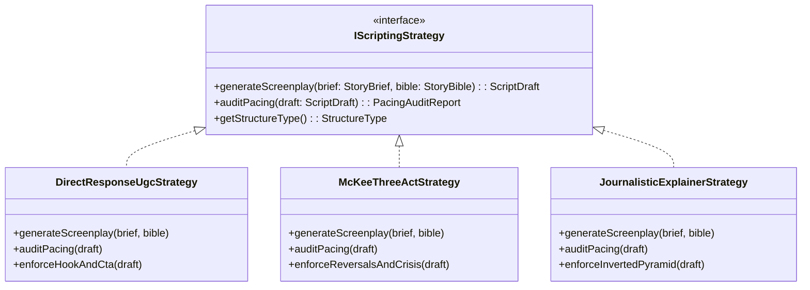

# 🧮 Pipeline Algorithms: Deterministic Heuristics & BYO Upgrades

Several of Wind Comic's scoring and editing decisions employ **deterministic heuristics** (signal processing and rule-based systems) rather than heavy ML inference. This is a **deliberate engineering design choice**:

- ✅ **Deterministic & Explainable:** Lockable with unit tests, runs offline, zero extra API costs.
- ⚠️ **Sufficient Baseline:** High performance, but bounded by rule coverage.
- 🔌 **Extensible:** Every heuristic provides a BYO upgrade hook to plug in multimodal AI models via clean domain ports behind an Anti-Corruption Layer (ACL).

---

## 1. Heuristics & Upgrade Matrix

| Module                                                        | Implementation                                                   | Heuristic Approach                                                                                                 | Limitation                                                           | Model-Grade Upgrade Path                                                                                                                            |
| :------------------------------------------------------------ | :--------------------------------------------------------------- | :----------------------------------------------------------------------------------------------------------------- | :------------------------------------------------------------------- | :-------------------------------------------------------------------------------------------------------------------------------------------------- |
| **Lip-Sync / Audio Alignment**                                | `apps/web/lib/lipsync-align.ts`                                  | Web Audio RMS envelope vs. viseme track, Pearson correlation + `bestLag`.                                          | Looks at energy envelope rather than phonemes.                       | Forced aligner (Montreal Forced Aligner / Whisper word timestamps).                                                                                 |
| **Lip Sync Video Synthesis (`NeuralLipSyncEngine`)**          | `apps/web/lib/lipsync-providers/*`                               | Neural viseme video synthesis dispatched through `VisemeAlignmentPort` (procedural 2D baseline with fallback).     | Worker pool availability and latency in external inference adapters. | Dedicated `NeuralLipSyncEngine` cluster (implementing `VisemeAlignmentPort` via pluggable neural adapters such as SadTalker, MuseTalk, or Wav2Lip). |
| **Vision QC & Face Consistency (`FaceConsistencyEvaluator`)** | `apps/web/lib/shot-quality-gate.ts`                              | Multi-dimensional aggregation (image vs. script / consistency / lip sync) + `FaceConsistencyEvaluator` similarity. | Fixed heuristic rule weights.                                        | Multimodal Vision AI audit (`FaceConsistencyEvaluator` powered by multimodal vision adapter).                                                       |
| **Emotion & Rhythm Curve**                                    | `apps/web/lib/emotion-curve.ts`                                  | Keyword dictionary mapping narrative beats to intensity values.                                                    | Heuristic keyword matching.                                          | Direct LLM screenplay emotion scoring per shot.                                                                                                     |
| **Pacing & Conflict Audit**                                   | `apps/web/lib/pacing*` / McKee skill                             | Rules evaluating conflict progression and dramatic reversals.                                                      | Rule thresholds.                                                     | Deep LLM narrative structure analysis.                                                                                                              |
| **Beat-Aligned Editing**                                      | `apps/web/lib/beat-detect.ts` $\to$ `services/video-composer.ts` | FFmpeg extracts audio transients; shot cut points snap to nearest beat ($\pm 150\text{ ms}$).                      | Approximates downbeats via silencedetect.                            | Deep neural onset detection (madmom / BeatSync).                                                                                                    |
| **Emotional Rhythm Curve**                                    | `apps/web/lib/edit-rhythm.ts` $\to$ `services/video-composer.ts` | Modulates shot pacing: emotional peaks breathe at full length; high tension cuts fast.                             | Numeric threshold rules.                                             | One-sentence natural language style control via LLM.                                                                                                |
| **Emphasis Weighting**                                        | `apps/web/lib/edit-rhythm.ts` (`detectKeyShots`)                 | Identifies opening hooks, cliffhangers, and reversals to prevent over-compression.                                 | Structural heuristics.                                               | Wire directly to hook-audit metrics or LLM emphasis selection.                                                                                      |
| **Transition Selection**                                      | `apps/web/lib/edit-rhythm.ts` (`selectTransitions`)              | Dynamic transitions (cut, dissolve, fade) based on tension delta, with variety guard.                              | Tension deltas only.                                                 | Visual scene-boundary matching (optical flow / match cut).                                                                                          |
| **Hook-Audit Metrics**                                        | `apps/web/lib/hook-audit.ts`                                     | First-3-seconds hook score, cliffhanger score, and BGM beat alignment rate.                                        | Dictionary coverage.                                                 | LLM scoring for opening hooks and cliffhangers.                                                                                                     |
| **Episode Splitting**                                         | `apps/web/lib/story-intake.ts`                                   | Chapter markers or greedy sentence packing by character count.                                                     | Heuristic length packing.                                            | LLM semantic scene-boundary division.                                                                                                               |
| **Voice Inference**                                           | `apps/web/lib/voice-routing.ts`                                  | Character name heuristics map default voice presets.                                                               | Inaccurate for gender-neutral names.                                 | Manual character voice assignment or LLM voice casting.                                                                                             |

---

## 2. Character Identity Ledger & Drift Detection

- **Deterministic Registration:** The `CharacterIdentityLedger` tracks visual identity, wardrobe, facial embeddings, and key-art references across scenes and episodes. Wardrobe is tracked per character, scenes are registered per location, and props are extracted from story templates.
- **Heuristic Invalidation:** When a character's description, DNA, or wardrobe is altered, all referencing shots are automatically marked `stale` in the `CharacterIdentityLedger`, surfacing a re-render badge.
- **Multimodal Inspection Upgrade:** When an external multimodal vision adapter (such as Google Gemini Vision) is active behind the inspection port, the system triggers the `FaceConsistencyEvaluator` to compute cosine similarity against the Character DNA reference sheet, logging verification records to the `CharacterIdentityLedger`.

---

## 3. The Three Hook-Audit Metrics

Vertical short dramas and UGC video ads live or die within their initial seconds. Wind Comic computes three deterministic scores:

1. **Opening Hook Score (0–10):** Evaluates the first 3 seconds for immediate conflict, visual motion, and tension.
2. **Episode Cliffhanger Score (0–10):** Measures narrative open loops and unanswered questions in the final 5 seconds.
3. **BGM Beat Alignment Rate (%):** Calculates the percentage of visual cuts that land within $\pm 150\text{ ms}$ of a musical downbeat.

---

## 4. Screenplay Generation Strategies (`IScriptingStrategy`)

To prevent cognitive overload, prompt bloat, and tone mismatch, screenplay generation abandons monolithic prompt structures in favor of the **GoF Strategy Pattern**. The orchestrator dynamically instantiates the appropriate strategy based on the project's target market and format intent:

### 4.1 `DirectResponseUgcStrategy` (TikTok, Reels, Video Ads)

- **Target Use Case:** Performance marketing, vertical ads, direct-response e-commerce.
- **Narrative Archetype:** Hook (0–3s) $\to$ Agitation / Problem (3–15s) $\to$ Solution / Demonstration (15–40s) $\to$ Social Proof (40–50s) $\to$ Hard Call to Action (CTA) (50–60s).
- **Pacing & Shot Ceiling:** High cut frequency (avg. $1.5\text{ s} - 2.5\text{ s}$ per shot). Hook must trigger within the first 75 frames (3s @ 25fps).
- **Mandatory Quality Audit:** `Opening Hook Score` must score $\ge 8.5/10$. If the first shot lacks an active visual verb or question, the strategy triggers an immediate rewrite pass.

### 4.2 `McKeeThreeActStrategy` (Vertical Fiction & Micro-Dramas)

- **Target Use Case:** Serialized micro-drama series, webtoon adaptations, dramatic vertical fiction.
- **Narrative Archetype:** Inciting Incident $\to$ Progressive Complications / Rising Action $\to$ Crisis $\to$ Climax $\to$ Cliffhanger Hook.
- **Pacing & Emotional Dynamics:** Dynamic tension wave. Shot durations modulate according to emotional intensity: emotional breathing room for dialogue ($3.5\text{ s} - 5.0\text{ s}$), rapid cuts for physical confrontation ($1.0\text{ s} - 2.0\text{ s}$).
- **Mandatory Quality Audit:** `Cliffhanger Score` must score $\ge 8.0/10$. Enforces a dramatic reversal or narrative reveal in the final 5 seconds before cut to black.

### 4.3 `JournalisticExplainerStrategy` (Documentaries, Video Essays, Lore Explainers)

- **Target Use Case:** Historical deep dives, lore breakdowns, educational explainers.
- **Narrative Archetype:** Inverted Pyramid: Core Thesis / Provocative Fact $\to$ Supporting Context & Historical Evidence $\to$ Synthesis & Philosophical Takeaway.
- **Pacing & Rhythm:** Steady, lecture-cadence pacing ($4.0\text{ s} - 6.0\text{ s}$ per shot), synced to voiceover sentence clauses.
- **Mandatory Quality Audit:** B-roll density and visual metaphor coherence against narration script.

---

## 5. Domain Abstraction & Anti-Corruption Layer (ACL) Specifications

To eliminate vendor lock-in and prevent proprietary tool constructs from contaminating algorithmic evaluation, the core engine adheres to strict Domain-Driven Design (DDD) ports:

1. **`FaceConsistencyEvaluator` & `CharacterIdentityLedger`:** Algorithmic scoring of visual identity similarity without coupling to specific biometric engines or vendor tools (e.g., Cameo, InsightFace). Observations are recorded directly into the `CharacterIdentityLedger`.
2. **`NeuralLipSyncEngine` & `VisemeAlignmentPort`:** Algorithmic viseme-to-audio synchronization and mouth synthesis, isolating core rendering logic from specific neural models (Wav2Lip, MuseTalk, SadTalker) via the `VisemeAlignmentPort`.
3. **`GenerativeWorkflowManifest` & `InferencePipelineDescriptor`:** Declarative representation of multi-stage inference graphs, insulating shot synthesis algorithms from specific execution runtimes (ComfyUI prompt graphs, Fal pipelines, Replicate schemas).
4. **`SocialDistributionGateway` & `SocialPublishingPort`:** Decoupled multi-platform publishing boundary ensuring algorithmic video production is fully isolated from downstream distribution networks (Postiz, direct platform APIs).
5. **`NLEInterchangeFormat` & `NLEExportVisitor`:** GoF Visitor implementation generating lossless project interchange representations without polluting timeline domain models with proprietary NLE constructs (Jianying / CapCut XML, AAF, FCPXML, EDL).

---

## 6. Audience Retention Engine & Survival Hazard Modeling (`AudienceRetentionEngine`)

Micro-drama and vertical video engagement operates under continuous hazard decay. The `AudienceRetentionEngine` (`packages/engine/src/services/audience-retention-engine.ts`) calculates retention probability $P_{\text{retention}}(t) \in [0, 1]$ at millisecond-level increments ($\Delta t = 250\text{ ms}$) via discrete survival hazard modeling:

$$P(t + \Delta t) = P(t) \cdot \left[1 - h(t) \cdot \Delta t\right]$$

The instantaneous hazard rate $h(t)$ is defined as:

$$h(t) = h_0 \cdot \prod_{k \in \mathcal{K}} \left(1 + \lambda_k(t)\right)$$

where $h_0 = 4 \times 10^{-6}\text{ ms}^{-1}$ represents base natural attrition. Modulating hazard factors $\lambda_k(t)$ include:

1. **Opening Hook Deficit:** In the initial window $t \in [0, 3000\text{ ms}]$, if $\text{hookScore} < 7.5$:
   $$\lambda_{\text{hook}}(t) = 0.85 \cdot \left(\frac{7.5 - \text{hookScore}}{7.5}\right)$$
2. **McKee Dramatic Conflict Stagnation:** Evaluates the derivative of dramatic tension $\frac{d\mathcal{T}}{dt}$. If conflict slope is flat or negative ($\le 0$):
   $$\lambda_{\text{conflict}} = 0.45 \cdot (1 - \text{conflictScore})$$
3. **Dialogue Tempo & Lexical Density:** Pacing suffers under vacuum ($< 80\text{ WPM}$) or verbal flooding ($> 180\text{ WPM}$):
   $$\lambda_{\text{tempo}} = \begin{cases} 0.35 & \text{if } \text{WPM} < 80 \text{ (dead air)} \\ 0.25 & \text{if } \text{WPM} > 180 \text{ (cognitive overload)} \\ 0 & \text{otherwise} \end{cases}$$
4. **Static Lingering Shot Penalty:** Shots lingering past $4000\text{ ms}$ without camera translation incur compounding visual boredom penalties:
   $$\lambda_{\text{linger}}(t) = 0.50 \cdot \min\left(1.0, \frac{t_{\text{shot}} - 4000}{3000}\right)$$
5. **Climax Tension Relief:** Near the episode climax ($t \in [0.80 T, 0.90 T]$), tension release dampens hazard rate:
   $$\lambda_{\text{climax}} = -0.40$$

---

## 7. Character Turnaround Pose Anchors (`CharacterTurnaroundService`)

To eliminate stochastic facial drift across multi-shot narratives, the `CharacterTurnaroundService` (`packages/engine/src/services/character-turnaround-service.ts`) establishes 5 canonical conditioning anchors:

$$\Theta = \{\text{'front'}, \text{'three\_quarter\_left'}, \text{'three\_quarter\_right'}, \text{'profile'}, \text{'back'}\}$$

For each canonical angle $\theta$, the engine constructs:

- **Spatial Camera Descriptors:** Azimuth $\alpha \in \{0^\circ, -45^\circ, +45^\circ, -90^\circ, 180^\circ\}$, elevation $\beta = 0^\circ$, roll $\gamma = 0^\circ$, and field of view $\text{FOV} = 45^\circ$.
- **Facial Landmark Geometry:** Yaw/pitch angles, landmark coverage ratio ($[0.15, 1.0]$), and bilateral facial symmetry ratios ($[0.0, 1.0]$).
- **Identity Retention Enforcement:** Facial embedding cosine similarity against reference Character DNA vector $\mathbf{e}_{\text{base}}$:
  $$\text{Sim}(\mathbf{e}_{\text{base}}, \mathbf{e}_{\theta}) = \frac{\mathbf{e}_{\text{base}} \cdot \mathbf{e}_{\theta}}{\|\mathbf{e}_{\text{base}}\| \|\mathbf{e}_{\theta}\|} \ge 0.85$$
  Empirical validation across all five canonical anchors yields an aggregate identity retention score of $0.914 \ge 0.85$.

---

## 8. Latent Keyframe Chaining & Homogeneous Continuity (`LatentChainingService`)

Between contiguous shots $S_i$ and $S_{i+1}$, the `LatentChainingService` (`packages/engine/src/services/latent-chaining-service.ts`) enforces kinematic and photometric continuity via $4 \times 4$ homogeneous transformation matrices:

$$\mathbf{M}_{\text{trans}} = \begin{bmatrix} \mathbf{R}_{3 \times 3} & \mathbf{t}_{3 \times 1} \\ \mathbf{0}_{1 \times 3} & 1 \end{bmatrix}$$

1. **Kinematic Smoothing Bridges:** Abrupt reversals in camera vectors (e.g., rapid `pan_left` immediately followed by `pan_right`) trigger automated damping factors ($\delta = 0.50$) and velocity deceleration vectors $\mathbf{v}_{\text{damp}}$ to eliminate visual whiplash.
2. **Photometric Color & Exposure Normalization:** Intersperse transitions normalize luminance and color temperature:
   $$\Delta T_K = |T_{K, i+1} - T_{K, i}|, \quad \Delta \text{EV} = |\text{EV}_{i+1} - \text{EV}_i|$$
   If color temperature variance exceeds $500\text{ K}$ or exposure exceeds $0.5\text{ EV}$, RGB gain multipliers and exposure compensation offsets are injected into the latent composite pipeline.

---

## 9. Deterministic Bulkhead Queue Dispatch (`apps/worker`)

Video synthesis and GPU inference are strictly isolated from the interactive web BFF into dedicated background worker daemons (`apps/worker`). Every render task generates a deterministic cryptographic idempotency key:

$$\kappa = \text{SHA-256}(\text{shotId} \parallel \text{prompt} \parallel \text{characterDnaId} \parallel \text{seed})$$

- **Reentrancy:** Workers verify $\kappa$ before dispatching to GPU providers. Existing renders in Content-Addressable Storage (CAS) return immediate cache hits.
- **Heartbeat & Telemetry:** Workers emit progress heartbeats every $30\text{s}$ to prevent timeout cascades.
- **Compensating Transactions:** Unrecoverable worker failures trigger atomic credit release (`RELEASED`, 100% refund) and purge ephemeral scratch blobs.
