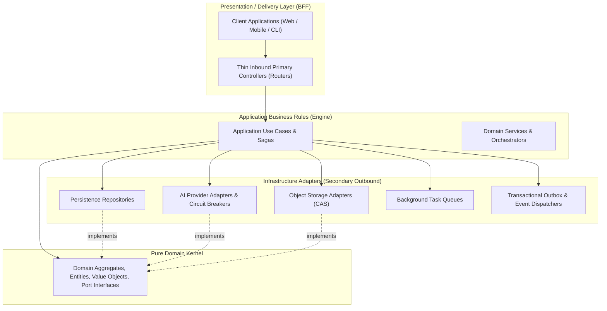
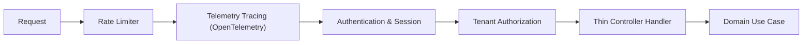

# ⚡ Contract-First Type-Safe API & Inbound Primary Adapters

This document specifies the API boundary architecture. In strict adherence to Clean Architecture, the API layer is **not** the center of the domain; it functions strictly as a **Delivery Mechanism and Presentation Boundary (Backend-for-Frontend / BFF)**.

---

## 1. Clean Architecture & Layered Boundary Rules

The dependency flow is strictly unidirectional inward toward the domain core. Delivery mechanisms know about use cases, but the domain kernel and application business rules have zero awareness of network protocols, serialization frameworks, or HTTP headers.

---

## 2. Inbound Primary Adapter (Thin Controller) Pattern

Every API route or procedure functions strictly as an **Inbound Primary Adapter**:

1. **Schema Validation:** Ingests input and validates strict typing via immutable schema contracts (Zod / JSON Schema). Rejects malformed requests at the boundary before executing application logic.
2. **Context & Identity Extraction:** Extracts authenticated session identity, tenancy scope, and verifies resource access permissions.
3. **Use Case Delegation:** Delegates business execution directly to an Application Use Case (`IUseCase<TInput, TOutput>`).
4. **Exception Translation:** Intercepts pure Domain Exceptions (e.g., `InsufficientCreditsException`, `ProjectNotFoundException`) and translates them into strongly typed protocol status codes.
5. **LOC Boundary Constraint:** No controller or router file may exceed 300 lines of code ($\le 300\text{ LOC}$). Business logic, loops, or complex branching inside controllers are strictly prohibited.

---

## 3. Dual Protocol Architecture (Contract-First)

To maximize developer ergonomics and interoperability, procedure contracts support two communication protocols from a single source of truth:

1. **Type-Safe RPC Protocol:**
   - Designed for high-throughput, low-latency communication between first-party client applications and the backend.
   - Provides end-to-end compile-time type safety across client and server boundaries without manual schema generation steps.
2. **OpenAPI / REST Protocol:**
   - Exposes standardized, restful HTTP endpoints with automatic OpenAPI 3.1 specification generation.
   - Enables third-party integrations, webhook callbacks, and automated documentation explorers.

---

## 4. Middleware Pipeline & Declarative Cross-Cutting Concerns

Cross-cutting operational concerns are composed declaratively via ordered middlewares rather than polluted across business endpoints:

1. **Rate Limiting Middleware:** Enforces token-bucket rate limits per client IP or authenticated tenant.
2. **Distributed Tracing Middleware:** Injects OpenTelemetry trace context (`traceparent`) and starts a server span for latency attribution.
3. **Authentication Middleware:** Resolves bearer tokens, verifies cryptographic signatures, and attaches the authenticated `UserSession` to the execution context.
4. **Authorization Middleware:** Verifies that the authenticated user possesses appropriate role permissions on the requested aggregate resource before execution proceeds.
