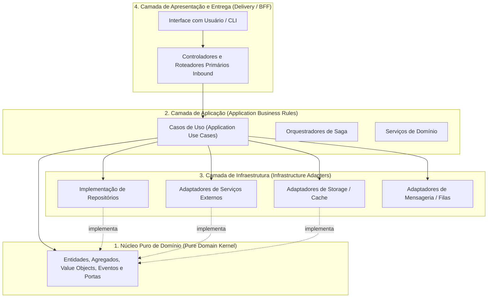

# 🏛️ Clean Architecture & Domain-Driven Design (DDD)

Este documento estabelece as regras canônicas de separação de responsabilidades, estratificação em camadas e isolamento do domínio de negócio.

---

## 1. O Princípio da Dependência Unidirecional

O fluxo de dependência é estritamente unidirecional, apontando sempre para dentro, em direção ao núcleo do domínio. As camadas mais externas (APIs, bancos de dados, interfaces com o usuário, bibliotecas de terceiros) são detalhes de infraestrutura e entrega; o núcleo do domínio possui **zero** conhecimento sobre elas.



---

## 2. Estratificação em Camadas

### 2.1 Núcleo Puro de Domínio (Pure Domain Kernel)
- **Conteúdo:** Entidades de domínio, Raízes de Agregação (*Aggregate Roots*), Objetos de Valor (*Value Objects*), Eventos de Domínio (*Domain Events*), Exceções de Domínio e Interfaces de Portas (*Ports*).
- **Invariante Absoluta:** O domínio é escrito em linguagem pura (TypeScript/ecossistema nativo), sem qualquer dependência de frameworks web, ORMs, drivers de banco de dados, bibliotecas de UI ou utilitários externos de rede.

### 2.2 Camada de Aplicação (Application Business Rules)
- **Conteúdo:** Casos de Uso (*Use Cases*), coordenadores de fluxo, políticas de orquestração e contratos de entrada/saída.
- **Responsabilidade:** Orquestra a execução das regras de negócio expressas no domínio, coordenando a persistência e a invocação de serviços externos através de injeção de dependência / inversão de controle das interfaces de portas.

### 2.3 Camada de Infraestrutura (Infrastructure Outbound Adapters)
- **Conteúdo:** Implementações concretas de repositórios, comunicação de rede, clientes de banco de dados, brokers de mensageria e sistemas de arquivos.
- **Responsabilidade:** Traduz as interfaces de porta declaradas pelo domínio para as chamadas técnicas específicas das tecnologias e fornecedores utilizados.

### 2.4 Camada de Apresentação / Entrega (Presentation & Inbound Adapters)
- **Conteúdo:** Controladores HTTP, rotas de API, comandos CLI ou componentes de tela.
- **Responsabilidade:** Atua estritamente como *Inbound Primary Adapter*: decodifica a requisição externa, valida a tipagem dos dados na fronteira, extrai o contexto de sessão e delega a execução diretamente ao Caso de Uso correspondente.

---

## 3. Eliminação da Obsessão por Primitivos (Branded Types)

No design de domínio, tipos primitivos puros (`string`, `number`) mascaram significados semânticos distintos e permitem erros sutis de invocação (ex: passar um `UserId` onde se esperava um `TenantId`).

- **Regra de Branded Types:** Identificadores únicos, valores monetários, unidades de tempo e métricas críticas devem ser modelados como tipos nominais enriquecidos (*Branded Types*):

```typescript
export type Brand<T, B extends string> = T & { readonly __brand: B };

export type ProjectId = Brand<string, "ProjectId">;
export type EntityId = Brand<string, "EntityId">;
export type Microseconds = Brand<number, "Microseconds">;
export type ExecutionBudget = Brand<number, "ExecutionBudget">;
```

- **Benefício:** O compilador impede estaticamente que tipos semânticos distintos sejam confundidos ou passados invertidos em chamadas de função, garantindo integridade conceitual em todo o sistema.
