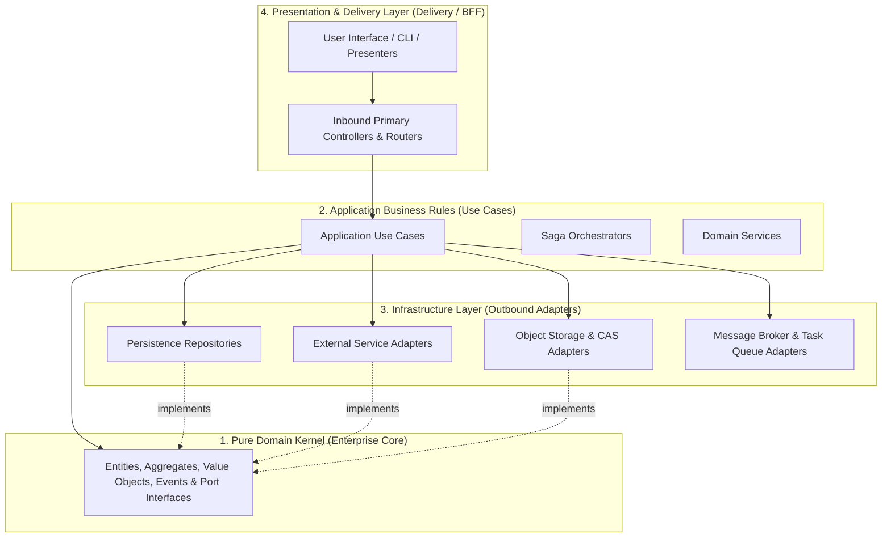

# 🏛️ Clean Architecture & Domain-Driven Design (DDD)

This document establishes the canonical rules for separation of concerns, layer stratification, and business domain isolation.

---

## 1. The Unidirectional Dependency Rule

The dependency flow is strictly unidirectional inward toward the domain core. Outer delivery layers (APIs, databases, user interfaces, third-party libraries) are infrastructure and delivery details; the domain kernel has **zero** awareness of them.



---

## 2. Layered Stratification

### 2.1 Pure Domain Kernel
- **Contents:** Domain Entities, Aggregate Roots, Value Objects, Domain Events, Domain Exceptions, and Port Interfaces.
- **Constitutional Invariant:** The domain is authored in pure language constructs (standard TypeScript/native primitives), with **zero** dependencies on web frameworks, ORMs, database drivers, UI components, or network utilities.

### 2.2 Application Business Rules (Use Cases)
- **Contents:** Application Use Cases, workflow coordinators, orchestration policies, and input/output contracts.
- **Responsibility:** Orchestrates business operations expressed in the domain model, coordinating persistence, transactions, and external communication exclusively via Dependency Inversion over declared Port interfaces.

### 2.3 Infrastructure Layer (Outbound Adapters)
- **Contents:** Concrete repository implementations, database clients, network connectors, file system drivers, and message brokers.
- **Responsibility:** Translates domain port interfaces into concrete technical invocations required by underlying databases, storage engines, or third-party APIs.

### 2.4 Presentation & Delivery Layer (Inbound Adapters)
- **Contents:** HTTP controllers, API routers, CLI commands, or frontend presenters.
- **Responsibility:** Functions strictly as an *Inbound Primary Adapter*: parses external requests, validates input data schemas at the boundary, extracts authentication context, and delegates execution directly to the designated Application Use Case.

---

## 3. Eliminating Primitive Obsession (Branded Types)

In domain modeling, raw primitives (`string`, `number`) obscure semantic meaning and allow subtle invocation errors (e.g., supplying a `UserId` where an `AccountId` was expected).

- **Branded Types Rule:** Unique identifiers, monetary amounts, execution intervals, and critical domain metrics must be modeled as nominal types (*Branded Types*):

```typescript
export type Brand<T, B extends string> = T & { readonly __brand: B };

export type ProjectId = Brand<string, "ProjectId">;
export type EntityId = Brand<string, "EntityId">;
export type Microseconds = Brand<number, "Microseconds">;
export type ExecutionBudget = Brand<number, "ExecutionBudget">;
```

- **Architectural Benefit:** The compiler statically prevents semantic type confusion and inverted arguments across function signatures, preserving model integrity throughout the entire application.
