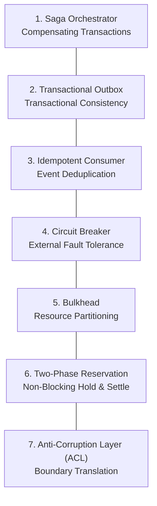

# 🛡️ Distributed Systems & Resilience Patterns

This document specifies the software engineering patterns for ensuring eventual consistency, fault isolation, and resource protection in asynchronous and distributed architectures.

---

## 1. Resilience Patterns Catalog

---

### 1.1 Saga Orchestrator (Garcia-Molina & Salem; Richardson)
- **Problem:** Traditional distributed transactions based on Two-Phase Commit (2PC) lock database resources for long periods and suffer prohibitive latency in long-running asynchronous workflows.
- **Solution:** The workflow is decomposed into an ordered series of local transactions coordinated by an explicit Finite State Machine (FSM). For each successfully completed forward transaction $T_i$, a corresponding compensating action $C_i$ is registered.
- **Guarantee:** If an unrecoverable failure occurs at step $k$, the orchestrator triggers compensating actions in reverse order ($C_{k-1}, C_{k-2}, \dots, C_1$), safely unwinding partial mutations, refunding reserved quotas, and purging orphaned temporary resources.

---

### 1.2 Transactional Outbox (Richardson)
- **Problem:** The dual-write hazard occurs when a system attempts to mutate database state and publish an event to a message broker in separate operations. If the broker is unreachable after the database commit, the event is permanently lost; if the event is published before the commit, a subsequent database failure emits a ghost event.
- **Solution:** The domain event to be dispatched is written to a dedicated `outbox` table **within the exact same ACID database transaction** as the business entity mutation. An asynchronous relay daemon continuously scans the outbox table and dispatches events to the message broker with guaranteed *at-least-once delivery*.

---

### 1.3 Idempotent Consumer (Hohpe & Woolf)
- **Problem:** In distributed networks with *at-least-once* messaging semantics, network timeouts or connection retries can deliver the exact same command or event multiple times.
- **Solution:** Every inbound command or event must carry a deterministic `idempotencyKey`.
- **Protocol:** Prior to executing any side-effecting operations, the consumer inspects its processed key registry:
  - If the key is already marked as completed: returns the cached response immediately without re-executing business logic.
  - If the key is currently processing: rejects concurrent re-entrance or initiates an orderly wait.
  - If the key is unseen: executes the operation and commits completion atomic with state mutation.

---

### 1.4 Circuit Breaker (Nygard)
- **Problem:** Intermittent degradation or severe outages in external APIs and third-party dependencies can exhaust local connection pools and thread workers, resulting in cascading system-wide collapse.
- **Solution:** External network invocations are encapsulated within a 3-state Circuit Breaker:
  - **Closed:** Normal operations. Requests pass freely while errors are tracked across a rolling execution window.
  - **Open:** The error rate exceeds the defined tolerance threshold. All subsequent requests fail immediately (*fast-fail*) without touching the remote network, allowing the failing dependency time to recover.
  - **Half-Open:** Following an automated cool-down window, a trial batch of requests is allowed through. If successful, the circuit resets to *Closed*; if failures persist, it immediately returns to *Open*.

---

### 1.5 Bulkhead (Nygard)
- **Problem:** A sudden surge in computationally heavy or slow tasks consumes 100% of server CPU, memory, or worker threads, causing starvation and total downtime for lightweight, interactive user requests.
- **Solution:** Physical partitioning of concurrency pools and resources:
  - Dedicated worker daemons and strict concurrency limits for resource-intensive background jobs.
  - Isolated thread pools and database connections allocated specifically for responsive, user-facing API interactions.

---

### 1.6 Two-Phase Resource Reservation (Hold & Settle Pattern)
- **Problem:** During long-running asynchronous tasks (e.g., 2 to 10 minutes), maintaining an active database transaction while waiting for execution completely exhausts the database connection pool in seconds.
- **Solution:** A non-blocking two-phase reservation protocol:
  1. **Phase 1 (Hold, fast ACID transaction ~5ms):** Validates available balance or capacity and commits a reservation record with status `HELD`. The database transaction closes immediately.
  2. **Asynchronous Execution:** Background workers perform execution entirely outside of any open database transaction.
  3. **Phase 2a (Settle, fast ACID transaction ~5ms):** Upon successful completion, an atomic transaction transitions the hold status to `SETTLED` and permanently deducts the consumed quota.
  4. **Phase 2b (Compensating Release):** In the event of task failure or timeout, the status transitions to `RELEASED`, unlocking reserved capacity with zero penalty.

---

### 1.7 Anti-Corruption Layer - ACL (Evans)
- **Problem:** Allowing external vendor schemas, third-party data shapes, or remote SDK structures to infiltrate core application services corrupts the ubiquitous language and binds the architecture to proprietary implementations.
- **Solution:** A perimeter translation boundary that intercepts external data structures and bi-directionally maps them into strongly-typed internal domain entities. If external providers or protocols change, only the perimeter ACL adapter is updated; the core domain remains completely untouched.
