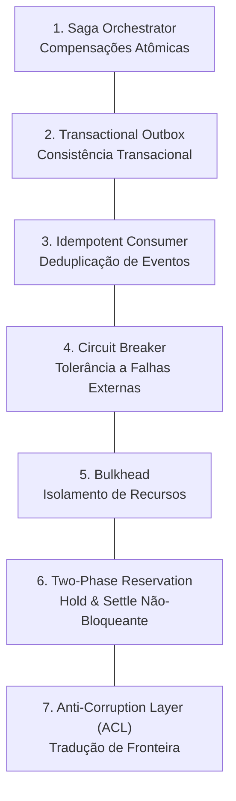

# 🛡️ Padrões de Resiliência & Sistemas Distribuídos

Este documento especifica os padrões de engenharia para garantia de consistência eventual, tolerância a falhas e isolamento de recursos em arquiteturas distribuídas e assíncronas.

---

## 1. Catálogo de Padrões de Resiliência

---

### 1.1 Saga Orchestrator (Garcia-Molina & Salem; Richardson)
- **Problema:** Transações distribuídas tradicionais baseadas em Two-Phase Commit (2PC) bloqueiam recursos e sofrem de alta latência em fluxos assíncronos de longa duração.
- **Solução:** O fluxo é decomposto em uma sequência de transações locais orquestradas por uma Máquina de Estados Finita (FSM). Para cada transação $T_i$ executada com sucesso, existe uma ação compensatória correspondente $C_i$.
- **Garantia:** Se a etapa $k$ falhar de forma irrecuperável, o orquestrador aciona em ordem reversa as ações compensatórias $C_{k-1}, C_{k-2}, \dots, C_1$, restaurando a consistência do sistema (reembolso de créditos, liberação de locks, purga de artefatos temporários).

---

### 1.2 Transactional Outbox (Richardson)
- **Problema:** O risco de escrita dupla (*dual-write hazard*), onde o sistema grava uma alteração no banco de dados e tenta publicar uma mensagem em um broker. Se a conexão com a rede falhar após o commit, a mensagem é perdida; se falhar antes, o evento foi emitido sem o registro persistido.
- **Solução:** O evento de domínio a ser publicado é persistido em uma tabela de *Outbox* dentro da **mesma transação ACID** que realizou a mutação da entidade. Um processo em background lê os registros da tabela outbox e os despacha para a fila/broker com garantia de entrega de ao menos uma vez (*at-least-once delivery*).

---

### 1.3 Idempotent Consumer (Hohpe & Woolf)
- **Problema:** Redes distribuídas e brokers com entrega *at-least-once* podem reenviar a mesma mensagem repetidamente em casos de reconexão ou timeout.
- **Solução:** Toda mensagem ou comando assíncrono transporta uma chave de idempotência determinística (`idempotencyKey`).
- **Comportamento:** Antes de executar qualquer processamento com efeitos colaterais, o consumidor verifica se a chave já foi registrada:
  - Se já foi processada: retorna o resultado anterior imediatamente sem re-execução.
  - Se estiver em processamento: aguarda ou rejeita reentrância concorrente.
  - Se for inédita: executa o processamento e registra a conclusão atomicamente.

---

### 1.4 Circuit Breaker (Nygard)
- **Problema:** Falhas intermitentes ou lentidão em APIs e serviços externos podem prender threads e esgotar os pools de conexão locais, causando falha em cascata em todo o sistema.
- **Solução:** As invocações externas são envolvidas em um disjuntor com 3 estados:
  - **Closed (Fechado):** Operação normal. Requisições passam livremente e falhas são contabilizadas em janela deslizante.
  - **Open (Aberto):** A taxa de erro ultrapassou o limiar de segurança. Todas as chamadas subsequentes falham imediatamente (*fast-fail*), sem tocar a rede externa, aliviando o serviço remoto.
  - **Half-Open (Meio-Aberto):** Após um intervalo de resfriamento (*cooldown*), um número limitado de requisições de teste é permitido. Se forem bem-sucedidas, o circuito fecha; caso falhem, retorna imediatamente para o estado aberto.

---

### 1.5 Bulkhead (Nygard)
- **Problema:** Uma carga massiva de processamento pesado ou lento consome 100% da CPU, memória ou threads do servidor, tornando indisponíveis as operações interativas simples dos usuários.
- **Solução:** Isolamento estrito de recursos através de partições independentes:
  - Fila e limites de concorrência dedicados para tarefas computacionalmente pesadas em workers de background.
  - Limites dedicados e isolados para requisições de API interativas e leituras do usuário.

---

### 1.6 Two-Phase Resource Reservation (Hold & Settle Pattern)
- **Problema:** Em operações assíncronas de longa duração (ex: 2 a 10 minutos), manter uma transação de banco de dados aberta enquanto o processamento ocorre esgota o pool de conexões em segundos.
- **Solução:** Protocolo de dois passos sem bloqueio de conexão:
  1. **Fase 1 (Hold, transação rápida ~5ms):** Verifica o saldo/capacidade e insere um registro de reserva com status `HELD`. A transação fecha imediatamente.
  2. **Processamento Assíncrono:** O worker executa fora de qualquer transação de banco de dados.
  3. **Fase 2a (Settle, transação rápida ~5ms):** Concluído com sucesso, o registro é atualizado para `SETTLED` e o recurso é definitivamente consumido.
  4. **Fase 2b (Release, compensação):** Em caso de falha ou timeout, o status é alterado para `RELEASED` e a reserva é estornada na íntegra.

---

### 1.7 Anti-Corruption Layer - ACL (Evans)
- **Problema:** Acoplar o núcleo de domínio aos modelos de dados, nomenclaturas ou contratos de fornecedores externos e ferramentas de terceiros polui a linguagem ubíqua e cria dependência tecnológica perigosa.
- **Solução:** Uma camada mediadora no perímetro do sistema que traduz bidirecionalmente os conceitos externos para as entidades e contratos do domínio interno. Se o fornecedor externo for trocado, apenas o adaptador ACL é reescrito; o núcleo do domínio permanece 100% inalterado.
