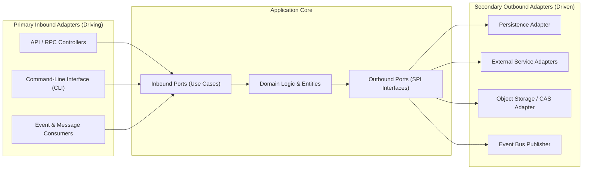

# 🔌 Hexagonal Architecture: Ports, Adapters & Contracts

This document defines the core principles of **Hexagonal Architecture (Ports & Adapters)** and standardized contract boundaries.

---

## 1. Core Architectural Concept (Cockburn)

The application business logic resides at the center of the hexagon, isolated from infrastructure concerns. The external environment interacts with the core exclusively through **Ports** (abstract interfaces) implemented by concrete technical **Adapters**:

---

## 2. Primary Adapters (Inbound / Driving)

Primary adapters initiate communication with the application by translating external requests into internal use case commands.

### 2.1 The Thin Controller Pattern
- **Size Ceiling:** No individual controller, route handler, or command file may exceed 300 lines of code ($\le 300\text{ LOC}$).
- **Strict Responsibilities:**
  1. Validate incoming request structure and payload typing against immutable schemas (Zod / JSON Schema).
  2. Extract session identity, tenancy context, and verify security permissions.
  3. Delegate execution directly to the designated Application Use Case.
  4. Map internal domain exceptions into standardized protocol status codes.
- **Strict Prohibition:** Including business logic, direct database mutations, or complex processing loops inside controllers is strictly forbidden.

### 2.2 Contract-First Strategy & Multi-Protocol Delivery
- Operations are defined from immutable, typed contracts (input, output, metadata).
- A unified contract definition can serve dual delivery protocols:
  - **Type-Safe RPC Protocol:** Optimized for high-throughput, compile-time end-to-end type safety between first-party clients and servers.
  - **REST / OpenAPI Protocol:** Standardized endpoints with automated OpenAPI 3.1 generation for external consumers and automated tooling.

---

## 3. Secondary Adapters (Outbound / Driven)

Secondary adapters are invoked by the application to communicate with external infrastructure (databases, file systems, third-party network services).

### 3.1 The Dependency Inversion Principle (DIP)
- The application defines the interface required to fulfill its goals (`IRepository`, `IStorageService`, `INotificationGateway`).
- The infrastructure module implements this interface. The domain kernel has zero awareness of specific drivers, database dialects, or network protocols.
- Swapping an infrastructure component (e.g., changing database engines or cloud storage providers) occurs without modifying a single line of domain or application code.
