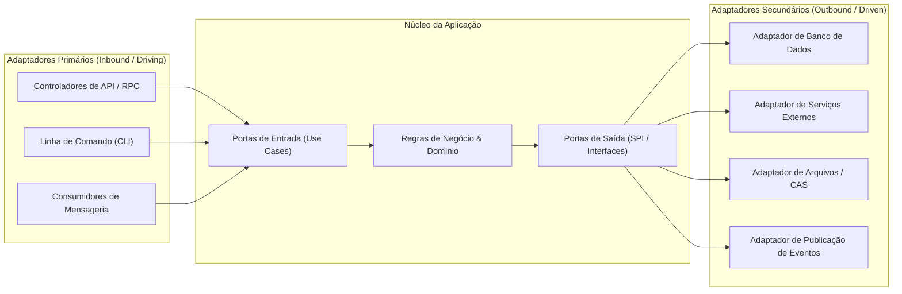

# 🔌 Arquitetura Hexagonal: Portas, Adaptadores & Contratos

Este documento define os princípios da **Arquitetura Hexagonal (Ports & Adapters)** e a padronização de contratos de entrada e saída.

---

## 1. Conceito Central da Arquitetura Hexagonal (Cockburn)

A aplicação reside no centro do hexágono, contendo a lógica de negócios e as regras do domínio. O mundo externo interage com a aplicação através de **Portas** (interfaces abstratas) que são implementadas por **Adaptadores** técnicos:

---

## 2. Adaptadores Primários (Inbound / Driving)

Os adaptadores primários são responsáveis por receber estímulos do mundo exterior, converter esses estímulos em dados compreensíveis pela aplicação e invocar a porta de entrada adequada.

### 2.1 Padrão de Controlador Fino (Thin Controller)
- **Tamanho Máximo:** Nenhum arquivo de controlador, rota ou comando deve exceder 300 linhas de código ($\le 300\text{ LOC}$).
- **Responsabilidades Estritas:**
  1. Validar a tipagem e conformidade da requisição através de esquemas imutáveis (Zod / JSON Schema).
  2. Extrair contexto de identidade, sessão e permissões.
  3. Delegar a execução para o Caso de Uso correspondente.
  4. Mapear exceções de domínio em códigos de status de rede padronizados.
- **Proibição:** É estritamente proibido incluir regras de negócio, manipulação direta de banco de dados ou loops computacionais dentro dos controladores.

### 2.2 Estratégia Contract-First & Suporte a Múltiplos Protocolos
- As operações são definidas a partir de contratos tipados imutáveis (entrada, saída, metadados).
- Uma única definição de contrato pode expor:
  - **Protocolo RPC Tipado:** Para comunicação de alto desempenho e tipagem ponta a ponta em clientes internos.
  - **Protocolo REST / OpenAPI:** Para integração de terceiros, interoperabilidade e documentação viva.

---

## 3. Adaptadores Secundários (Outbound / Driven)

Os adaptadores secundários são invocados pela aplicação para interagir com o ambiente externo (bancos de dados, sistemas de arquivos, serviços de terceiros).

### 3.1 Princípio da Inversão de Dependência (DIP)
- A aplicação declara a interface necessária para realizar seu objetivo (`IRepository`, `IStorageService`, `INotificationGateway`).
- O módulo de infraestrutura implementa essa interface. O núcleo de domínio desconhece completamente o driver, banco ou protocolo de rede subjacente.
- A substituição de uma tecnologia de infraestrutura (ex: trocar o motor de banco de dados ou o provedor de storage) ocorre sem alterar uma única linha de código nas camadas de Domínio ou Aplicação.
