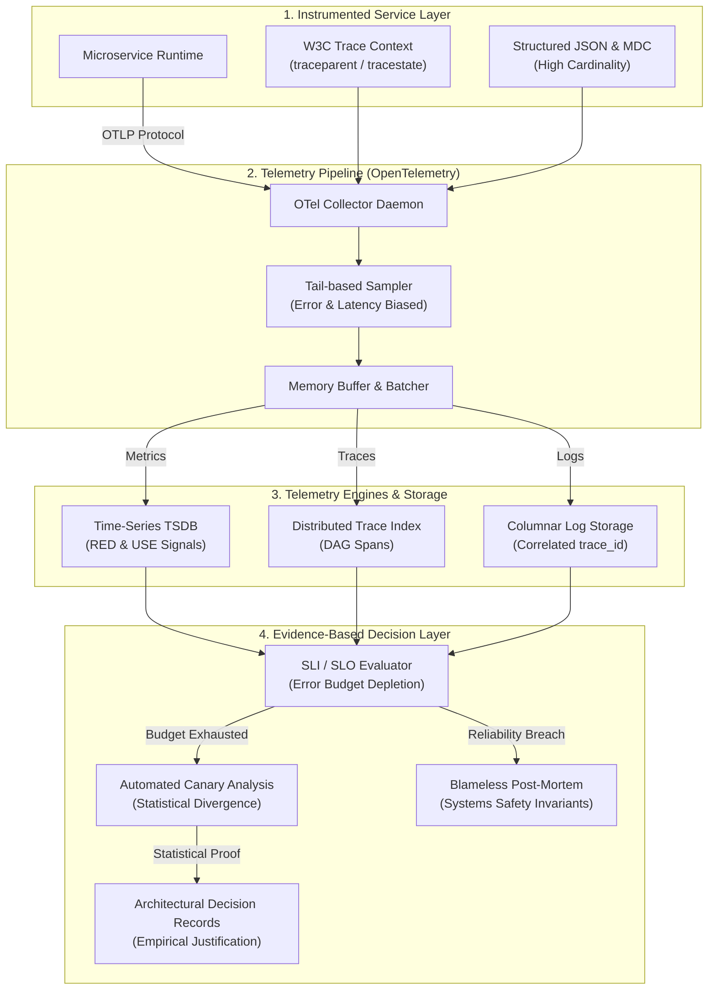

# 📡 Observability, Distributed Telemetry & Evidence-Based Decision Making

This document formalizes the architectural patterns, telemetry pipelines, and empirical decision frameworks used to guarantee software reliability, operational transparency, and continuous resilience in mission-critical distributed systems.

---

## 1. Unified Telemetry & Evidence Pipeline Architecture



---

## 2. Core Observability Patterns Catalog

### 2.1 Distributed Tracing & W3C Context Propagation (Sigelman et al., 2010; W3C)
- **Problem:** In microservice meshes and asynchronous message buses, a single inbound user transaction branches into dozens of downstream network hops. Traditional log files cannot correlate multi-tier failures or identify latency bottlenecks across process boundaries.
- **Solution:** Every inbound transaction is injected with a globally unique W3C Trace Context:
  $$\text{traceparent} = \text{version}-\text{trace\_id}-\text{parent\_id}-\text{trace\_flags}$$
- **Protocol:**
  1. The edge gateway creates an immutable 16-byte `trace_id` and initial `span_id`.
  2. Inbound and outbound HTTP/gRPC/Messaging adapters automatically extract and inject the `traceparent` and `tracestate` headers across network boundaries without polluting domain entities.
  3. Every execution span records its monotonic start and end timestamps, parent span reference, status code, and structured attributes, forming a Directed Acyclic Graph (DAG) of the entire request execution tree.

---

### 2.2 The 4 Golden Signals & The RED Method (Beyer et al., 2016; Wilkie, 2017)
- **Problem:** Monitoring thousands of raw CPU and memory counters creates alert fatigue while obscuring actual client-perceived degradation.
- **Solution:** For all user-facing services and request-driven APIs, engineering monitoring is strictly organized around the **RED** paradigm and Google's **Four Golden Signals**:

| Signal / Metric | Formal Mathematical Definition | Operational Meaning |
| :--- | :--- | :--- |
| **Rate (R) / Traffic** | $\lambda = \frac{\Delta N_{\text{requests}}}{\Delta t}$ | Request arrival rate per second across service boundaries. |
| **Errors (E)** | $E_{\text{rate}} = \frac{\Delta N_{\text{failed}}}{\Delta N_{\text{total}}} \times 100\%$ | Ratio of failed requests ($5\text{xx}$ HTTP, unhandled exceptions) to total requests. |
| **Duration (D) / Latency** | $\mathcal{P}_{50}, \mathcal{P}_{95}, \mathcal{P}_{99} \text{ of } T_{\text{elapsed}}$ | Latency percentiles across time buckets; averages are strictly prohibited due to long-tail skew. |
| **Saturation** | $\text{Sat} = \frac{\text{Queue Depth}}{\text{Max Capacity}} \text{ or } \frac{\text{Active Workers}}{\text{Pool Size}}$ | Fraction of resource capacity consumed; warns of impending degradation prior to throughput collapse. |

---

### 2.3 The USE Method for System Resources (Gregg, 2012)
- **Problem:** Infrastructure bottlenecks (CPU scheduling latency, socket starvation, memory fragmentation) silently degrade services before explicit errors surface.
- **Solution:** For every hardware and kernel-level resource (CPUs, memory, disks, network interfaces, connection pools), metric collectors continuously sample:
  1. **Utilization:** The percentage of time the resource was actively serving work (e.g., CPU core busy ratio).
  2. **Saturation:** The extra work queued that cannot be serviced immediately (e.g., Linux OS run-queue length, thread pool queue depth).
  3. **Errors:** Hardware or driver error events (e.g., dropped network packets, TCP retransmissions, disk read retries).

---

### 2.4 High-Cardinality Structured Logging & Mapped Diagnostic Context (MDC)
- **Problem:** Unstructured text logging (`console.log("Processing order " + id)`) prevents indexing, explodes log volume, and cannot be filtered programmatically during high-stress production incidents.
- **Solution:** All log emission is strictly structured JSON adhering to the OpenTelemetry Semantic Conventions. Every log record carries contextual tags injected automatically through Mapped Diagnostic Context (MDC):
  ```json
  {
    "timestamp": "2026-09-22T18:40:00.123Z",
    "level": "ERROR",
    "message": "Payment gateway connection timeout",
    "service.name": "billing-service",
    "trace_id": "4bf92f3577b34da6a3ce929d0e0e4736",
    "span_id": "00f067aa0ba902b7",
    "account.id": "acc-9841",
    "circuit_breaker.state": "HALF_OPEN",
    "duration_ms": 2503.4
  }
  ```
- **Rule:** Unstructured string concatenation in production logging is an automated quality violation.

---

### 2.5 Dynamic Telemetry Sampling (Head vs. Tail-Based)
- **Problem:** Uniform 100% trace sampling across high-throughput distributed systems consumes astronomical network bandwidth and petabytes of unnecessary storage for healthy $200\text{ OK}$ requests.
- **Solution:** Telemetry collectors employ **Tail-Based Sampling**:
  - Ingestion collectors buffer span DAGs in local memory until request completion.
  - Traces containing unhandled errors ($5\text{xx}$), circuit breaker trips, or latencies exceeding the $\mathcal{P}_{95}$ threshold are retained at **100% sampling rate**.
  - Nominal, sub-millisecond successful traces are sampled down to **1% to 5%** for baseline statistical representation.

---

## 3. Evidence-Based Decision Engineering Patterns

### 3.1 Quantitative Reliability Contracts: SLI, SLO & Error Budgets (Google SRE)
Reliability is not a binary state; it is an empirical probability distribution bounded by quantitative thresholds:

1. **Service Level Indicator (SLI):** A formally computed metric ratio defining acceptable service behavior:
   $$\text{SLI} = \frac{\sum \text{Successful Events}}{\sum \text{Valid Events}} \times 100\%$$
   *Example:* $\frac{\text{Count of HTTP calls with status } < 500 \text{ and duration } \le 200\text{ms}}{\text{Total count of HTTP calls}}$

2. **Service Level Objective (SLO):** The target percentage of reliability committed over an operational compliance window (typically rolling 30 days):
   $$\text{SLO} \ge 99.9\% \quad (\text{Three Nines})$$

3. **Error Budget ($EB$):** The allowable room for unreliability:
   $$EB = 1.0 - \text{SLO} = 1.0 - 0.999 = 0.001 \quad (0.1\% \text{ of total traffic})$$

4. **Error Budget Depletion Policy:**
   - **$EB > 20\%$ Available:** Normal feature development and deployments proceed.
   - **$EB \le 0\%$ (Exhausted):** Automated deployment freeze. All engineering capacity immediately halts product releases and focuses 100% on resilience improvements, architectural hardening, and bug fixes until the error budget recovers.

---

### 3.2 Automated Canary Analysis & Statistical Metric Divergence (Humble & Farley, 2010)
- **Problem:** Deploying new code directly to 100% of production traffic risks fleet-wide outages due to undetected edge cases or memory leaks.
- **Solution:** Automated canary release verification:
  1. A small canary slice (e.g., $5\%$ of traffic) is deployed with the candidate release alongside an identical baseline fleet.
  2. The telemetry pipeline continuously computes the Mann-Whitney $U$ test or Kolmogorov-Smirnov test comparing the error rates and $\mathcal{P}_{99}$ latency distributions between the canary and baseline instances.
  3. If statistical divergence exceeds the critical alpha threshold ($\alpha = 0.01$), the canary deployment is automatically halted and rolled back within milliseconds without requiring human intervention.

---

### 3.3 Architectural Decision Records (ADRs) as Empirical Proofs (Nygard, 2011)
Architectural changes must never occur on intuitive whim. Every structural evolution, framework adoption, or boundary refactor requires a version-controlled ADR documenting:
1. **Status:** Proposed, Accepted, Rejected, Deprecated, Superseded.
2. **Context:** The technical problem and empirical measurements (profiler flame graphs, Little's Law queue metrics, network bottlenecks) necessitating change.
3. **Decision & Invariants:** The exact architectural pattern, module boundaries, and interfaces selected.
4. **Consequences & Trade-offs:** Positive guarantees, acknowledged operational overhead, and migration rollback pathways.

---

### 3.4 Blameless Post-Mortems & Resilience Engineering (Allspaw, 2012)
- **Core Principle:** Human error is never the root cause of an incident; human error is the *symptom* of a systemic vulnerability in the sociotechnical system.
- **Protocol:** Following any $P_0$ or $P_1$ production anomaly:
  1. Construct a chronological timeline of empirical telemetry metrics (Golden Signals, state changes, logs).
  2. Identify latent conditions: missing circuit breakers, unbuffered queues, inadequate fallback guards, or conflicting timeouts.
  3. Produce actionable engineering remediations: automated regression tests, architectural quality ratchets, and structural circuit breakers. Blame assignment is explicitly prohibited.

---

## 4. Architectural Invariants & Anti-Patterns

### ✅ Mandatory Engineering Invariants
1. **Zero Uninstrumented Inbound Boundaries:** Every external entry point (HTTP, gRPC, WebSocket, Queue consumer) must automatically initialize a W3C trace span.
2. **Zero Unstructured Text Logging:** Logs must be emitted strictly as structured JSON with mandatory `trace_id`, `service.name`, and severity level.
3. **Percentile-Driven SLA Verification:** Performance reports must exclusively cite $\mathcal{P}_{50}$, $\mathcal{P}_{95}$, $\mathcal{P}_{99}$, and $\mathcal{P}_{99.9}$. Arithmetic means are forbidden.
4. **Actionable Alerting Contract:** An alert must never trigger unless it represents an immediate threat to the SLO and contains a linked, verified runbook for operational remediation.

### 🚫 Prohibited Anti-Patterns
- **The Metric Graveyard:** Emitting hundreds of ad-hoc gauges and counters that no dashboard visualizes and no alert checks.
- **Blind Try-Catch Telemetry Suppression:** Catching exceptions to return a default null object without incrementing error counters or logging trace context.
- **Static Averages Fallacy:** Claiming "average API response time is 80ms" while the 99th percentile suffers a 4-second timeout due to garbage collection stops.
- **Blame Assignment Culture:** Concluding an incident investigation with "developer pushed bad configuration" instead of implementing automated schema validation gates.

---

## 5. Academic & Seminal References

- **Allspaw, J. (2012).** *Blameless Post-Mortems and a Just Culture*. Etsy Code as Craft.
- **Beyer, B., Jones, C., Petoff, J., & Murphy, N. R. (2016).** *Site Reliability Engineering: How Google Runs Production Systems*. O'Reilly Media. ISBN: 978-1491929124.
- **Gregg, B. (2012).** *The USE Method: A Methodology for Analyzing Performance*. Brendan Gregg's Technical Papers.
- **Humble, J., & Farley, D. (2010).** *Continuous Delivery: Reliable Software Releases through Build, Test, and Deployment Automation*. Addison-Wesley. ISBN: 978-0321601919.
- **Majors, C., Fong-Jones, L., & Miranda, G. (2022).** *Observability Engineering: Achieving Production Excellence*. O'Reilly Media. ISBN: 978-1492029014.
- **Nygard, M. (2011).** *Documenting Architecture Decisions*. Cognitect Technical Artifacts.
- **Sigelman, B. H., et al. (2010).** *Dapper, a Large-Scale Distributed Systems Tracing Infrastructure*. Google Technical Report.
- **W3C Recommendation (2021).** *Trace Context: W3C Recommendation 23 November 2021*. World Wide Web Consortium.
- **Wilkie, T. (2017).** *The RED Method: How to Instrument Your Services*. Microservices Practitioner Summit.

