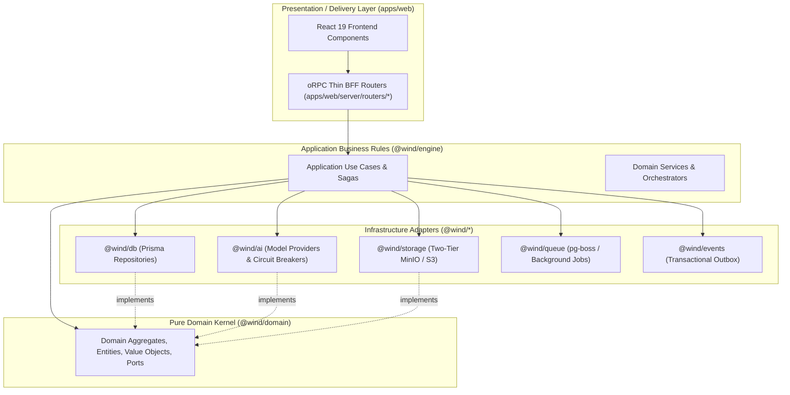

# ⚡ The API Layer: Type-Safe oRPC Architecture (Clean BFF Controller)

The Wind Comic API layer is powered by **oRPC**. In strict adherence to Clean Architecture, `apps/web` is **not** the center of the domain; it serves strictly as a **Delivery Mechanism and Presentation Layer (Backend-for-Frontend / BFF)**.

Every oRPC procedure functions as an **Inbound Primary Adapter (Thin Controller)**:
1. Validates input and output schemas via immutable Zod contracts (`@wind/zod`).
2. Extracts session identity and verifies resource permissions (`@wind/auth`).
3. Delegates business execution directly to Application Use Cases (`@wind/engine`).
4. Maps pure Domain Exceptions into strongly typed HTTP/RPC error codes.

The API exposes two protocols from unified procedure definitions:
1. **RPC Protocol** (`/api/orpc/rpc/*`): High-throughput type-safe RPC consumed by the internal React frontend via `@orpc/client` and TanStack Query.
2. **OpenAPI REST Protocol** (`/api/orpc/rest/*`): Standard RESTful JSON endpoints with auto-generated OpenAPI 3.1 documentation for external integration.

---

## 1. Clean Architecture & Monorepo Stratification

The dependency flow is strictly unidirectional inward toward the domain core. Outer delivery layers know about use cases, but the domain and use cases have zero awareness of oRPC, HTTP, or Next.js:



### Monorepo File Stratification

| File | Layer | Architectural Responsibility |
| :--- | :--- | :--- |
| `apps/web/server/orpc.ts` | Presentation / BFF | Base oRPC builder (`os`), context extraction, and procedure middlewares (`authed`, `projectMember`). |
| `apps/web/server/router.ts` | Presentation / BFF | Root `appRouter` aggregating all thin BFF sub-routers. |
| `apps/web/server/routers/*` | Presentation / BFF | Thin BFF Controllers (`script`, `storyboard`, `generation`, `editing`, etc.). Max 300 LOC each. |
| `apps/web/app/api/orpc/[...orpc]/route.ts` | Presentation / BFF | Next.js route handler mounting `/api/orpc/rpc` and `/api/orpc/rest`. |
| `apps/web/lib/orpc-client.ts` | Presentation / BFF | Client-side typed `client` and TanStack Query hooks. |
| `@wind/engine` | Application Business Rules | Pure TypeScript Use Cases (`CreateProjectUseCase`), Sagas, and Orchestrators (`HybridOrchestrator`). |
| `@wind/domain` | Pure Domain Kernel | Entities (`Project`, `Character`, `Shot`), Aggregate Roots, Branded Types, Domain Events, and Port Interfaces. |
| `@wind/db`, `@wind/ai`, `@wind/storage` | Infrastructure Adapters | Concrete implementations of domain ports (Repositories, AI Engine Factories, Cloud Storage). |

---

## 2. Calling from the Client

```typescript
import { client, orpc } from "@/lib/orpc-client";

const { presets, categories, total } = await client.catalogs.styles({
  withArtwork: true,
});

const { data, isLoading } = orpc.catalogs.styles.useQuery({
  withArtwork: true,
});
```

---

## 3. Thin Controller Implementation Pattern

oRPC router handlers must remain pure controllers. All business logic, transaction boundaries, and orchestration reside inside `@wind/engine` Use Cases.

```typescript
import { ORPCError } from "@orpc/server";
import { authedProcedure } from "../orpc";
import { createProjectInputSchema, projectSummarySchema } from "@wind/zod";
import { CreateProjectUseCase } from "@wind/engine";
import { 
  InsufficientCreditsException, 
  DuplicateProjectTitleException,
  CharacterNotFoundException 
} from "@wind/domain";

export const createProjectProcedure = authedProcedure
  .input(createProjectInputSchema)
  .output(projectSummarySchema)
  .mutation(async ({ input, context }) => {
    try {
      const useCase = context.container.resolve(CreateProjectUseCase);
      const result = await useCase.execute({
        userId: context.session.user.id,
        title: input.title,
        prompt: input.prompt,
        aspectRatio: input.aspectRatio,
        characterId: input.characterId,
      });

      return result;
    } catch (error) {
      if (error instanceof InsufficientCreditsException) {
        throw new ORPCError({
          code: "PAYMENT_REQUIRED",
          message: error.message,
        });
      }

      if (error instanceof DuplicateProjectTitleException) {
        throw new ORPCError({
          code: "CONFLICT",
          message: error.message,
        });
      }

      if (error instanceof CharacterNotFoundException) {
        throw new ORPCError({
          code: "NOT_FOUND",
          message: error.message,
        });
      }

      throw error;
    }
  });
```

---

## 4. Server-Side Procedure Invocations

Procedures can be invoked directly server-side within the Next.js process without an HTTP network hop:

```typescript
import { call } from "@orpc/server";
import { appRouter } from "@/server/router";

const result = await call(
  appRouter.catalogs.styles,
  { withArtwork: false },
  { context },
);
```

---

## 5. Domain Exception to HTTP Status Mapping

oRPC routers translate pure Domain Exceptions raised by `@wind/engine` into standardized RPC/HTTP statuses:

| Domain Exception | oRPC Error Code | HTTP Status | Description |
| :--- | :--- | :--- | :--- |
| `EntityNotFoundException` | `NOT_FOUND` | `404 Not Found` | Requested Project, Episode, Shot, or Asset does not exist. |
| `InsufficientCreditsException` | `PAYMENT_REQUIRED` | `402 Payment Required` | User lacks credits for two-phase hold reservation. |
| `ConcurrentModificationException` | `CONFLICT` | `409 Conflict` | Optimistic Concurrency Control (OCC) version mismatch. |
| `UnauthorizedAccessException` | `FORBIDDEN` | `403 Forbidden` | User does not own the project or organization resource. |
| `InvalidStateTransitionException` | `BAD_REQUEST` | `400 Bad Request` | Illegal state machine transition requested. |
| `CameoThresholdDegradedException` | `UNPROCESSABLE_CONTENT` | `422 Unprocessable` | Facial similarity cosine metric below quality threshold. |
| `CircuitBreakerOpenException` | `SERVICE_UNAVAILABLE` | `503 Service Unavailable` | Downstream external AI provider circuit breaker is open. |

---

## 6. Strict Prohibitions & Architectural Rules

1. **Thin Orchestrators Only:** Routers strictly validate schemas via Zod, authenticate users, authorize ownership, delegate execution to `@wind/engine` Use Cases, and map domain errors to HTTP statuses.
2. **Zero Direct Persistence in Routers:** Direct invocation of Prisma (`prisma.<model>.*`) or direct calls to database repositories (`@wind/db/repos/*`) inside router files is strictly prohibited. Persistence is injected exclusively into `@wind/engine` Use Cases.
3. **Zero Media or Binary Operations:** Invoking FFmpeg, sharp, libass, canvas, or audio decoders inside oRPC router handlers is strictly prohibited. Media operations are handled by dedicated background workers (`@wind/worker`) or engine services.
4. **Zero AI Provider Invocations:** Direct calls to OpenAI, Gemini, ComfyUI, Fal, or Replicate SDKs from routers are strictly prohibited. AI interactions are managed by `@wind/ai` adapters through `@wind/engine`.
5. **Strict Line Count Ceiling:** No oRPC router or sub-router file may exceed **300 lines of code**. Routers exceeding this limit must decompose procedures into cohesive sub-routers.
6. **Monorepo Boundary Direction:** Presentation routers reside in `apps/web/server/routers/` and may import `@wind/engine`, `@wind/domain`, `@wind/zod`, and `@wind/auth`. Packages inside `packages/*` must never import from `apps/web`.
