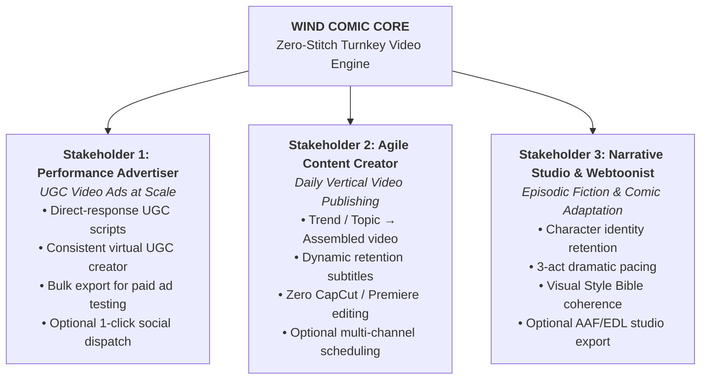

# 🎯 Core Premises, System Mandate & Stakeholder Triptych

## 1. The Foundational Premise (The Architectural Core Mandate)

Modern generative AI video tools suffer from severe workflow fragmentation rather than an absence of generative capability. A creator attempting to produce a finished vertical video today is forced through a fragmented multi-tool pipeline:

1. Writing a prompt/script in a conversational LLM.
2. Generating disconnected 4–5 second silent video clips in separate models (Runway, Kling, Sora, Google Flow).
3. Synthesizing voiceover in a standalone TTS service (ElevenLabs).
4. Sourcing background music from third-party libraries.
5. Manually stitching clips, synchronizing speech, aligning audio transients, and burning subtitles inside external NLE software (CapCut, Premiere Pro, DaVinci Resolve).

This fragmentation creates high cognitive overhead, stochastic visual drift (characters and creators altering appearance across cuts), and prohibitive manual assembly times.

### The System Core Definition

> **Wind Comic Core Mandate:**  
> A **Zero-Stitch Finished Video Engine**.  
> The core system accepts a minimal input (a prompt, a product URL, a brief, or an idea) and deterministically outputs a **complete, fully-assembled vertical video** (`final.mp4`) containing:
>
> 1. An intention-aware structured script.
> 2. Visually consistent characters or virtual creators across every cut.
> 3. Synchronized speech, narration, or dialogue (TTS).
> 4. Balanced background audio with automatic ducking.
> 5. Formatted, beat-synchronized dynamic subtitles with zero garbled glyphs.

The delivery of a ready-to-watch, fully-assembled video is the **indivisible core**. Downstream social distribution, non-linear editing, and multi-track timelines are optional modular extensions built on top of this foundation.

---

## 2. Core vs. Feature Boundary Matrix

```
┌────────────────────────────────────────────────────────────────────────┐
│                        THE INDIVISIBLE CORE                            │
│                                                                        │
│   User Input (Idea / Script / Product URL / Brief)                     │
│          │                                                             │
│          ▼                                                             │
│   Script & Narrative Structuring (McKee / Direct-Response UGC)         │
│          │                                                             │
│          ▼                                                             │
│   Consistent Visual Cast (Style Bible Key-Art & Character DNA)         │
│          │                                                             │
│          ▼                                                             │
│   Full Audiovisual Assembly (Video + Voice + BGM + Burned Subtitles)   │
│          │                                                             │
│          ▼                                                             │
│   Composited Finished Video (`final.mp4`)                              │
└──────────────────────────────────┬─────────────────────────────────────┘
                                   │
                     Modular Downstream Features:
                                   │
         ┌─────────────────────────┼─────────────────────────┐
         ▼                         ▼                         ▼
[ SOCIAL PUBLISHING ]     [ NLE & TIMELINE ]        [ AD OPTIMIZATION ]
• 1-Click Postiz Publish  • Multi-track timeline    • Bulk A/B hook variants
• TikTok / IG / YouTube   • AAF / EDL / FCPXML      • Safe-area masking
• Scheduled delivery      • Real-time presence      • -14 LUFS normalization
```

| Dimension                             | In the Core?   | Feature / Extension? | Rationale                                                                                                                                                                                   |
| :------------------------------------ | :------------- | :------------------- | :------------------------------------------------------------------------------------------------------------------------------------------------------------------------------------------ |
| **Finished MP4 Assembly**             | **YES (CORE)** | —                    | The fundamental contract is delivering an assembled, watchable video without external manual editing.                                                                                       |
| **Character Vault & DNA Lock**        | **YES (CORE)** | —                    | Global `Character` Aggregate Root ensuring visual continuity across multi-shot cuts and multiple projects/episodes.                                                                         |
| **Intent-Aware Scripting Strategy**   | **YES (CORE)** | —                    | Pluggable `ScriptingStrategy` (UGC Direct-Response, McKee 3-Act, Journalistic Explainer) matching stakeholder narrative rhythm.                                                             |
| **Synchronized Audio & Subtitles**    | **YES (CORE)** | —                    | Integrated voiceover, BGM ducking, and libass subtitle burning eliminate manual NLE work.                                                                                                   |
| **Two-Phase Financial Hold**          | **YES (CORE)** | —                    | Prevents PostgreSQL pool starvation during long GPU inference runs (Hold $\to$ Settle/Release).                                                                                             |
| **Shot Idempotency & Reentrancy**     | **YES (CORE)** | —                    | Deterministic hash caching allowing seamless worker resumption without re-rendering or double-charging.                                                                                     |
| **Three-Tier CAS Storage Lifecycle**  | **YES (CORE)** | —                    | Automatic 24h TTL on ephemeral render scraps (`scratch/`), reserving permanent storage for vault assets (`vault/`) and production deliverables (`releases/`).                               |
| **Social Media Auto-Publishing**      | NO             | **YES (FEATURE)**    | Publishing to TikTok, Instagram, or YouTube via `SocialPublishingPort` (e.g. Postiz adapter) is strictly an optional, decoupled feature (`RF-FEAT-01`). Social API errors never fail video. |
| **Manual Multi-Track Timeline**       | NO             | **YES (FEATURE)**    | Optional human-in-the-loop granular adjustment; the pipeline completes zero-touch generation without it.                                                                                    |
| **Professional NLE Export (AAF/EDL)** | NO             | **YES (FEATURE)**    | Studio interchange format for high-end colorists and sound designers.                                                                                                                       |
| **Bulk Hook Variant Generation**      | NO             | **YES (FEATURE)**    | Specialized performance marketing tool for A/B creative testing.                                                                                                                            |

---

## 3. Epistemological Stratification: Cognitive Autonomous AI Agents vs. Deterministic Processing Services

To eliminate the industry-wide phenomenon of **semantic inflation**—where routine procedural transformations, single API wrappers, or CLI utilities are erroneously labeled as "AI Agents"—Wind Comic establishes a rigorous, scientifically grounded distinction between **Cognitive Autonomous AI Agents** and **Deterministic Processing Services**.

```
┌────────────────────────────────────────────────────────────────────────────────────────┐
│                        COGNITIVE DELIBERATION LAYER (AUTONOMOUS AGENTS)                │
│                                                                                        │
│   Creative Brief / User Intent                                                         │
│         │                                                                              │
│         ▼                                                                              │
│   ┌───────────────────────────┐     Actor-Critic Loop     ┌────────────────────────┐   │
│   │     ScreenwriterAgent     │ ◄───────────────────────► │  NarrativeCriticAgent  │   │
│   │          (Actor)          │   Tension & Hook Feedback │        (Critic)        │   │
│   └─────────────┬─────────────┘                           └────────────────────────┘   │
│                 │                                                                      │
│                 ▼ Emits Approved, Validated Contract                                   │
│   ┌────────────────────────────────────────────────────────────────────────────────┐   │
│   │         ScreenplayManifest (Immutable ScriptShot[] with Budgets & Cues)        │   │
│   └────────────────────────────────────────┬───────────────────────────────────────┘   │
└────────────────────────────────────────────┼───────────────────────────────────────────┘
                                             │ Saga Handoff
┌────────────────────────────────────────────▼───────────────────────────────────────────┐
│                    DETERMINISTIC PROCESSING LAYER (MEDIA SERVICES)                     │
│                                                                                        │
│         ┌──────────────────────────────────┴──────────────────────────────────┐        │
│         ▼                                                                     ▼        │
│  [ VoiceSynthesisService ]                                            [ ImageGenerationService ]
│  • Dialogue → Phoneme Timings                                         • ControlNet / IP-Adapter
│  • Edge-TTS / ElevenLabs Audio                                        • Deterministic Hash Cache
│         │                                                                     │        │
│         └──────────────────────────────────┬──────────────────────────────────┘        │
│                                            ▼                                           │
│                             [ TimelineCompositionEngine ]                              │
│                             • Multi-track timeline assembly                            │
│                             • Beat-aligned cutting & BGM ducking                       │
│                             • libass dynamic subtitle compilation                      │
│                                            │                                           │
│                                            ▼                                           │
│                              [ MediaTranscodeService ]                                 │
│                              • FFmpegCommandBuilder hardware pipeline                  │
│                              • Container muxing & ffprobe compliance                   │
│                                            │                                           │
│                                            ▼                                           │
│                             Finished Video (`final.mp4`)                               │
└────────────────────────────────────────────────────────────────────────────────────────┘
```

### 3.1 The Scientific Criteria for Cognitive Autonomous AI Agency

Following foundational artificial intelligence literature (Russell & Norvig, 2020; Wooldridge, 2009; Franklin & Graesser, 1996), an entity qualifies as a **Cognitive Autonomous AI Agent** within Wind Comic if and only if it satisfies four non-negotiable criteria:

1. **Perception ($P$):** The entity ingests, interprets, and maintains an evolving model of an open, multi-modal context (e.g., Story Brief, Story Bible, Character DNA traits, Voice Fingerprints, Scene Budgets).
2. **Teleological Orientation (Goals $G$):** The entity pursues explicit, non-linear, dramatic and engagement objectives (e.g., achieving monotonic tension growth, resolving narrative conflict arcs, or sustaining direct-response hook retention $\ge 80\%$).
3. **Autonomous Deliberation & Reasoning ($D$):** The entity exhibits non-deterministic problem-solving and generative planning powered by Large Language Model (LLM) inference, utilizing the GoF Strategy Pattern (`IScriptingStrategy`: `DirectResponseUgcStrategy`, `McKeeThreeActStrategy`, `JournalisticExplainerStrategy`) to dynamically navigate dramatic possibilities.
4. **Closed-Loop Evaluative Dialectic ($E$):** The entity operates inside a closed **Actor-Critic evaluation loop** (`ScreenwriterAgent` $\leftrightarrow$ `NarrativeCriticAgent`). Candidate artifacts are audited against quantitative and qualitative heuristics (Hook Retention Score $H$, McKee Tension Gradient $T$, Dialogue-to-Action Density $D$). If criteria fail, the Critic issues structured critique vectors that compel the Actor to execute targeted, goal-directed rewrites prior to contract commitment.

### 3.2 The Formal Definition of Deterministic Processing Services

Operations that transform, synthesize, transcode, or stitch media deterministically are **Deterministic Processing Services**. They are defined as bounded mathematical transformation functions:

$$f: X \times \Theta \to Y$$

where $X$ represents input data artifacts, $\Theta$ denotes execution parameters and configuration vectors, and $Y$ is the synthesized media output.

A processing service possesses:

- **Zero Teleological Agency:** It does not define dramatic goals, question artistic intent, or arbitrate conflict arcs.
- **Procedural Determinism:** Given identical inputs, seeds, and model weights, its output is strictly reproducible.
- **Stateless or Transactional Scope:** It operates as an idempotent task worker within the background queue (`@wind/worker`), guarded by deterministic cache hashes (`hash(prompt, characterDnaId, seed, cameraMove)`).

Muxing audio streams, invoking an image diffusion checkpoint, requesting TTS audio from a provider, or burning subtitles via FFmpeg is strictly a procedural transformation, **not** an agent action.

### 3.3 Epistemological Boundary Matrix

| Dimension                   | Cognitive Autonomous AI Agent                                   | Deterministic Processing Service                                                                        |
| :-------------------------- | :-------------------------------------------------------------- | :------------------------------------------------------------------------------------------------------ |
| **System Identity**         | `ScreenwriterAgent`, `NarrativeCriticAgent`                     | `VoiceSynthesisService`, `ImageGenerationService`, `TimelineCompositionEngine`, `MediaTranscodeService` |
| **Primary Responsibility**  | Dramatic reasoning, narrative structuring, pacing critique      | Media transformation, acoustic synthesis, timeline assembly, hardware transcode                         |
| **Execution Paradigm**      | Non-deterministic, generative, heuristic LLM deliberation       | Procedural, repeatable, mathematically bounded algorithmic execution                                    |
| **Input / Perception**      | Story Brief, Story Bible, Scene Budgets, Voice Fingerprints     | Structured schemas: text strings, timestamps, image latents, media paths                                |
| **Internal Teleology**      | Resolving dramatic tension, maximizing viewer retention         | Executing requested transcode, synthesis, or muxing with zero loss                                      |
| **Evaluation Mechanism**    | Actor-Critic dialectic loop with iterative rewrite feedback     | Deterministic assertions, schema validation, and `ffprobe` stream compliance                            |
| **Failure Mode**            | Pacing deficit, hook fatigue, narrative incoherence (Cognitive) | HTTP timeout, GPU VRAM OOM, invalid codec parameter (Infrastructure)                                    |
| **Concurrency & Lifecycle** | Fast token generation within interactive/worker boundary        | Bulkhead-isolated background queue workers (`@wind/worker`)                                             |

### 3.4 Formal Catalog of Subsystem Components

#### Cognitive Autonomous AI Agents

- **`ScreenwriterAgent` (The Generative Actor):** Ingests creative input, selects the appropriate `IScriptingStrategy`, and structures the scene breakdown, shot visual prompts, character dialogue, and emotional cadence.
- **`NarrativeCriticAgent` (The Evaluative Critic):** Audits candidate screenplays against pacing benchmarks, hook retention algorithms ($H \ge 80$), and McKee dramatic curves, returning quantitative defect vectors that trigger targeted rewrites.

#### Deterministic Processing Services

- **`VoiceSynthesisService`:** Ingests dialogue strings and voice profile identifiers; interfaces with TTS engines (ElevenLabs, Edge-TTS); calculates acoustic durations and extracts word-level phoneme timestamps.
- **`ImageGenerationService`:** Ingests scene visual prompts, camera specifications, and Character DNA latent references; invokes diffusion backends (ComfyUI, SDXL, Fal) with deterministic hash caching.
- **`TimelineCompositionEngine`:** Ingests audio stems, visual clips, and script cues; aligns cuts to acoustic beat transients; computes sidechain audio ducking; and generates libass subtitle streams.
- **`MediaTranscodeService`:** Encapsulates `FFmpegCommandBuilder` to execute hardware-accelerated video scaling, filter graph processing, audio-video container muxing, and `ffprobe` stream integrity validation.

---

## 4. The Stakeholder Triptych

The system architecture is engineered to serve three distinct primary stakeholders whose workflows share the same core requirement: **complete video assembly without manual clip stitching**.



### 4.1 Stakeholder 1: The Performance Advertiser & E-Commerce Operator (UGC Video Ads)

- **Profile:** Media buyers, direct-to-consumer (DTC) e-commerce founders, and affiliate performance marketers running paid traffic on TikTok Ads, Meta Ads (Reels), and YouTube Shorts.
- **Job-To-Be-Done (JTBD):** _"When launching or scaling an ad campaign, I need to produce 20 to 50 UGC-style video variations with consistent creators and varied sales angles in 24 hours, so I can combat ad fatigue and identify winning creatives without spending thousands of dollars on physical content creators."_
- **Core Value Realized:** Eliminates the \$500–\$2,000 per-video creator fee and 2-week turnaround. The cognitive `ScreenwriterAgent` and `NarrativeCriticAgent` synthesize and audit high-retention direct-response structures (Hook $\to$ Problem $\to$ Solution $\to$ Social Proof $\to$ CTA), while deterministic services produce consistent creator visuals, voiceover, and burned dynamic subtitles into ready-to-run video ad creatives.

### 4.2 Stakeholder 2: The Agile Content Creator & Social Publisher (Automated Media)

- **Profile:** Digital creators, brand social media managers, and vertical channel operators publishing daily short-form video on TikTok, Instagram Reels, and YouTube Shorts (explainer channels, news summaries, technology, personal finance).
- **Job-To-Be-Done (JTBD):** _"When a breaking topic or trending story occurs, I need to turn a text summary or script into an engaging, captioned vertical video in under 10 minutes, so I can capture audience attention immediately without spending hours manually editing clips in CapCut."_
- **Core Value Realized:** Eliminates the manual "stitching loop". The creator inputs a topic; the cognitive agents deliberate and structure the script; the deterministic services produce natural voiceover, contextual visual shots, beat-aligned music ducking, and styled subtitles. The resulting video can be downloaded immediately or dispatched via the optional Postiz publisher.

### 4.3 Stakeholder 3: The Narrative Studio, Webtoon Creator & Indie Filmmaker (Serialized Storytelling)

- **Profile:** Comic book writers, webtoon artists adapting 2D panels into motion shorts, and independent short-drama producers creating episodic vertical content.
- **Job-To-Be-Done (JTBD):** _"When producing serialized drama episodes, I need characters and art styles to maintain strict visual consistency across every scene and episode, so the narrative holds audience suspension of disbelief."_
- **Core Value Realized:** Solves the stochastic diffusion lottery. The cognitive agents plan three-act dramatic arcs and character beats, while the `ImageGenerationService` locks overarching scene aesthetics and Character DNA across dozens of consecutive shots.

### 4.4 Industry Inspiration & Architectural Benchmarks

To achieve parity with commercial state-of-the-art solutions across each stakeholder segment, Wind Comic synthesizes foundational architectural paradigms from three industry pioneers:

1. **TopView.ai (E-Commerce Video Ad Automation):**
   - **Inspiration & Parity Target:** Powers Stakeholder 1 (Performance Advertisers) and the Commercial Ad Factory. Wind Comic adopts TopView's turnkey product-to-ad paradigm: product URL scraping (Amazon, Shopify), high-converting direct-response scripting frameworks (PAS, AIDA, Unboxing, Viral Hook Matrix), dynamic motion-graphics overlays (star ratings, price tags, discount stickers, CTA badges), and bulk A/B creative hook generation.
2. **HeyGen (Photorealistic Digital Twins & Global Dubbing):**
   - **Inspiration & Parity Target:** Powers Stakeholder 2 (Agile Publishers) and virtual creator pipelines. Wind Comic adopts HeyGen's high-fidelity facial retargeting, neural lipsync driving (`INeuralMotionProvider` with LivePortrait and MuseTalk), expressiveness and gaze preservation, and multilingual voice-cloned video-to-video dubbing.
3. **Runway (Cinematic Control & Latent Bridging):**
   - **Inspiration & Parity Target:** Powers Stakeholder 3 (Narrative Studios) and cinematic scene composition. Wind Comic adopts Runway's camera trajectory steering (`CameraCtrl` pose vectors, motion curves), dual-keyframe latent bridging (First-Last-Frame DiT interpolation via Wan2.1 and CogVideoX strategies), and webcam-driven performance capture (Act-One style motion retargeting).

---

## 5. Requirements Engineering & Traceability

For the full formal specification of Functional Requirements, Non-Functional Quality Attributes (ISO/IEC 25010), architectural UML models, and the bidirectional engineering traceability matrix, see:

- [foundation-constitution.md](./foundation-constitution.md) — The master academic monograph, epistemological framework (DSR), and foundational constitution.
- [requirements-matrix.md](./requirements-matrix.md) — ISO/IEC/IEEE 29148 requirements specification and bidirectional traceability matrix.
- [system-models.md](./system-models.md) — Formal UML class diagrams, Saga sequence diagrams, finite state machines, and deployment topologies.
