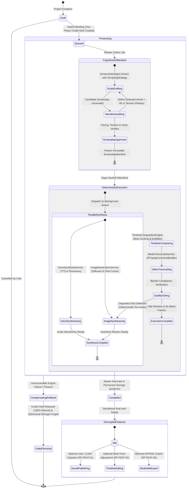
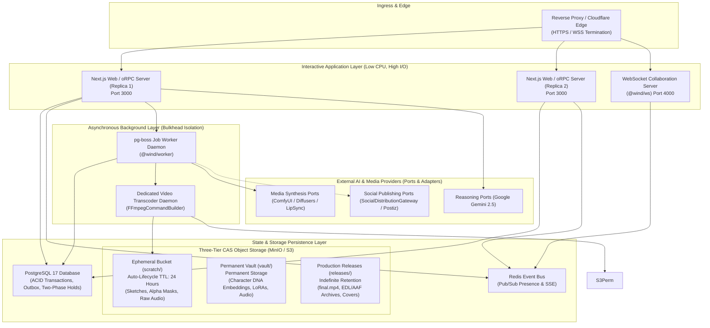

# 📊 Formal System Models & Architecture Diagrams (UML & SysML)

This document provides the formal software engineering models for **Wind Comic** (v12.320), establishing rigorous architectural specifications for academic review (TCC / Capstone) and engineering governance.

All models adhere to the **Engineering Constitution** ([`../architecture/engineering-constitution.md`](../architecture/engineering-constitution.md)) and the **Foundational Constitution** ([`./foundation-constitution.md`](./foundation-constitution.md)).

---

## 1. Domain Class Diagram (Domain-Driven Design & Primitive Obsession Elimination)

```mermaid
classDiagram
    direction TB

    class Project {
        +ProjectId id
        +UserId userId
        +string title
        +string description
        +string status
        +string styleId
        +string aspect
        +CharacterId primaryCharacterId
        +DateTime createdAt
        +DateTime updatedAt
        +createEpisode(number) Episode
        +bindCharacter(CharacterId) void
    }

    class Character {
        <<AggregateRoot>>
        +CharacterId id
        +UserId ownerId
        +string name
        +CharacterDna dna
        +string voiceProfileId
        +DateTime createdAt
        +verifyContinuity(float[] currentEmbedding) float
    }

    class CharacterDna {
        <<ValueObject>>
        +string faceFeatures
        +string hairStyle
        +string wardrobe
        +string colorPalette
        +float[] embeddingVector
        +computeCosineSimilarity(float[]) float
    }

    class Episode {
        +EpisodeId id
        +ProjectId projectId
        +int episodeNumber
        +string title
        +ScriptShot[] shots
        +DateTime createdAt
    }

    class ScriptShot {
        +ShotId id
        +EpisodeId episodeId
        +int sequenceIndex
        +string characterName
        +string dialogue
        +string visualPrompt
        +string cameraMovement
        +DurationMs duration
        +EmotionScore emotionScore
        +LipSyncData lipSync
        +computeIdempotencyKey() string
    }

    class CreditHold {
        +HoldId id
        +UserId userId
        +CreditAmount amount
        +HoldStatus status
        +DateTime createdAt
        +settle() void
        +release() void
    }

    class PipelineRun {
        +RunId id
        +ProjectId projectId
        +UserId userId
        +string state
        +string step
        +int attempts
        +string lastError
        +DateTime startedAt
        +DateTime finishedAt
        +transitionTo(string) void
    }

    class IScriptingStrategy {
        <<interface>>
        +generateScenes(string prompt, Briefing brief) ScriptShot[]
    }

    class DirectResponseUgcStrategy {
        +generateScenes(string prompt, Briefing brief) ScriptShot[]
    }

    class McKeeThreeActStrategy {
        +generateScenes(string prompt, Briefing brief) ScriptShot[]
    }

    class JournalisticExplainerStrategy {
        +generateScenes(string prompt, Briefing brief) ScriptShot[]
    }

    class IProjectRepository {
        <<interface>>
        +findById(ProjectId) Project
        +save(Project) void
        +updateWithOcc(Project, int expectedVersion) void
        +deleteCascade(ProjectId) void
    }

    class ICharacterRepository {
        <<interface>>
        +findById(CharacterId) Character
        +save(Character) void
        +listByUser(UserId) Character[]
    }

    class ICreditHoldRepository {
        <<interface>>
        +createHold(UserId, CreditAmount) CreditHold
        +settleHold(HoldId) void
        +releaseHold(HoldId) void
    }

    class ScreenwriterAgent {
        <<CognitiveAgent (Actor)>>
        -IScriptingStrategy strategy
        +deliberate(CreativeBrief, StoryBible) CandidateScreenplay
        +executeTargetedRewrite(CritiqueVector) CandidateScreenplay
    }

    class NarrativeCriticAgent {
        <<CognitiveAgent (Critic)>>
        +evaluate(CandidateScreenplay) CritiqueResult
        +computeHookScore(ScriptShot) float
        +auditTensionGradient(ScriptShot[]) float
        +verifyVoiceConsistency(ScriptShot[], VoiceFingerprint) float
    }

    class VoiceSynthesisService {
        <<ProcessingService>>
        +synthesizeDialogue(string text, string voiceId) AudioStem
    }

    class ImageGenerationService {
        <<ProcessingService>>
        +generateKeyframe(string prompt, CharacterDna dna, int seed) ImageRaster
    }

    class TimelineCompositionEngine {
        <<ProcessingService>>
        +assembleTracks(ScriptShot[], AudioStem[]) TimelineManifest
        +applyBgmDucking(AudioStem bgm, AudioStem dialogue) AudioStem
        +generateSubtitles(ScriptShot[]) SubtitleAss
    }

    class MediaTranscodeService {
        <<ProcessingService>>
        -FFmpegCommandBuilder ffmpegBuilder
        +renderMasterMp4(TimelineManifest) VideoResult
        +verifyCompliance(string mp4Path) ComplianceResult
    }

    class HybridOrchestrator {
        <<Facade>>
        -IProjectRepository projectRepo
        -ICharacterRepository characterRepo
        -ICreditHoldRepository creditHoldRepo
        -ScreenwriterAgent writerAgent
        -NarrativeCriticAgent criticAgent
        -VoiceSynthesisService voiceService
        -ImageGenerationService imageService
        -TimelineCompositionEngine timelineEngine
        -MediaTranscodeService transcodeService
        +executeCreationPipeline(CreativeIdea) VideoResult
        +retryDegradedShot(ShotId) ShotResult
    }

    Project "1" *-- "many" Episode : contains
    Episode "1" *-- "many" ScriptShot : breaks down into
    Project "many" --> "1" Character : references
    Character "1" *-- "1" CharacterDna : encapsulates
    Project "1" --> "many" PipelineRun : tracks
    Project "1" ..> CreditHold : guarantees payment via
    IScriptingStrategy <|.. DirectResponseUgcStrategy : implements
    IScriptingStrategy <|.. McKeeThreeActStrategy : implements
    IScriptingStrategy <|.. JournalisticExplainerStrategy : implements
    ScreenwriterAgent ..> IScriptingStrategy : executes
    ScreenwriterAgent "1" <--> "1" NarrativeCriticAgent : Actor-Critic dialectic loop
    HybridOrchestrator ..> ScreenwriterAgent : orchestrates
    HybridOrchestrator ..> NarrativeCriticAgent : orchestrates
    HybridOrchestrator ..> VoiceSynthesisService : dispatches audio
    HybridOrchestrator ..> ImageGenerationService : dispatches frames
    HybridOrchestrator ..> TimelineCompositionEngine : dispatches timeline
    HybridOrchestrator ..> MediaTranscodeService : dispatches transcode
    HybridOrchestrator ..> IProjectRepository : interacts
    HybridOrchestrator ..> ICharacterRepository : interacts
    HybridOrchestrator ..> ICreditHoldRepository : manages two-phase hold
```

The core domain model encapsulates video project aggregates, scriptboards, character DNA consistency vaults, financial credit holds, and execution runs. All entities utilize TypeScript **Branded Types** (`Brand<K, T>`) to eradicate primitive obsession.

---

## 2. Distributed Saga Orchestrator Sequence Diagram (Two-Phase Hold & Reentrant Checkpoint)

Multi-stage creation pipelines (_Cognitive Deliberation $\to$ Deterministic Audio/Visual Synthesis $\to$ Timeline Assembly $\to$ Transcoding_) operate as an orchestrated Saga with forward recovery, deterministic shot idempotency, and non-blocking Two-Phase Financial Holds.

```mermaid
sequenceDiagram
    autonumber
    actor Showrunner as Showrunner (Client UI)
    participant Router as oRPC Thin Router (BFF Controller)
    participant UseCase as CreateProjectUseCase (@wind/engine)
    participant Ledger as Financial Ledger (@wind/db)
    participant Saga as CreationSagaOrchestrator (@wind/engine)
    participant Outbox as Transactional Outbox (@wind/events)
    participant Writer as ScreenwriterAgent (Actor)
    participant Critic as NarrativeCriticAgent (Critic)
    participant VoiceSvc as VoiceSynthesisService (@wind/ai)
    participant ImageSvc as ImageGenerationService (@wind/ai)
    participant TimelineEng as TimelineCompositionEngine (@wind/worker)
    participant TranscodeSvc as MediaTranscodeService (@wind/worker)
    participant S3Temp as MinIO Ephemeral Scratch (scratch/)
    participant S3Vault as MinIO Permanent Library (vault/)
    participant S3Rel as MinIO Deliverables Store (releases/)
    participant Social as SocialDistributionGateway (RF-FEAT-01)

    Showrunner->>Router: createProject(prompt, brief, mode)
    Router->>UseCase: execute(validatedCommand)
    UseCase->>Ledger: Phase 1: Atomic Fast Hold (INSERT credit_holds status='HELD', 5ms)
    Ledger-->>UseCase: Hold Created (HoldId, OK)
    UseCase->>Outbox: INSERT INTO outbox (PipelineDispatchedEvent)
    UseCase->>Saga: dispatchPipeline(ProjectId, userId, HoldId)
    UseCase-->>Router: DispatchedResult(PipelineRunId, StreamToken)
    Router-->>Showrunner: HTTP 202 Accepted (PipelineRunId, SSE Stream)

    rect rgb(20, 35, 20)
        Note over Saga, Critic: Stage 1: Cognitive Deliberation (Actor-Critic Closed Loop)
        Saga->>Writer: deliberate(Brief, StoryBible, IScriptingStrategy)
        loop Dialectic Evaluation (Max 3 Iterations)
            Writer->>Critic: evaluate(CandidateScreenplay)
            Critic->>Critic: computeMetrics(Hook >= 80, TensionGradient, Voice)
            alt Defect Detected (Score < Threshold)
                Critic-->>Writer: CritiqueVector(TargetedRewrites, Hints)
                Writer->>Writer: executeTargetedRewrite(CritiqueVector)
            else Quality Benchmark Met
                Critic-->>Writer: Approved(ScreenplayManifest)
            end
        end
        Writer-->>Saga: ScreenplayManifest (Immutable ScriptShot[] + Audio Cues)
        Saga->>Outbox: UPDATE pipeline_runs (step='screenplay_approved')
    end

    rect rgb(20, 35, 45)
        Note over Saga, S3Temp: Stage 2: Deterministic Asset Synthesis (Parallel Queues)
        par Voice & Sound Generation
            Saga->>VoiceSvc: synthesizeDialogue(manifest.shots)
            VoiceSvc-->>Saga: AudioStems (speech.mp3 + phonemeTimestamps)
        and Visual Keyframe Generation
            loop For each ScriptShot
                Saga->>S3Temp: Check IdempotencyKey(hash(prompt, dna, seed))
                alt Cache Hit (Already Rendered)
                    S3Temp-->>Saga: Keyframe Cached (Skip GPU)
                else Cache Miss (Render Needed)
                    Saga->>ImageSvc: generateKeyframe(visualPrompt, CharacterDNA)
                    ImageSvc-->>Saga: Frame Rendered
                    Saga->>S3Temp: Store Intermediate Keyframe
                end
            end
        end
    end

    alt Success Scenario: Turnkey Video Assembled
        rect rgb(35, 25, 45)
            Note over Saga, TranscodeSvc: Stage 3: Deterministic Timeline Assembly & Video Transcode
            Saga->>TimelineEng: assembleTimeline(shots, audioStems, audioCues)
            TimelineEng->>TimelineEng: alignBeatsDuckingAndSubtitles(libassSubtitles)
            TimelineEng-->>Saga: TimelineManifestReady
            Saga->>TranscodeSvc: renderMasterMp4(TimelineManifest, FFmpegCommandBuilder)
            TranscodeSvc->>S3Perm: Write final.mp4 + cover.jpg
            TranscodeSvc-->>Saga: Composited MP4 Verified (ffprobe OK)
        end
        Saga->>Ledger: Phase 2: Atomic Settle (UPDATE credit_holds SET status='SETTLED', 5ms)
        Ledger-->>Saga: Credits Consumed
        Saga->>Outbox: UPDATE pipeline_runs (state='completed')
        Saga-->>Showrunner: SSE Event: COMPLETED (Download URL for final.mp4)

        opt Downstream Social Publishing (Optional RF-FEAT-01, Fully Decoupled)
            Showrunner->>Social: 1-Click Publish Request (TikTok / IG / YouTube)
            Social-->>Showrunner: Dispatched (Non-blocking)
        end

    else Terminal Failure Scenario: Media Provider Exhaustion
        ImageSvc-->>Saga: 503 Service Unavailable / CircuitBreaker OPEN
        Note over Saga, Ledger: COMPENSATING TRANSACTIONS (Saga Rollback)
        Saga->>Ledger: Phase 2: Atomic Release (UPDATE credit_holds SET status='RELEASED', 5ms)
        Ledger-->>Saga: 100% Credits Refunded to Balance
        Saga->>S3Temp: Purge Ephemeral Render Blobs
        Saga->>Outbox: INSERT INTO outbox (PipelineFailedCompensatedEvent)
        Saga-->>Showrunner: SSE Event: FAILED_REFUNDED (Error Reason)
    end
```

---

## 3. Pipeline Lifecycle Finite State Machine Diagram (State Automaton)

The end-to-end video production lifecycle is governed by a deterministic finite state machine cleanly partitioned between **Cognitive Deliberation** and **Deterministic Execution**.

---

## 4. Clean Architecture & Monorepo Stratification Diagram

Strict dependency inversion: inner concentric layers know nothing of outer layers. Outer layers access inner core logic strictly through interfaces and ports.

```mermaid
flowchart TB
    subgraph Ring4["Layer 4: Frameworks & Drivers (External)"]
        WebUI["Next.js 16 Web Console<br/>(Tailwind 4, React 19)"]
        Postgres["PostgreSQL 17<br/>(Transactional Engine)"]
        MinioStore["MinIO / AWS S3<br/>(Two-Tier Storage: Ephemeral & Permanent)"]
        ComfyHost["ComfyUI Server<br/>(GPU Video / Image Worker)"]
        GeminiApi["Google Gemini API<br/>(Reasoning & Scripting)"]
        PostizBroker["Postiz Social Broker<br/>(Decoupled RF-FEAT-01)"]
    end

    subgraph Ring3["Layer 3: Interface Adapters (Inbound & Outbound)"]
        Routers["oRPC Thin BFF Routers<br/>(apps/web/server/routers/*)"]
        WsHub["Real-Time Presence Server<br/>(@wind/ws)"]
        Repos["52 Prisma Repositories<br/>(@wind/db/src/repos/*)"]
        WorkerDaemon["Bulkhead Processing Daemons<br/>(@wind/worker)"]
        AIAdapters["Model Providers & Circuit Breakers<br/>(@wind/ai)"]
        StorageAdapters["Two-Tier Storage Adapter<br/>(@wind/storage)"]
        QueueAdapters["pg-boss Queue Dispatcher<br/>(@wind/queue)"]
        EventOutbox["Transactional Outbox Dispatcher<br/>(@wind/events)"]
    end

    subgraph Ring2["Layer 2: Application Business Rules (@wind/engine)"]
        UseCases["Application Use Cases<br/>(CreateProject, SaveTimeline, etc.)"]
        Orchestrator["HybridOrchestrator Facade<br/>(@wind/engine)"]
        SagaEngine["CreationSagaOrchestrator<br/>(@wind/engine)"]
        Strategies["ScriptingStrategy (GoF)<br/>(UGC, McKee 3-Act, Explainer)"]
        DomainServices["Domain Services & Audits<br/>(CameoEvaluator, PacingAudit)"]
    end

    subgraph Ring1["Layer 1: Enterprise Business Rules & Pure Domain (@wind/domain)"]
        Entities["Domain Aggregates & Entities<br/>(Project, CharacterVault, Episode, Shot)"]
        BrandedTypes["Branded Types<br/>(ProjectId, CharacterId, UserId, CreditAmount)"]
        DomainEvents["Domain Events & Exceptions<br/>(InsufficientCredits, OccConflict)"]
        DomainPorts["Repository & Service Ports<br/>(IProjectRepo, ICharacterRepo, etc.)"]
        Schemas["Immutable Zod Contracts<br/>(@wind/zod, @wind/types)"]
    end

    Ring4 --> Ring3
    Ring3 --> Ring2
    Ring2 --> Ring1

    classDef inner fill:#14342b,stroke:#2ea44f,stroke-width:2px,color:#fff;
    classDef mid fill:#1a2736,stroke:#388bfd,stroke-width:2px,color:#fff;
    classDef outer fill:#2b1d36,stroke:#bc8cff,stroke-width:2px,color:#fff;
    classDef ext fill:#33221a,stroke:#d29922,stroke-width:2px,color:#fff;

    class Entities,BrandedTypes,DomainEvents,DomainPorts,Schemas inner;
    class UseCases,Orchestrator,SagaEngine,Strategies,DomainServices mid;
    class Routers,WsHub,Repos,WorkerDaemon,AIAdapters,StorageAdapters,QueueAdapters,EventOutbox outer;
    class WebUI,Postgres,MinioStore,ComfyHost,GeminiApi,PostizBroker ext;
```

---

## 5. Deployment Topology & Storage Architecture

The physical distributed deployment isolates interactive web requests from compute-heavy media transcoding via bulkhead containers, and partitions storage into ephemeral vs permanent tiers.

---

## 6. Verification and Traceability

| Architectural Enhancement      | Theoretical Foundation                              | Implementation Artifact                                                    | Quality Verification Harness                              |
| :----------------------------- | :-------------------------------------------------- | :------------------------------------------------------------------------- | :-------------------------------------------------------- |
| **Two-Phase Credit Hold**      | Distributed Transaction Sagas (Garcia-Molina, 1987) | `packages/db/src/repos/credit-hold-repo.ts`                                | Vitest: `apps/web/tests/team-credits.test.ts`             |
| **Scripting Strategy (GoF)**   | Strategy Pattern (Gamma et al., 1994)               | `packages/ai/src/director/prompt-planner.ts`                               | Vitest: `apps/web/tests/pacing-audit.test.ts`             |
| **Shot Idempotency Hash**      | Distributed Caching & Idempotency (Helland, 2012)   | `@wind/engine` (`packages/engine/src/orchestrator/hybrid-orchestrator.ts`) | Vitest: `apps/web/tests/hybrid-orchestrator-full.test.ts` |
| **Two-Tier Storage Lifecycle** | Cloud Storage Optimization & Garbage Collection     | `packages/storage/src/index.ts`                                            | Pre-Commit Gate: `bun run boundaries`                     |
| **Character Vault Aggregate**  | Domain-Driven Design (Evans, 2003)                  | `packages/types/src/character.ts`                                          | Vitest: `apps/web/tests/character-studio.test.ts`         |
| **Social Broker Decoupling**   | Event-Driven Architecture (Hohpe & Woolf, 2003)     | `services/distribution/postiz-publish-broker.ts`                           | Vitest: `apps/web/tests/publish-package.test.ts`          |
