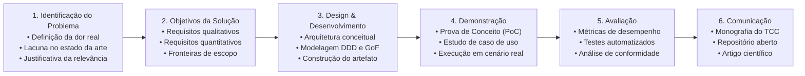

# 🎓 Metodologia Científica: Design Science Research (DSR)

Este documento estabelece o framework epistemológico e metodológico para o desenvolvimento do **Trabalho de Conclusão de Curso (TCC)** e de sua **Prova de Conceito (PoC)** computacional.

---

## 1. O Paradigma Design Science Research (DSR)

Na pesquisa em Sistemas de Informação e Engenharia de Software, o paradigma comportamental busca explicar ou prever fenômenos humanos e organizacionais, enquanto o paradigma de **Design Science Research (DSR)** busca estender os limites das capacidades humanas e organizacionais através da criação e avaliação de **artefatos computacionais inovadores** (Hevner, March, Park, & Ram, 2004).

O projeto é estruturado sobre o modelo de processo de 6 estágios formalizado por Peffers, Tuunanen, Rothenberger e Chatterjee (2007):

---

## 2. As Sete Diretrizes de Hevner et al. (2004)

A condução do trabalho segue rigorosamente as sete diretrizes de DSR:

1. **O Design como Artefato (Design as an Artifact):**  
   A pesquisa deve produzir um artefato computacional viável — formalizado na forma de construtos (linguagem ubíqua, tipos), modelos (diagramas, arquitetura), métodos (algoritmos, heurísticas) ou instanciações (código executável da PoC).

2. **Relevância do Problema (Problem Relevance):**  
   O artefato deve abordar um problema de negócios ou técnico relevante, não resolvido satisfatoriamente pelas abordagens ou ferramentas existentes.

3. **Avaliação do Design (Design Evaluation):**  
   A utilidade, qualidade e eficácia do artefato devem ser rigorosamente demonstradas através de métodos empíricos de avaliação (testes automatizados, métricas de complexidade estática, análise formal de invariantes).

4. **Contribuição da Pesquisa (Research Contributions):**  
   A pesquisa deve fornecer contribuições claras e verificáveis na área do artefato de design, nos fundamentos de engenharia ou nas metodologias aplicadas.

5. **Rigor da Pesquisa (Research Rigor):**  
   A construção e a avaliação do artefato dependem da aplicação rigorosa de fundamentos matemáticos, padrões consolidados de engenharia de software (Clean Architecture, DDD, GoF) e teorias de sistemas.

6. **O Design como Processo de Busca (Design as a Search Process):**  
   A descoberta de um design eficaz é um processo iterativo de exploração de alternativas, trade-offs e refinamento progressivo guiado por métricas de convergência.

7. **Comunicação da Pesquisa (Communication of Research):**  
   Os resultados devem ser apresentados com clareza tanto para audiências acadêmicas (rigor epistemológico, fundamentação teórica) quanto para audiências técnicas e gerenciais (implementação prática, viabilidade de engenharia).
