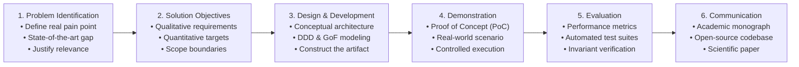

# 🎓 Scientific Methodology: Design Science Research (DSR)

This document establishes the epistemological and methodological framework for developing the **Capstone Project / Thesis (_Trabalho de Conclusão de Curso - TCC_)** and its computational **Proof of Concept (PoC)**.

---

## 1. The Design Science Research (DSR) Paradigm

In Information Systems (IS) and Software Engineering research, the behavioral paradigm seeks to explain or predict human and organizational phenomena, whereas the **Design Science Research (DSR)** paradigm seeks to extend the boundaries of human and organizational capabilities through the creation and evaluation of **innovative computational artifacts** (Hevner, March, Park, & Ram, 2004).

This project is structured upon the authoritative six-stage process model formalised by Peffers, Tuunanen, Rothenberger, and Chatterjee (2007):

---

## 2. The Seven Guidelines of Hevner et al. (2004)

The execution of this research strictly adheres to the seven guidelines for design science:

1. **Design as an Artifact:**  
   The research must produce a viable computational artifact — formalised as constructs (ubiquitous language, nominal types), models (architectural diagrams, domain models), methods (algorithms, invariants), or instantiations (executable PoC code).

2. **Problem Relevance:**  
   The artifact must address an important and relevant business or technical problem that is not satisfactorily solved by existing tools or approaches.

3. **Design Evaluation:**  
   The utility, quality, and efficacy of the artifact must be rigorously demonstrated through empirical evaluation methods (automated test suites, static complexity ratchets, formal invariant verification).

4. **Research Contributions:**  
   The research must provide clear and verifiable contributions in the area of the design artifact, software engineering foundations, or applied design methodologies.

5. **Research Rigor:**  
   The construction and evaluation of the artifact rely on the rigorous application of mathematical formalisms, established software engineering patterns (Clean Architecture, DDD, GoF), and systems theories.

6. **Design as a Search Process:**  
   The discovery of an effective design is an iterative heuristic process of exploring alternatives, navigating trade-offs, and progressively converging toward optimal solutions.

7. **Communication of Research:**  
   The findings must be presented effectively to both academic audiences (epistemological rigor, theoretical grounding) and technical/practitioner audiences (practical implementation, architectural feasibility).
