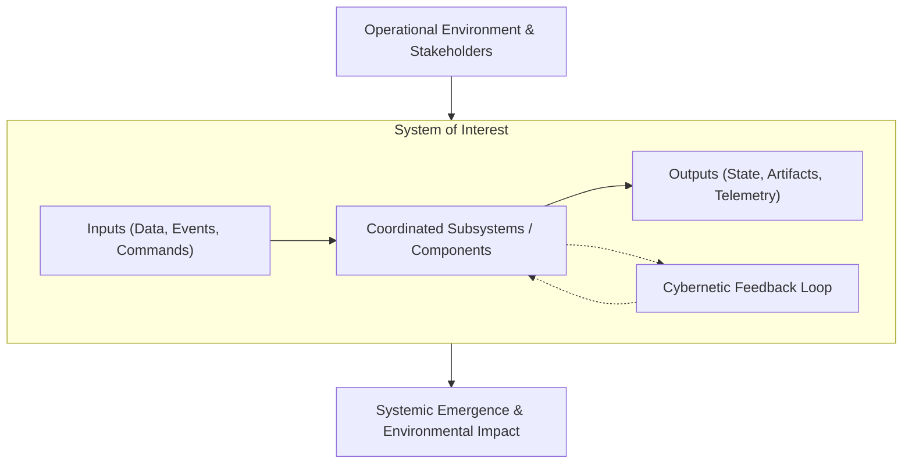
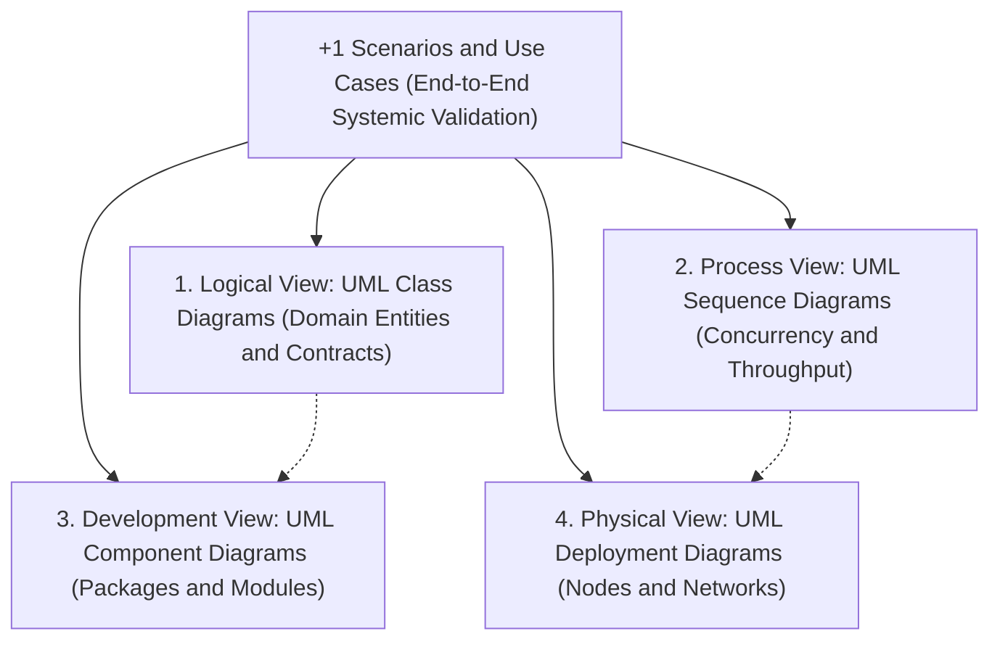

# ⚙️ Systems Engineering, Dependability & Systemic Lifecycles

This document formalizes the systemic engineering methodology, dependability taxonomy, and life cycle processes governing the system, grounded in the international standard **ISO/IEC/IEEE 15288:2015** and the **INCOSE Systems Engineering Handbook**.

---

## 1. Systems Engineering Foundations

Systems engineering is an interdisciplinary approach and means to enable the realization of successful socio-technical and computational systems.



### 1.1 Core Systems Axioms
- **Holism & Emergence:** The system exhibits properties, behaviors, and failure modes that emerge from the interaction of its parts and cannot be deduced from any part in isolation.
- **Strict Boundary Specification:** Clear definition of what lies inside the System of Interest (SoI) versus what belongs to the external operational environment. Every interaction across the boundary must occur through explicit, verified interfaces.
- **Hierarchy & Modularity:** Systems are partitioned into cohesive, loosely coupled subsystems. Coupling across subsystem boundaries must be strictly minimized.

---

## 2. ISO/IEC/IEEE 15288 Technical Life Cycle Processes

The development lifecycle follows the recursive and iterative technical processes defined by ISO/IEC/IEEE 15288:

```
Stakeholder Needs Definition
         │
         ▼
System Requirements Definition (ISO 29148)
         │
         ▼
System Architecture Definition
         │
         ▼
Design Definition
         │
         ▼
Implementation (Zero Comment, Clean Code, TDD)
         │
         ▼
Integration (Continuous Integration & Boundary Validation)
         │
         ▼
Verification ("Are we building the product right?")
         │
         ▼
Validation ("Are we building the right product?")
         │
         ▼
Transition, Operation & Continuous Evolution
```

### 2.1 Verification vs. Validation (V&V)
As formulated by Barry Boehm (1981):
- **Verification:** *"Are we building the product right?"*  
  Evaluates whether the artifact satisfies specified technical constraints, type signatures, unit assertions, performance ceilings, and quality ratchets.
- **Validation:** *"Are we building the right product?"*  
  Evaluates whether the realized system accomplishes its intended purpose, satisfies genuine stakeholder needs, and resolves the real-world problem in its operational context.

### 2.2 Model-Based Systems Engineering (MBSE) & OMG UML 2.5.1
Model-Based Systems Engineering (MBSE), standardized by the **INCOSE Systems Engineering Handbook** and **ISO/IEC/IEEE 15288:2023**, replaces ambiguous textual specifications with formal, semantically unified diagrammatic models. Diagrammatic planning operates as the primary instrument for the *System Architecture Definition* and *Design Definition* processes before implementation.

Under **OMG UML 2.5.1 (ISO/IEC 19505:2012)**, modeling is partitioned into complementary structural and behavioral formalisms:
- **Structural Blueprints:** Class, Package, Component, and Deployment diagrams. Anchored in David Parnas's principle of **Information Hiding (1972)**, structural modeling partitions systems into cohesive modules where implementation secrets are hidden behind unyielding interface boundaries.
- **Behavioral Dynamics & Formal Contracts:** Sequence, State Machine, and Activity diagrams. Invariants, state transitions, and messaging flows are bound by **Design by Contract (Bertrand Meyer, 1988)** and the **Object Constraint Language (OMG OCL / ISO/IEC 19507)**, specifying mathematical preconditions ($pre$), postconditions ($post$), and state invariants across operations.

#### Kruchten's "4+1" Architectural View Model
Philippe Kruchten (1995, *IEEE Software*) established the canonical standard for organizing architectural models by addressing distinct stakeholder concerns through five interconnected views:



1. **Logical View (Design Object Model):** Captures functional requirements, domain boundaries, and conceptual services. Represented via UML Class and Object diagrams.
2. **Process View (Concurrency & Synchronization):** Addresses non-functional requirements such as concurrency, execution threads, communication mechanisms, and latency budgets. Represented via UML Sequence, Activity, and State Machine diagrams.
3. **Development View (Software Module Organization):** Defines code structure, package hierarchies, internal layering, and build dependencies. Represented via UML Package and Component diagrams.
4. **Physical View (Deployment & Topology):** Details mapping of software components to compute nodes, server clusters, network fabrics, and cloud environments. Represented via UML Deployment diagrams.
5. **+1 Scenarios (Operational Use Cases):** Ground truth operational journeys that validate and tie together the other four views, ensuring the holistic architecture satisfies business missions. Represented via UML Use Case diagrams.

---

## 3. Dependability & Fault-Tolerance Taxonomy

Software systems operate in hostile, fallible environments. Dependability theory, formalised by Avizienis, Laprie, Randell, and Landwehr (2004), provides the fundamental taxonomy for system resilience.

### 3.1 The Fundamental Threat Chain
A failure in a system is not a spontaneous event; it is the culmination of a causal chain:

$$\text{Fault} \xrightarrow{\text{activation}} \text{Error} \xrightarrow{\text{propagation}} \text{Failure}$$

```
+---------------------------------------------------------------------------------+
| FAULT (Defect / Bug / Hardware Glitch)                                          |
| An internal flaw or external condition that may lead to an error.                |
| Examples: An off-by-one index, an unhandled network timeout, memory corruption.  |
+---------------------------------------------------------------------------------+
                                      │ (Activation during execution)
                                      ▼
+---------------------------------------------------------------------------------+
| ERROR (Invalid Internal State)                                                  |
| An internal state anomaly that deviates from the expected operational state.    |
| Examples: A null pointer in memory, corrupted cache entry, desynchronized lock. |
+---------------------------------------------------------------------------------+
                                      │ (Propagation to system boundary)
                                      ▼
+---------------------------------------------------------------------------------+
| FAILURE (Service Deviation / Outage)                                            |
| The system's delivered service deviates from its specified external contract.   |
| Examples: HTTP 500 error returned to client, transaction loss, data corruption. |
+---------------------------------------------------------------------------------+
```

### 3.2 The Four Dependability Means
1. **Fault Prevention:** Rigorous software engineering practices (TDD, strong static typing, pure functions) to prevent faults from being introduced.
2. **Fault Removal:** Quality gates, automated testing, static analysis (Biome, Knip), and formal inspection during development to detect and eliminate existing faults.
3. **Fault Forecasting:** Probabilistic estimation of failure rates, MTBF calculations, and monitoring telemetry trends.
4. **Fault Tolerance:** Designing the system to maintain service delivery or degrade gracefully despite the presence and activation of active faults:
   - *Error Detection:* Identifying internal errors before they propagate to the boundary (schema assertions, checksums).
   - *Error Recovery:* Restoring a valid state via backward recovery (rollbacks, Memento snapshots, Saga compensation) or forward recovery (retry with idempotency, circuit breakers, fallback safe states).

---

## 4. Quantitative Reliability Mathematics

Dependability attributes must be quantified using rigorous mathematical metrics:

### 4.1 Core Reliability Metrics
- **Mean Time to Detect (MTTD):** The average duration elapsed between the occurrence of a fault and its automated detection by monitoring/telemetry systems.
- **Mean Time to Repair / Resolve (MTTR):** The average duration required to diagnose, patch, and restore the system to full operational status after a detected failure.
- **Mean Time Between Failures (MTBF):** The operational uptime duration between two consecutive system failures.

### 4.2 System Availability Equation
Operational availability ($A$) is mathematically expressed as the ratio of uptime to total time:

$$A = \frac{\text{MTBF}}{\text{MTBF} + \text{MTTR}}$$

### 4.3 High Availability ("The Nines")

| Availability Level | Downtime per Year | Downtime per Month | Architectural Implications |
| :--- | :--- | :--- | :--- |
| **$99.0\%$ (Two Nines)** | $3.65\text{ days}$ | $7.3\text{ hours}$ | Single-instance server with manual recovery. |
| **$99.9\%$ (Three Nines)** | $8.76\text{ hours}$ | $43.8\text{ minutes}$ | Automated health checks, multi-instance failover. |
| **$99.99\%$ (Four Nines)** | $52.6\text{ minutes}$ | $4.38\text{ minutes}$ | Automated zero-downtime rolling deploys, multi-AZ redundancy. |
| **$99.999\%$ (Five Nines)** | $5.26\text{ minutes}$ | $26.3\text{ seconds}$ | Active-active multi-region, sub-second consensus failover. |

---

## 5. Systems Decision Analysis: Trade-Offs & Multi-Criteria Selection

Engineering decisions must not be driven by dogmatism or aesthetic preferences. Every major structural decision requires formal multi-criteria trade-off analysis.

### 5.1 The Pareto Efficiency Frontier
A design option is **Pareto optimal** if no single attribute (e.g., latency, cost, consistency, throughput) can be improved without degrading at least one other attribute.

```
Cost / Complexity
    ^
    |          Sub-optimal Solutions (Dominated)
    |              x         x
    |                  x
    |        (Pareto Frontier Curve)
    |       *----------------*-------------* Optimal Trade-Offs
    |      /
    +----------------------------------------> Performance / Reliability
```

### 5.2 Pugh Decision Matrix (Controlled Convergence)
When evaluating competing architectural alternatives, assign normalized weights $w_i \in (0, 1)$ with $\sum w_i = 1$ across standardized criteria:

$$\text{Score}(A) = \sum_{i=1}^{k} w_i \cdot s_i(A)$$

| Evaluation Criterion | Weight ($w_i$) | Baseline (0) | Alternative A | Alternative B |
| :--- | :--- | :--- | :--- | :--- |
| **Fault Isolation** | $0.25$ | $0$ | $+1$ | $+2$ |
| **Latency Overhead** | $0.25$ | $0$ | $-1$ | $+1$ |
| **Operational Simplicity** | $0.20$ | $0$ | $+1$ | $-2$ |
| **Data Consistency** | $0.30$ | $0$ | $+2$ | $+1$ |
| **Weighted Total** | **$1.00$** | **$0.00$** | **$+0.80$** | **$+0.45$** |

Alternative A provides the mathematically superior trade-off balance and becomes the selected architecture.

