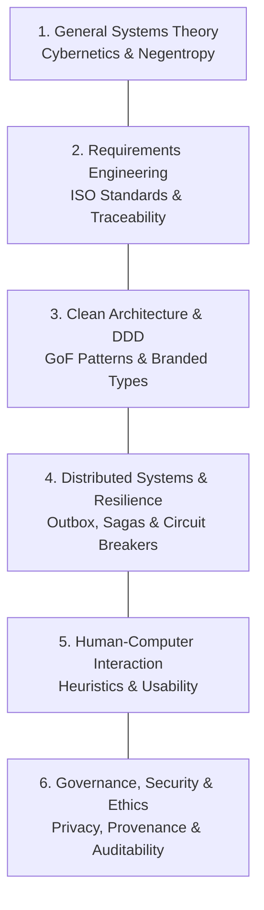

# 🏛️ General Systems Theory & Software Engineering Pillars

This document formalises the systemic foundations and core engineering pillars underpinning the software design.

---

## 1. General Systems Theory (GST) & Cybernetics

- **Theoretical Grounding:** Ludwig von Bertalanffy (1968) *General System Theory*; Norbert Wiener (1948) *Cybernetics*; Peter Checkland (1981) *Soft Systems Methodology (SSM)*.
- **Socio-Technical Formulation:** The software is modeled as an **open socio-technical system**. Human operators fulfill strategic, evaluative, and decision-making roles, while autonomous and deterministic computational subsystems execute operational, analytical, and transformation tasks.
- **Entropy & Negentropy (Negative Entropy):** Stochastic, generative, or distributed processes inherently introduce systemic entropy (contextual drift, state desynchronization, malformed payloads). The computational system injects **negentropy** through:
  1. Strict boundary validation contracts (immutable schemas at all perimeters).
  2. Cryptographic audit ledgers to guarantee state traceability.
  3. Automated quality gates that prevent corrupted or non-compliant artifacts from progressing downstream.
- **Cybernetic Feedback Loops:** Deliberative and iterative decision processes must incorporate measurable feedback signals that drive self-correcting regulatory loops prior to definitive state commitment.

---

## 2. The Six Pillars of Software Systems & Engineering

1. **General Systems Theory (GST):** Holistic modeling of system boundaries, inputs, outputs, subcomponents, and cybernetic feedback.
2. **Requirements Engineering (ISO/IEC/IEEE 29148:2018):**
   - Rigorous delineation between the **Indivisible Core** and optional downstream modular extensions.
   - Atomic, verifiable requirements formulated in testable behavioral terms (`WHEN... THEN... AND`).
   - Non-functional quality attributes grounded in the **ISO/IEC 25010:2023** Software Quality Model (Reliability, Performance Efficiency, Maintainability, Security).
3. **Clean Architecture & Domain-Driven Design (DDD):**
   - Pure domain kernel isolated from external frameworks, databases, or delivery mechanisms.
   - Elimination of primitive obsession through nominal *Branded Types*.
4. **Distributed Systems & Resilience:**
   - Asynchronous workflow orchestration via distributed Sagas with guaranteed compensating rollbacks.
   - Elimination of dual-write anomalies through the *Transactional Outbox* pattern.
5. **Human-Computer Interaction (HCI):**
   - Nielsen's usability heuristics, clear system status visibility, user error prevention, and cognitive ergonomics aligned with the operator's mental model.
6. **Governance, Security & Ethics:**
   - Principle of least privilege, automated PII and credential scrubbing in telemetry/logs, immutable cryptographic auditability, and protection against unauthorized state mutations.
