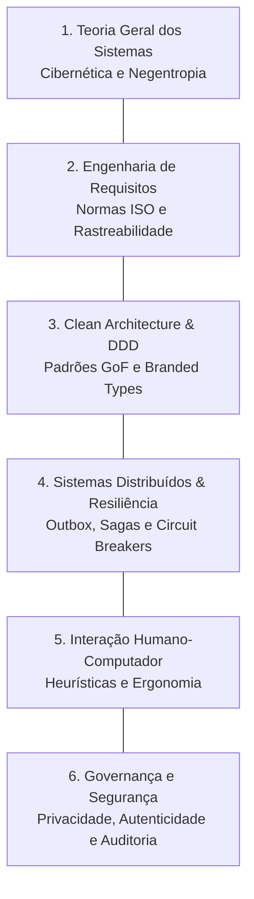

# 🏛️ Teoria Geral dos Sistemas & Pilares Curriculares de Engenharia de Software

Este documento formaliza a base teórica de sistemas e os pilares de engenharia que sustentam o projeto de software.

---

## 1. Teoria Geral dos Sistemas (TGS) & Cibernética

- **Fundamentação Teórica:** Ludwig von Bertalanffy (1968) *General System Theory*; Norbert Wiener (1948) *Cybernetics*; Peter Checkland (1981) *Soft Systems Methodology (SSM)*.
- **Formulação Sócio-Técnica:** O software é modelado como um **sistema sócio-técnico aberto**. Os operadores humanos exercem o papel estratégico e decisório, enquanto subsistemas autônomos e determinísticos executam tarefas operacionais e analíticas.
- **Entropia e Negentropia (Negative Entropy):** Processos estocásticos ou integrados tendem naturalmente à desordem e inconsistência (deriva de contexto, dados corrompidos ou malformados). O sistema computacional introduz **negentropia** através de:
  1. Contratos estritos de validação nas fronteiras (schemas imutáveis).
  2. Livros-razão de auditoria (audit ledgers) para rastreabilidade de estado.
  3. Quality gates automatizados que impedem a progressão de artefatos que não atinjam critérios objetivos de aceitação.
- **Loops Cibernéticos de Retroalimentação:** Processos de tomada de decisão ou refinamento iterativo devem possuir sinais de feedback mensuráveis que alimentam mecanismos de autorregulação e convergência antes da persistência definitiva.

---

## 2. Os Seis Pilares de Engenharia de Sistemas & Software

1. **Teoria Geral dos Sistemas (TGS):** Modelagem holística do ecossistema, fronteiras de entrada/saída e retroalimentação.
2. **Engenharia de Requisitos (ISO/IEC/IEEE 29148:2018):**
   - Delineamento rigoroso entre o que é o **Núcleo Indivisível** (Core) e o que são extensões ou features opcionais.
   - Requisitos funcionais atômicos e testáveis (`WHEN... THEN... AND`).
   - Requisitos não-funcionais aderentes ao modelo de qualidade **ISO/IEC 25010:2023** (Confiabilidade, Eficiência de Desempenho, Manutenibilidade, Segurança).
3. **Clean Architecture & Domain-Driven Design (DDD):**
   - Núcleo de domínio puro sem dependências de frameworks, bibliotecas de terceiros ou mecanismos de persistência.
   - Eliminação da obsessão por tipos primitivos através de *Branded Types*.
4. **Sistemas Distribuídos & Resiliência:**
   - Coordenação de fluxos assíncronos e orquestração de transações distribuídas (Sagas) com garantia de compensação.
   - Prevenção do problema de escrita dupla (*dual-write hazard*) via *Transactional Outbox*.
5. **Interação Humano-Computador (IHC):**
   - Heurísticas de Nielsen, visibilidade do estado do sistema, prevenção de erros e design de interfaces orientado ao modelo mental do usuário.
6. **Governança, Segurança & Ética:**
   - Princípio do menor privilégio, sanitização de dados sensíveis e credenciais em logs/telemetria, auditoria imutável e proteção contra acesso indevido.
