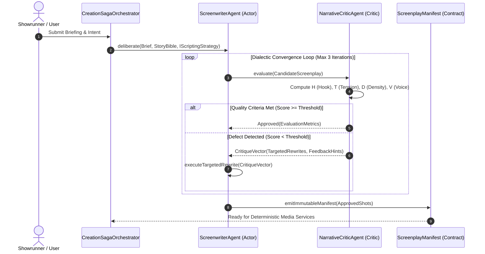

# ✍️ Screenwriter Cognitive System & Actor-Critic Reference

This document provides the canonical architectural and scientific reference for the **Cognitive Screenwriting Subsystem** in Wind Comic (v12.320).

---

## 1. Epistemological Foundation & Subsystem Architecture

The Screenwriting Subsystem represents the **pure cognitive layer** of Wind Comic. It is responsible for environmental perception, dramatic teleology, strategic deliberation, and evaluative critique.

### 1.1 Eliminating Semantic Inflation in Screenwriting

Prior architectures suffered from **semantic inflation**, conflating cognitive narrative deliberation with downstream procedural transformations (e.g., classifying image diffusion sampling, LUT grading, audio ducking, or FFmpeg concatenation as "Screenwriter Skills").

In Wind Comic, the boundary is strictly delineated:
- **Cognitive Autonomous AI Agents** formulate intent, structure drama, write dialogue, direct shots, and audit narrative pacing.
- **Deterministic Processing Services** execute downstream linear transformations (raster synthesis, TTS audio generation, timeline composition, and video transcoding) based on the immutable manifest produced by the cognitive layer.

```
┌────────────────────────────────────────────────────────────────────────────────────────┐
│                        COGNITIVE DELIBERATION SUBSYSTEM                                │
│                                                                                        │
│   Creative Prompt / Story Brief / Product URL                                          │
│         │                                                                              │
│         ▼                                                                              │
│   ┌────────────────────────────────────────────────────────────────────────────────┐   │
│   │ Perception Layer: Story Bible, Character DNA Vault, Voice Fingerprints         │   │
│   └───────────────────────────────────────┬────────────────────────────────────────┘   │
│                                           │                                            │
│                                           ▼                                            │
│                         ┌──────────────────────────────────┐                           │
│                         │  ScreenwriterAgent (The Actor)   │ ◄──────────┐              │
│                         │  • Strategy Selection (GoF)      │            │              │
│                         │  • Scene & Beat Construction     │            │              │
│                         │  • Shot Directing & Dialogue     │            │              │
│                         └─────────────────┬────────────────┘            │              │
│                                           │                             │              │
│                              Candidate    │ ScriptShot[]                │ Critique     │
│                              Screenplay   │                             │ Feedback     │
│                                           ▼                             │ Vector       │
│                         ┌──────────────────────────────────┐            │ (Δ rewrite)  │
│                         │ NarrativeCriticAgent (The Critic)│            │              │
│                         │ • Hook Retention Audit (H >= 80) │            │              │
│                         │ • McKee Dramatic Tension Curve   │            │              │
│                         │ • Dialogue Density & Brevity     │ ───────────┘              │
│                         └─────────────────┬────────────────┘  Score < Threshold        │
│                                           │                                            │
│                                           ▼ Score >= Threshold (Convergence)           │
│   ┌────────────────────────────────────────────────────────────────────────────────┐   │
│   │ ScreenplayManifest: Immutable Approved ScriptShot[] + Audio Cues + DNA Binding │   │
│   └───────────────────────────────────────┬────────────────────────────────────────┘   │
└───────────────────────────────────────────┼────────────────────────────────────────────┘
                                            │ Saga Handoff
┌───────────────────────────────────────────▼────────────────────────────────────────────┐
│                    DETERMINISTIC PROCESSING SERVICES                                   │
│                                                                                        │
│   • VoiceSynthesisService       : Text → Phoneme Timings & Dialogue Waveforms          │
│   • ImageGenerationService      : Visual Prompts & Character DNA → Keyframe Rasters    │
│   • TimelineCompositionEngine   : Beat Matching, Sidechain Ducking & Subtitle Overlay  │
│   • MediaTranscodeService       : FFmpegCommandBuilder Concatenation & ffprobe Gating  │
└────────────────────────────────────────────────────────────────────────────────────────┘
```

---

## 2. Cognitive Autonomous AI Agents

The subsystem is implemented as a closed **Actor-Critic architecture** comprising two specialized cognitive agents:



### 2.1 ScreenwriterAgent (The Generative Actor)

The `ScreenwriterAgent` operates as the primary generative actor in the cognitive layer.

- **Perception Inputs:**
  - `CreativeBrief`: Raw user premise, product features, target audience, and duration budget.
  - `StoryBible`: World rules, thematic constraints, and character ensemble profiles.
  - `CharacterVault`: Visual DNA identifiers and voice profile bindings.
  - `SceneBudgets`: Target shot count, pace cadence, and duration ceilings.

- **Teleological Goals:**
  - Construct compelling character arcs and dramatic stakes.
  - Generate emotionally evocative scene breakdowns.
  - Formulate precise cinematographic camera directions (lens, framing, movement).
  - Write concise, character-specific dialogue adhering to voice fingerprints.

- **Deliberative Reasoning via Strategy Pattern (GoF):**
  The agent does not use hardcoded prompt branching; it dynamically executes an `IScriptingStrategy`:

  ```typescript
  interface IScriptingStrategy {
    readonly strategyId: string;
    buildSystemPrompt(bible: StoryBible): string;
    planSceneBreakdown(brief: CreativeBrief): ScenePlan[];
    generateShots(scenes: ScenePlan[], ctx: WriterContext): ScriptShot[];
  }
  ```

  1. **`DirectResponseUgcStrategy`:**
     - Tailored for high-converting vertical video advertisements (TikTok, Meta, Shorts).
     - Enforces the strict conversion progression: **Hook (0–3s) $\to$ Problem Agitation $\to$ Solution Mechanism $\to$ Social Proof $\to$ Call to Action (CTA)**.
  2. **`McKeeThreeActStrategy`:**
     - Tailored for episodic web fiction, webtoon adaptations, and narrative micro-dramas.
     - Enforces classical screenwriting structure: **Inciting Incident $\to$ Progressive Complications $\to$ Crisis $\to$ Climax $\to$ Resolution**.
  3. **`JournalisticExplainerStrategy`:**
     - Tailored for documentary shorts, tech explainers, and trend analysis.
     - Enforces informational velocity: **Thesis Hook $\to$ Contextual Unpacking $\to$ Core Insight $\to$ Synthesis**.

---

### 2.2 NarrativeCriticAgent (The Evaluative Critic)

The `NarrativeCriticAgent` acts as the objective evaluator, auditing candidate screenplays against strict narrative and psychological engagement heuristics.

- **Perception Inputs:**
  - Candidate `ScriptShot[]` sequence produced by `ScreenwriterAgent`.
  - Strategy-specific pacing rubrics and duration tolerances.
  - Registered Character Voice Fingerprints.

- **Teleological Goals:**
  - Detect narrative stagnation, exposition dumps, and weak hooks.
  - Audit dialogue density to prevent viewer cognitive overload.
  - Enforce visual storytelling over redundant verbal narration.
  - Provide structured, non-destructive critique vectors for self-correction.

- **Mathematical Evaluation Heuristics:**

  1. **Hook Retention Score ($H \in [0, 100]$):**
     Evaluates the first 3.0 seconds (Shot 1) to guarantee immediate audience capture:
     $$H = 0.35 \cdot S_{\text{surprise}} + 0.30 \cdot S_{\text{clarity}} + 0.25 \cdot S_{\text{urgency}} - 0.10 \cdot S_{\text{exposition\_lag}}$$
     *Gate:* $H \ge 80$. If $H < 80$, the Critic rejects the script with a `HOOK_WEAK` revision hint.

  2. **McKee Tension Progression Gradient ($T$):**
     Evaluates dramatic progression across scenes:
     $$\frac{\Delta T}{\Delta t} = \frac{T(s_{i+1}) - T(s_i)}{\text{duration}(s_i)} > 0$$
     *Gate:* Monotonic tension growth across complications until the climax shot. Stagnant flatlines trigger `TENSION_PLATEAU` revisions.

  3. **Dialogue-to-Action Density ($D$):**
     Measures word count relative to shot duration:
     $$D = \frac{\text{WordCount}(\text{dialogue})}{\text{DurationSec}(\text{shot})}$$
     *Gate:* $D \le 3.5 \text{ words/sec}$ (maximum 45 words per 5-second vertical shot). Breaches trigger `DIALOGUE_OVERFLOW` truncation directives.

  4. **Character Voice Consistency Score ($V \in [0, 1]$):**
     Computes semantic alignment between character lines and their voice profile:
     $$V = \cos(\mathbf{e}_{\text{dialogue}}, \mathbf{e}_{\text{voice\_fingerprint}})$$
     *Gate:* $V \ge 0.78$.

---

### 2.3 The Closed Dialectic Actor-Critic Convergence Loop

The interaction between `ScreenwriterAgent` ($\mathcal{A}$) and `NarrativeCriticAgent` ($\mathcal{C}$) is formalized as an iterative contraction mapping:

$$\mathcal{S}^{(0)} \sim \mathcal{A}(\text{Brief}, \text{Strategy})$$

$$\mathcal{R}^{(k)} = \mathcal{C}(\mathcal{S}^{(k)})$$

$$\mathcal{S}^{(k+1)} = \begin{cases} 
\mathcal{S}^{(k)} & \text{if } \text{Pass}(\mathcal{R}^{(k)}) = \text{true} \\
\mathcal{A}(\mathcal{S}^{(k)}, \mathcal{R}^{(k)}) & \text{if } \text{Pass}(\mathcal{R}^{(k)}) = \text{false} \text{ and } k < k_{\max} \\
\text{Reconcile}(\mathcal{S}^{(k)}, \mathcal{R}^{(k)}) & \text{if } k = k_{\max}
\end{cases}$$

This ensures that creative generation converges deterministically on quality benchmarks within a bounded computational ceiling ($k_{\max} = 3$), eliminating endless hallucinations or runaway LLM cycles.

---

## 3. Downstream Interface: The Handoff Contract

Once the Actor-Critic loop terminates with approval, the cognitive layer freezes an immutable **`ScreenplayManifest`**. 

This contract forms the single source of truth passed to the `CreationSagaOrchestrator`, which delegates physical production tasks to **Deterministic Processing Services**:

```typescript
interface ScreenplayManifest {
  manifestId: string;
  projectId: string;
  strategyId: string;
  totalDurationMs: number;
  shots: Array<{
    shotId: string;
    sequenceIndex: number;
    visualPrompt: string;
    camera: {
      lens: string;
      angle: string;
      movement: "pan_left" | "tilt_up" | "push_in" | "static" | "handheld";
    };
    dialogue: {
      speakerId: string;
      text: string;
      emotion: string;
      targetPaceMultiplier: number;
    };
    audioCues: {
      diegeticSfx: string[];
      musicMoodTag: string;
      duckingThresholdDb: number;
    };
    characterBindings: Array<{
      characterId: string;
      dnaHash: string;
      faceEmbeddingUrl: string;
    }>;
  }>;
}
```

### Delegation to Deterministic Media Services

| Service Name | Input from Manifest | Deterministic Operation | Output Artifact |
| :--- | :--- | :--- | :--- |
| **`VoiceSynthesisService`** | `dialogue.text`, `speakerId`, `pace` | Invokes Edge-TTS / ElevenLabs API; computes phoneme durations | `speech.mp3`, word-level timestamp alignment JSON |
| **`ImageGenerationService`** | `visualPrompt`, `characterBindings` | Invokes ComfyUI / SDXL diffusion model with ControlNet guidance; checks hash cache | `keyframe.png`, visual character reference sheet |
| **`TimelineCompositionEngine`** | Shot timings, `audioCues`, speech stems | Computes beat grid; applies sidechain audio ducking; compiles libass subtitle events | Multi-track timeline manifest, `subtitles.ass` |
| **`MediaTranscodeService`** | Video chunks, audio stems, subtitle file | Constructs fluent `FFmpegCommandBuilder` filter graph; muxes container; runs `ffprobe` | Master vertical deliverable (`final.mp4`) |

---

## 4. End-to-End Operational Scenarios

### 4.1 Scenario 1: Performance Marketing UGC Ad Generation

1. **Ingress:** Showrunner submits product URL and target demographic.
2. **Cognitive Deliberation:**
   - `ScreenwriterAgent` activates `DirectResponseUgcStrategy`.
   - Generates 3 hook alternatives targeting distinct psychological angles (Fear of Missing Out, Time Poverty, Status).
   - Constructs a 30-second, 6-shot scene breakdown.
3. **Critic Audit:**
   - `NarrativeCriticAgent` flags Hook Variant 2 for excessive exposition in the first 2 seconds ($H = 68 < 80$).
   - Actor executes targeted rewrite, replacing the verbal explanation with a visual pattern-interrupt hook ($H = 88$).
4. **Handoff & Execution:**
   - `ScreenplayManifest` committed to Outbox.
   - `VoiceSynthesisService` renders natural speech audio.
   - `ImageGenerationService` generates consistent virtual creator visuals.
   - `TimelineCompositionEngine` and `MediaTranscodeService` assemble and transcode the finished vertical ad (`final.mp4`).

### 4.2 Scenario 2: Serialized Dramatic Episode Adaptation

1. **Ingress:** Showrunner submits webtoon chapter summary.
2. **Cognitive Deliberation:**
   - `ScreenwriterAgent` activates `McKeeThreeActStrategy`.
   - Structures 12 consecutive shots around a pivotal character betrayal.
3. **Critic Audit:**
   - `NarrativeCriticAgent` verifies that tension $T$ increases progressively across Complications (Shots 3–9) and culminates in Climax (Shot 10).
   - Validates character voice consistency against the registered Character Vault ($V = 0.89$).
4. **Handoff & Execution:**
   - `ScreenplayManifest` dispatched to Saga.
   - `ImageGenerationService` enforces 8-dimensional Character DNA facial geometry using cached latents.
   - `TimelineCompositionEngine` ducks orchestral music under dialogue and aligns cuts to dynamic musical transients.
   - `MediaTranscodeService` renders the turnkey episode with burned subtitles.
