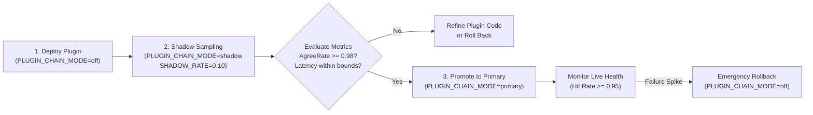

# 📊 Plugin Cutover & Telemetry Runbook

This runbook details how to safely deploy, shadow-test, and cut over custom AI provider plugins in production using zero-risk traffic shadowing.

---

## 1. The Three Operating Modes

The routing behavior is controlled globally via the `PLUGIN_CHAIN_MODE` environment variable in `apps/web/.env.local`:

| Mode                | System Behavior                                                                                                                                   | Impact on Production Traffic                                                                                          | Recommended Use Case                                                                                 |
| :------------------ | :------------------------------------------------------------------------------------------------------------------------------------------------ | :-------------------------------------------------------------------------------------------------------------------- | :--------------------------------------------------------------------------------------------------- |
| **`off` (Default)** | Pure baseline path; custom plugins are never executed.                                                                                            | Zero risk. Baseline engines handle 100% of user traffic.                                                              | Normal baseline production or immediate emergency rollback.                                          |
| **`shadow`**        | Baseline path serves user requests synchronously. The custom plugin runs asynchronously in the background at a sampled rate to collect telemetry. | Zero impact on user response latency or failure rate (plugin errors are swallowed). Incurs actual upstream API costs. | Collecting comparison data (agreement rate, latency) for $\ge 7$ days before promoting a new plugin. |
| **`primary`**       | Custom plugin chain executes first. Only falls back to the baseline path upon caught failure.                                                     | The custom plugin is on the live user-facing path.                                                                    | After shadow testing validates stability ($\ge 98\%$ agreement rate).                                |

---

## 2. Configuration Settings

```bash
# Global mode switch: off | shadow | primary
PLUGIN_CHAIN_MODE=off

# Shadow sampling rate (0.0 to 1.0). Default 0.05 = 5% of traffic
PLUGIN_CHAIN_SHADOW_RATE=0.05

# Optional auto-discovery directories
VIDEO_PROVIDERS_DIR=/opt/wind-comic/custom-video-plugins
TTS_PROVIDERS_DIR=/opt/wind-comic/custom-tts-plugins
```

---

## 3. Standard Cutover Lifecycle



### Step 1: Start Shadow Sampling

Deploy the new plugin with shadow mode enabled:

```bash
PLUGIN_CHAIN_MODE=shadow PLUGIN_CHAIN_SHADOW_RATE=0.10 bun start
```

### Step 2: Inspect Shadow Telemetry

Telemetry events are logged to the PostgreSQL `plugin_chain_events` table and aggregated via `ops-service.ts` (`handlePluginStats`). Query performance metrics through the administrative oRPC procedure:

```typescript
const stats = await client.admin.getPluginStats({ hours: 168 });
// Evaluate:
// - shadowAgreeRate: Target >= 0.98
// - avgLatencyMs: Latency comparison vs baseline
// - shadowDisagree: Categorized error traces
```

When `cutoverReady === true` (agreement rate $\ge 98\%$ across $\ge 50$ samples), proceed to promote the plugin.

### Step 3: Switch to Primary

```bash
PLUGIN_CHAIN_MODE=primary bun start
```

Monitor live production hit rates. If unexpected provider rate limits or upstream timeouts occur:

```bash
PLUGIN_CHAIN_MODE=off bun start
```

Switching to `off` instantly reverts 100% of traffic to the baseline engine without code redeployment.

---

## 4. Modality Implementation Status

- **Image Generation:** 100% cut over directly to `dispatchImageGenerate` (`apps/web/lib/image-providers/dispatch.ts`).
- **Video Generation:** Production traffic routed via `withVideoPlugin` in `apps/web/lib/plugin-chain-router.ts`.
- **Speech (TTS):** Narration loop routed via `withTTSPlugin` in `apps/web/lib/plugin-chain-router.ts`.
