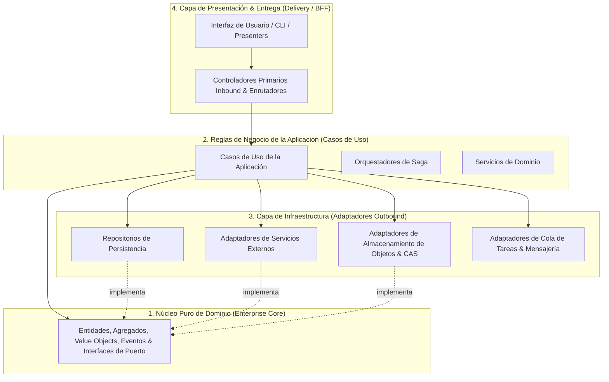

# 🏛️ Clean Architecture & Domain-Driven Design (DDD)

Este documento establece las reglas canónicas para la separación de responsabilidades, estratificación en capas y aislamiento del dominio del negocio.

---

## 1. La Regla de Dependencia Unidireccional

El flujo de dependencia es estrictamente unidireccional hacia adentro, orientado hacia el núcleo del dominio. Las capas externas de entrega (APIs, bases de datos, interfaces de usuario, bibliotecas de terceros) son detalles de infraestructura y entrega; el núcleo del dominio posee **cero** conocimiento sobre ellas.



---

## 2. Estratificación en Capas

### 2.1 Núcleo Puro de Dominio
- **Contenido:** Entidades de Dominio, Raíces de Agregación, Value Objects, Eventos de Dominio, Excepciones de Dominio e Interfaces de Puerto.
- **Invariante Constitucional:** El dominio se escribe en construcciones puras del lenguaje (TypeScript estándar / primitivos nativos), con **cero** dependencias de frameworks web, ORMs, drivers de bases de datos, componentes de interfaz o utilidades de red.

### 2.2 Reglas de Negocio de la Aplicación (Casos de Uso)
- **Contenido:** Casos de uso de la aplicación, coordinadores de flujo de trabajo, políticas de orquestación y contratos de entrada/salida.
- **Responsabilidad:** Orquesta operaciones de negocio expresadas en el modelo de dominio, coordinando persistencia, transacciones y comunicación externa exclusivamente mediante Inversión de Dependencias sobre interfaces de Puerto declaradas.

### 2.3 Capa de Infraestructura (Adaptadores Outbound)
- **Contenido:** Implementaciones concretas de repositorios, clientes de bases de datos, conectores de red, drivers de sistema de archivos y brokers de mensajería.
- **Responsabilidad:** Traduce interfaces de puerto del dominio en invocaciones técnicas concretas requeridas por las bases de datos subyacentes, motores de almacenamiento o APIs de terceros.

### 2.4 Capa de Presentación & Entrega (Adaptadores Inbound)
- **Contenido:** Controladores HTTP, enrutadores de API, comandos CLI o presentadores de interfaz.
- **Responsabilidad:** Opera estrictamente como un *Adaptador Primario Inbound*: analiza peticiones externas, valida esquemas de datos de entrada en el límite, extrae contexto de autenticación y delega la ejecución directamente al Caso de Uso de la Aplicación designado.

---

## 3. Eliminando la Obsesión por Primitivos (Branded Types)

En el modelado de dominio, los tipos primitivos puros (`string`, `number`) oscurecen el significado semántico y permiten errores sutiles de invocación (ej.: suministrar un `UserId` donde se requería un `AccountId`).

- **Regla de Tipos con Marca (Branded Types):** Identificadores únicos, importes monetarios, intervalos de ejecución y métricas críticas de dominio deben modelarse como tipos nominales (*Branded Types*):

```typescript
export type Brand<T, B extends string> = T & { readonly __brand: B };

export type ProjectId = Brand<string, "ProjectId">;
export type EntityId = Brand<string, "EntityId">;
export type Microseconds = Brand<number, "Microseconds">;
export type ExecutionBudget = Brand<number, "ExecutionBudget">;
```

- **Beneficio Arquitectónico:** El compilador previene estáticamente confusiones de tipos semánticos y argumentos invertidos en firmas de funciones, preservando la integridad del modelo en toda la aplicación.
