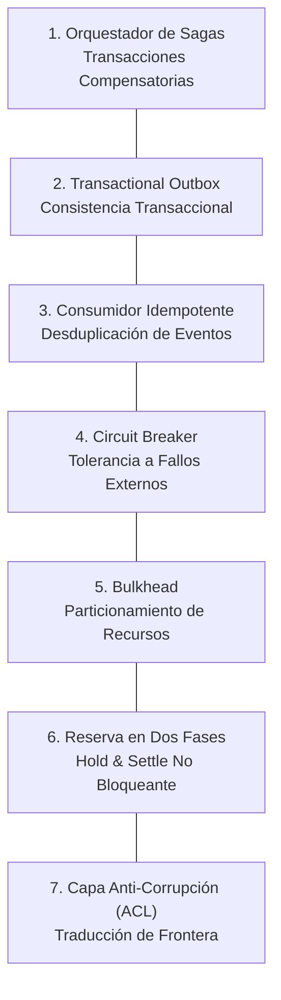

# 🛡️ Sistemas Distribuidos & Patrones de Resiliencia

Este documento especifica los patrones de ingeniería de software para garantizar consistencia eventual, aislamiento de fallos y protección de recursos en arquitecturas asíncronas y distribuidas.

---

## 1. Catálogo de Patrones de Resiliencia

---

### 1.1 Orquestador de Sagas (Garcia-Molina & Salem; Richardson)
- **Problema:** Las transacciones distribuidas tradicionales basadas en Two-Phase Commit (2PC) bloquean recursos de bases de datos por períodos prolongados y sufren de latencia prohibitiva en flujos asíncronos de larga duración.
- **Solución:** El flujo de trabajo se descompone en una serie ordenada de transacciones locales coordinadas por una Máquina de Estados Finitos (FSM) explícita. Por cada transacción directa completada con éxito $T_i$, se registra una acción de compensación correspondiente $C_i$.
- **Garantía:** Si ocurre un fallo irrecuperable en el paso $k$, el orquestador activa las acciones de compensación en orden inverso ($C_{k-1}, C_{k-2}, \dots, C_1$), revirtiendo con seguridad mutaciones parciales, reembolsando cuotas reservadas y purgando recursos temporales huérfanos.

---

### 1.2 Transactional Outbox (Richardson)
- **Problema:** El peligro de doble escritura (*dual-write hazard*) ocurre cuando un sistema intenta mutar el estado de la base de datos y publicar un evento en un broker de mensajería en operaciones separadas. Si el broker es inalcanzable tras el commit en la base de datos, el evento se pierde permanentemente; si el evento se publica antes del commit, un fallo posterior en la base emite un evento fantasma.
- **Solución:** El evento de dominio a despachar se escribe en una tabla dedicada de `outbox` **dentro de la misma transacción ACID** que la mutación de la entidad del negocio. Un demonio de retransmisión asíncrono escanea continuamente la tabla outbox y despacha eventos al broker con garantía de *entrega al menos una vez (at-least-once delivery)*.

---

### 1.3 Consumidor Idempotente (Hohpe & Woolf)
- **Problema:** En redes distribuidas con semántica de mensajería *at-least-once*, los tiempos de espera de red o reintentos de conexión pueden entregar exactamente el mismo comando o evento múltiples veces.
- **Solución:** Todo comando o evento de entrada debe llevar una `idempotencyKey` determinista.
- **Protocolo:** Antes de ejecutar cualquier operación con efectos secundarios, el consumidor inspecciona su registro de claves procesadas:
  - Si la clave ya está marcada como completada: devuelve la respuesta en caché de inmediato sin reejecutar la lógica de negocio.
  - Si la clave está en proceso concurrente: rechaza la reentrada o inicia una espera ordenada.
  - Si la clave no ha sido vista: ejecuta la operación y confirma la finalización de manera atómica con la mutación de estado.

---

### 1.4 Circuit Breaker (Nygard)
- **Problema:** La degradación intermitente o interrupciones severas en APIs externas y dependencias de terceros pueden agotar los grupos de conexiones y subprocesos locales, provocando un colapso en cascada de todo el sistema.
- **Solución:** Las llamadas a redes externas se encapsulan dentro de un Circuit Breaker de 3 estados:
  - **Closed (Cerrado):** Operación normal. Las solicitudes pasan libremente mientras se rastrean los errores en una ventana deslizante de ejecución.
  - **Open (Abierto):** La tasa de error supera el umbral de tolerancia configurado. Todas las solicitudes posteriores fallan inmediatamente (*fast-fail*) sin tocar la red remota, permitiendo que la dependencia externa se recupere.
  - **Half-Open (Semi-Abierto):** Tras un intervalo de enfriamiento (*cool-down*), se permite pasar un lote de prueba de solicitudes. Si tiene éxito, el circuito regresa a *Closed*; si persisten los fallos, regresa inmediatamente a *Open*.

---

### 1.5 Bulkhead (Nygard)
- **Problema:** Un aumento repentino en tareas lentas o computacionalmente pesadas consume el 100% de CPU, memoria o subprocesos de trabajo, causando inanición (*starvation*) y caída total para solicitudes interactivas y ligeras de usuarios.
- **Solución:** Particionamiento físico de grupos de concurrencia y recursos:
  - Demonios dedicados y límites estrictos de concurrencia para tareas pesadas en segundo plano.
  - Grupos de subprocesos y conexiones de base de datos aislados y asignados específicamente para la API interactiva de los usuarios.

---

### 1.6 Reserva de Recursos en Dos Fases (Patrón Hold & Settle)
- **Problema:** Durante tareas asíncronas prolongadas (ej.: de 2 a 10 minutos), mantener una transacción de base de datos activa mientras se espera la ejecución agota el grupo de conexiones en segundos.
- **Solución:** Un protocolo no bloqueante de reserva en dos fases:
  1. **Fase 1 (Hold, transacción ACID rápida ~5ms):** Valida el saldo o capacidad disponible y confirma un registro de reserva con estado `HELD`. La transacción de base de datos se cierra de inmediato.
  2. **Ejecución Asíncrona:** Los workers en segundo plano ejecutan la tarea fuera de cualquier transacción abierta en la base de datos.
  3. **Fase 2a (Settle, transacción ACID rápida ~5ms):** Tras una finalización exitosa, una transacción atómica cambia el estado a `SETTLED` y descuenta definitivamente la cuota consumida.
  4. **Fase 2b (Liberación Compensatoria):** En caso de fallo o tiempo de espera de la tarea, el estado pasa a `RELEASED`, desbloqueando la capacidad reservada sin penalización.

---

### 1.7 Capa Anti-Corrupción - ACL (Evans)
- **Problema:** Permitir que los esquemas de proveedores externos, formatos de datos de terceros o estructuras de SDKs remotos se infiltren en los servicios centrales de la aplicación corrompe el lenguaje ubicuo y ata la arquitectura a implementaciones propietarias.
- **Solución:** Un límite de traducción en el perímetro que intercepta estructuras externas y las mapea bidireccionalmente hacia entidades de dominio internas fuertemente tipadas. Si los proveedores externos o protocolos cambian, solo se actualiza el adaptador ACL en el perímetro; el dominio central permanece completamente intacto.
