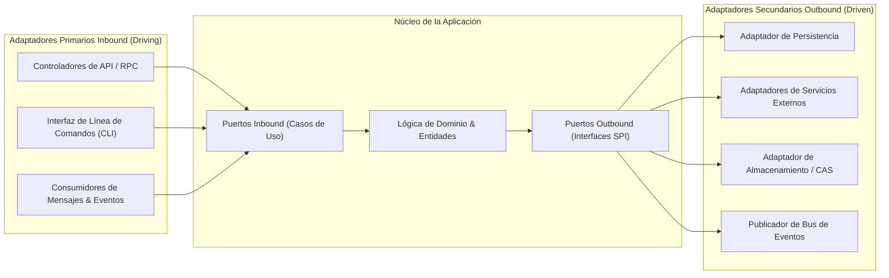

# 🔌 Arquitectura Hexagonal: Puertos, Adaptadores & Contratos

Este documento define los principios fundamentales de la **Arquitectura Hexagonal (Ports & Adapters)** y los límites estandarizados de contratos.

---

## 1. Concepto Arquitectónico Fundamental (Cockburn)

La lógica de negocio de la aplicación reside en el centro del hexágono, aislada de las preocupaciones de infraestructura. El entorno externo interactúa con el núcleo exclusivamente a través de **Puertos** (interfaces abstractas) implementados por **Adaptadores** técnicos concretos:

---

## 2. Adaptadores Primarios (Inbound / Driving)

Los adaptadores primarios inician la comunicación con la aplicación traduciendo solicitudes externas en comandos de casos de uso internos.

### 2.1 El Patrón Thin Controller (Controladores Finos)
- **Límite de Tamaño:** Ningún controlador, manejador de ruta o archivo de comando individual puede superar las 300 líneas de código ($\le 300\text{ LOC}$).
- **Responsabilidades Estrictas:**
  1. Validar la estructura de la solicitud y el tipado de la carga útil contra esquemas inmutables (Zod / JSON Schema).
  2. Extraer la identidad de la sesión, contexto de inquilino (tenancy) y verificar permisos de seguridad.
  3. Delegar la ejecución directamente al Caso de Uso de la Aplicación designado.
  4. Mapear excepciones internas del dominio en códigos de estado de protocolo estandarizados.
- **Prohibición Estricta:** Queda estrictamente prohibido incluir lógica de negocio, mutaciones directas de bases de datos o bucles de procesamiento complejos dentro de los controladores.

### 2.2 Estrategia Contract-First & Entrega Multi-Protocolo
- Las operaciones se definen a partir de contratos tipados e inmutables (entrada, salida, metadatos).
- Una definición unificada de contrato puede atender a protocolos dobles de entrega:
  - **Protocolo RPC Type-Safe:** Optimizado para alto rendimiento y seguridad de tipos de extremo a extremo en tiempo de compilación entre clientes propios y servidores.
  - **Protocolo REST / OpenAPI:** Endpoints estandarizados con generación automática de OpenAPI 3.1 para consumidores externos y herramientas automatizadas.

---

## 3. Adaptadores Secundarios (Outbound / Driven)

Los adaptadores secundarios son invocados por la aplicación para comunicarse con infraestructura externa (bases de datos, sistemas de archivos, servicios de red de terceros).

### 3.1 El Principio de Inversión de Dependencias (DIP)
- La aplicación define la interfaz necesaria para cumplir sus metas (`IRepository`, `IStorageService`, `INotificationGateway`).
- El módulo de infraestructura implementa esta interfaz. El núcleo de dominio posee cero conocimiento sobre drivers específicos, dialectos de base de datos o protocolos de red.
- La sustitución de un componente de infraestructura (ej.: cambio de motores de base de datos o proveedores de almacenamiento en la nube) se realiza sin modificar una sola línea de código de dominio o aplicación.
