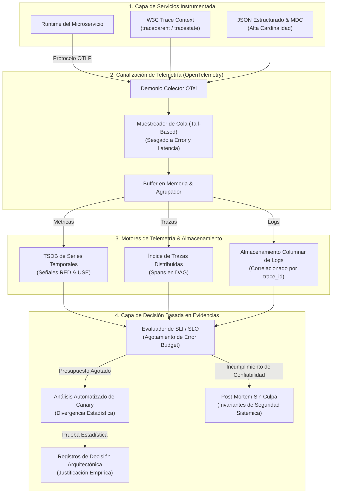

# 📡 Observabilidad, Telemetría Distribuida & Toma de Decisiones Basada en Evidencia

Este documento formaliza los patrones arquitectónicos, las canalizaciones de telemetría y los marcos de decisión empíricos utilizados para garantizar la confiabilidad del software, la transparencia operativa y la resiliencia continua en sistemas distribuidos de misión crítica.

---

## 1. Arquitectura Unificada de Telemetría & Canalización de Evidencias



---

## 2. Catálogo de Patrones Fundamentales de Observabilidad

### 2.1 Rastreo Distribuido & Propagación de Contexto W3C (Sigelman et al., 2010; W3C)
- **Problema:** En mallas de microservicios y buses de mensajería asíncronos, una sola transacción entrante de usuario se ramifica en docenas de saltos de red. Los registros tradicionales no pueden correlacionar fallos en múltiples capas ni identificar cuellos de botella de latencia entre procesos.
- **Solución:** A cada transacción entrante se le inyecta un contexto único global W3C Trace Context:
  $$\text{traceparent} = \text{version}-\text{trace\_id}-\text{parent\_id}-\text{trace\_flags}$$
- **Protocolo:**
  1. La puerta de enlace perimetral crea un `trace_id` inmutable de 16 bytes y un `span_id` inicial.
  2. Los adaptadores entrantes y salientes de HTTP/gRPC/Mensajería extraen e inyectan automáticamente las cabeceras `traceparent` y `tracestate` a través de los límites de red sin contaminar las entidades de dominio.
  3. Cada span de ejecución registra marcas temporales monotónicas de inicio y fin, referencia al span padre, código de estado y atributos estructurados, formando un Grafo Acíclico Dirigido (DAG) del árbol completo de ejecución de la solicitud.

---

### 2.2 Las 4 Señales Doradas & El Método RED (Beyer et al., 2016; Wilkie, 2017)
- **Problema:** Monitorear miles de contadores en bruto de CPU y memoria genera fatiga de alertas mientras oculta la degradación real percibida por el cliente.
- **Solución:** Para todos los servicios orientados al usuario y APIs basadas en solicitudes, el monitoreo se organiza estrictamente en torno al paradigma **RED** y a las **Cuatro Señales Doradas** de Google:

| Señal / Métrica | Definición Matemática Formal | Significado Operativo |
| :--- | :--- | :--- |
| **Tasa (Rate / R) / Tráfico** | $\lambda = \frac{\Delta N_{\text{requests}}}{\Delta t}$ | Tasa de llegada de solicitudes por segundo a través de los límites del servicio. |
| **Errores (Errors / E)** | $E_{\text{rate}} = \frac{\Delta N_{\text{failed}}}{\Delta N_{\text{total}}} \times 100\%$ | Proporción de solicitudes fallidas ($5\text{xx}$ HTTP, excepciones no controladas) respecto al total de solicitudes. |
| **Duración (Duration / D) / Latencia** | $\mathcal{P}_{50}, \mathcal{P}_{95}, \mathcal{P}_{99} \text{ de } T_{\text{elapsed}}$ | Percentiles de latencia en ventanas de tiempo; los promedios están estrictamente prohibidos debido al sesgo de cola larga. |
| **Saturación (Saturation)** | $\text{Sat} = \frac{\text{Profundidad de Cola}}{\text{Capacidad Máxima}} \text{ o } \frac{\text{Workers Activos}}{\text{Tamaño del Pool}}$ | Fracción de capacidad consumida; advierte sobre la degradación inminente antes del colapso del rendimiento. |

---

### 2.3 El Método USE para Recursos de Sistema (Gregg, 2012)
- **Problema:** Los cuellos de botella de infraestructura (latencia de programación de CPU, agotamiento de sockets, fragmentación de memoria) degradan silenciosamente los servicios antes de que aparezcan errores explícitos.
- **Solución:** Para cada recurso de hardware y nivel de kernel (CPUs, memoria, discos, interfaces de red, pools de conexiones), los colectores muestrean continuamente:
  1. **Utilización (Utilization):** El porcentaje de tiempo que el recurso estuvo procesando trabajo activamente (ej.: tasa de ocupación de núcleos de CPU).
  2. **Saturación (Saturation):** El trabajo adicional en cola que no puede atenderse de inmediato (ej.: longitud de la cola de ejecución del SO, profundidad de la cola de hilos).
  3. **Errores (Errors):** Eventos de error de hardware o controlador (ej.: paquetes de red descartados, retransmisiones TCP, reintentos de lectura de disco).

---

### 2.4 Logs Estructurados de Alta Cardinalidad & Mapped Diagnostic Context (MDC)
- **Problema:** El registro en texto no estructurado (`console.log("Procesando orden " + id)`) impide la indexación, dispara el volumen de registros y no se puede filtrar programáticamente durante incidentes de producción.
- **Solución:** Toda emisión de logs es estrictamente en formato JSON estructurado conforme a las Convenciones Semánticas de OpenTelemetry. Cada registro lleva etiquetas contextuales inyectadas automáticamente mediante Mapped Diagnostic Context (MDC):
  ```json
  {
    "timestamp": "2026-09-22T18:40:00.123Z",
    "level": "ERROR",
    "message": "Payment gateway connection timeout",
    "service.name": "billing-service",
    "trace_id": "4bf92f3577b34da6a3ce929d0e0e4736",
    "span_id": "00f067aa0ba902b7",
    "account.id": "acc-9841",
    "circuit_breaker.state": "HALF_OPEN",
    "duration_ms": 2503.4
  }
  ```
- **Regla:** La concatenación no estructurada de cadenas en registros de producción se considera una infracción automatizada de calidad.

---

### 2.5 Muestreo Dinámico de Telemetría (Head vs. Tail-Based)
- **Problema:** Un muestreo uniforme del 100% de las trazas en sistemas distribuidos de alto volumen consume un ancho de banda exorbitante y petabytes de almacenamiento innecesario para solicitudes correctas $200\text{ OK}$.
- **Solución:** Los colectores de telemetría emplean **Muestreo Basado en Cola (Tail-Based Sampling)**:
  - Los colectores de ingesta almacenan en búfer los DAGs de spans en la memoria local hasta que se completa la solicitud.
  - Las trazas que contienen errores no controlados ($5\text{xx}$), aperturas de circuit breakers o latencias que superan el percentil $\mathcal{P}_{95}$ se retienen al **100% de tasa de muestreo**.
  - Las trazas nominales exitosas de sub-milisegundo se reducen a un muestreo de **1% a 5%** para representación estadística basal.

---

## 3. Patrones de Ingeniería de Decisión Basada en Evidencia

### 3.1 Contratos Cuantitativos de Confiabilidad: SLI, SLO & Error Budgets (Google SRE)
La confiabilidad no es un estado binario; es una distribución de probabilidad empírica delimitada por umbrales cuantitativos:

1. **Indicador de Nivel de Servicio (SLI):** Proporción calculada formalmente que define el comportamiento aceptable del servicio:
   $$\text{SLI} = \frac{\sum \text{Eventos Exitosos}}{\sum \text{Eventos Válidos}} \times 100\%$$
   *Ejemplo:* $\frac{\text{Conteo de llamadas HTTP con estado } < 500 \text{ y duración } \le 200\text{ms}}{\text{Conteo total de llamadas HTTP}}$

2. **Objetivo de Nivel de Servicio (SLO):** El porcentaje meta de confiabilidad comprometido durante un período de cumplimiento (generalmente 30 días móviles):
   $$\text{SLO} \ge 99.9\% \quad (\text{Tres Nueves})$$

3. **Presupuesto de Error (Error Budget - $EB$):** El margen permitido para la falta de confiabilidad:
   $$EB = 1.0 - \text{SLO} = 1.0 - 0.999 = 0.001 \quad (0.1\% \text{ del tráfico total})$$

4. **Política de Agotamiento del Error Budget:**
   - **$EB > 20\%$ Disponible:** El desarrollo habitual de funciones y los despliegues continúan normalmente.
   - **$EB \le 0\%$ (Agotado):** Congelación automática de despliegues. Toda la capacidad de ingeniería detiene lanzamientos de productos y se enfoca al 100% en resiliencia, robustez y corrección de errores hasta que el presupuesto de error se recupere.

---

### 3.2 Análisis Automatizado de Canary & Divergencia Estadística de Métricas (Humble & Farley, 2010)
- **Problema:** Desplegar código nuevo directamente al 100% del tráfico corre el riesgo de cortes en toda la flota debido a casos límite no detectados o fugas de memoria.
- **Solución:** Verificación automatizada de lanzamientos canary:
  1. Se despliega una pequeña porción canary (ej.: $5\%$ del tráfico) con la versión candidata junto con una flota baseline idéntica.
  2. La canalización de telemetría calcula continuamente las pruebas Mann-Whitney $U$ o Kolmogorov-Smirnov comparando las tasas de error y las distribuciones de latencia $\mathcal{P}_{99}$ entre las instancias canary y baseline.
  3. Si la divergencia estadística supera el umbral crítico alfa ($\alpha = 0.01$), el despliegue canary se detiene y revierte automáticamente en milisegundos sin requerir intervención humana.

---

### 3.3 Registros de Decisiones Arquitectónicas (ADRs) como Pruebas Empíricas (Nygard, 2011)
Los cambios arquitectónicos nunca deben realizarse por mera intuición. Cada evolución estructural, adopción de frameworks o refactorización de límites requiere un ADR bajo control de versiones que documente:
1. **Estado:** Propuesto, Aceptado, Rechazado, Depreciado, Reemplazado.
2. **Contexto:** El problema técnico y las mediciones empíricas (gráficos de llama del perfilador, métricas de cola de la Ley de Little, cuellos de botella de red) que exigen el cambio.
3. **Decisión & Invariantes:** El patrón arquitectónico exacto, límites de módulos e interfaces seleccionadas.
4. **Consecuencias & Compromisos (Trade-offs):** Garantías positivas, sobrecarga operativa admitida y rutas de migración/reversión.

---

### 3.4 Post-Mortems Sin Culpa & Ingeniería de Resiliencia (Allspaw, 2012)
- **Principio Fundamental:** El error humano nunca es la causa raíz de un incidente; el error humano es el *síntoma* de una vulnerabilidad sistémica en el sistema sociotécnico.
- **Protocolo:** Tras cualquier anomalía de producción $P_0$ o $P_1$:
  1. Construir una cronología con métricas empíricas de telemetría (Señales Doradas, cambios de estado, logs).
  2. Identificar condiciones latentes: ausencia de circuit breakers, colas sin almacenamiento intermedio, protecciones de fallback inadecuadas o tiempos de espera en conflicto.
  3. Producir acciones correctivas de ingeniería: pruebas automáticas de regresión, trinquetes de calidad y circuit breakers estructurales. Se prohíbe explícitamente la asignación de culpas personales.

---

## 4. Invariantes Arquitectónicos & Anti-Patrones

### ✅ Invariantes de Ingeniería Obligatorios
1. **Cero Límites Inbound Sin Instrumentación:** Cada punto de entrada externo (HTTP, gRPC, WebSocket, consumidor de cola) debe inicializar automáticamente un span de traza W3C.
2. **Cero Logs en Texto No Estructurado:** Los registros deben emitirse estrictamente como JSON estructurado con `trace_id`, `service.name` y nivel de severidad obligatorios.
3. **Verificación de SLA Orientada a Percentiles:** Los informes de rendimiento deben citar exclusivamente $\mathcal{P}_{50}$, $\mathcal{P}_{95}$, $\mathcal{P}_{99}$ y $\mathcal{P}_{99.9}$. Los promedios aritméticos están prohibidos.
4. **Contrato de Alertas Accionables:** Una alerta jamás debe activarse a menos que represente una amenaza inmediata al SLO y contenga una guía operativa (runbook) verificada para su resolución.

### 🚫 Anti-Patrones Prohibidos
- **El Cementerio de Métricas:** Emitir cientos de medidores y contadores ad-hoc que ningún panel visualiza y ninguna alerta comprueba.
- **Supresión Ciega de Telemetría con Try-Catch:** Capturar excepciones para devolver un objeto nulo predeterminado sin incrementar contadores de error ni registrar el contexto de la traza.
- **Falacia de los Promedios Estáticos:** Afirmar que "el tiempo promedio de respuesta de la API es de 80ms" mientras el percentil 99 sufre un tiempo de espera de 4 segundos por pausas de recolección de basura.
- **Cultura de Asignación de Culpa:** Concluir una investigación de incidente con "el desarrollador introdujo una mala configuración" en lugar de implementar barreras automatizadas de validación de esquemas.

---

## 5. Referencias Académicas & Seminales

- **Allspaw, J. (2012).** *Blameless Post-Mortems and a Just Culture*. Etsy Code as Craft.
- **Beyer, B., Jones, C., Petoff, J., & Murphy, N. R. (2016).** *Site Reliability Engineering: How Google Runs Production Systems*. O'Reilly Media. ISBN: 978-1491929124.
- **Gregg, B. (2012).** *The USE Method: A Methodology for Analyzing Performance*. Brendan Gregg's Technical Papers.
- **Humble, J., & Farley, D. (2010).** *Continuous Delivery: Reliable Software Releases through Build, Test, and Deployment Automation*. Addison-Wesley. ISBN: 978-0321601919.
- **Majors, C., Fong-Jones, L., & Miranda, G. (2022).** *Observability Engineering: Achieving Production Excellence*. O'Reilly Media. ISBN: 978-1492029014.
- **Nygard, M. (2011).** *Documenting Architecture Decisions*. Cognitect Technical Artifacts.
- **Sigelman, B. H., et al. (2010).** *Dapper, a Large-Scale Distributed Systems Tracing Infrastructure*. Google Technical Report.
- **W3C Recommendation (2021).** *Trace Context: W3C Recommendation 23 November 2021*. World Wide Web Consortium.
- **Wilkie, T. (2017).** *The RED Method: How to Instrument Your Services*. Microservices Practitioner Summit.
