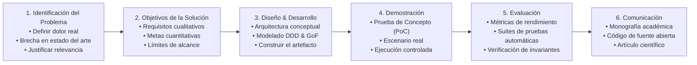

# 🎓 Metodología Científica: Design Science Research (DSR)

Este documento establece el marco epistemológico y metodológico para el diseño, implementación y evaluación de artefactos computacionales rigurosos en la investigación de ingeniería de software.

---

## 1. El Paradigma de Design Science Research (DSR)

En la investigación de Sistemas de Información (SI) e Ingeniería de Software, el paradigma conductual busca explicar o predecir fenómenos humanos y organizacionales, mientras que el paradigma de **Design Science Research (DSR)** busca extender las fronteras de las capacidades humanas y organizacionales mediante la creación y evaluación de **artefactos computacionales innovadores** (Hevner, March, Park, & Ram, 2004).

Este proyecto se estructura sobre el modelo de proceso de seis etapas formalizado por Peffers, Tuunanen, Rothenberger y Chatterjee (2007):

---

## 2. Las Siete Directrices de Hevner et al. (2004)

La ejecución de esta investigación se adhiere estrictamente a las siete directrices fundamentales para la ciencia del diseño:

1. **Diseño como un Artefacto:**  
   La investigación debe producir un artefacto computacional viable — formalizado como constructos (lenguaje ubicuo, tipos nominales), modelos (diagramas arquitectónicos, modelos de dominio), métodos (algoritmos, invariantes) o instanciaciones (código ejecutable de PoC).

2. **Relevancia del Problema:**  
   El artefacto debe abordar un problema técnico o de negocio importante y relevante que no esté resuelto satisfactoriamente por herramientas o enfoques existentes.

3. **Evaluación del Diseño:**  
   La utilidad, calidad y eficacia del artefacto deben demostrarse rigurosamente mediante métodos de evaluación empírica (suites de pruebas automatizadas, trinquetes de complejidad estática, verificación formal de invariantes).

4. **Contribuciones de la Investigación:**  
   La investigación debe aportar contribuciones claras y verificables en el área del artefacto diseñado, en los fundamentos de la ingeniería de software o en metodologías aplicadas de diseño.

5. **Rigor en la Investigación:**  
   La construcción y evaluación del artefacto se apoyan en la aplicación rigurosa de formalismos matemáticos, patrones consolidados de ingeniería de software (Clean Architecture, DDD, GoF) y teorías de sistemas.

6. **El Diseño como Proceso de Búsqueda:**  
   El descubrimiento de un diseño eficaz es un proceso heurístico e iterativo de exploración de alternativas, navegación por compromisos técnicos (trade-offs) y convergencia progresiva hacia soluciones óptimas.

7. **Comunicación de la Investigación:**  
   Los hallazgos deben comunicarse eficazmente tanto a audiencias académicas (rigor epistemológico, fundamentación teórica) como a audiencias técnicas y profesionales de la industria (implementación práctica, viabilidad arquitectónica).
