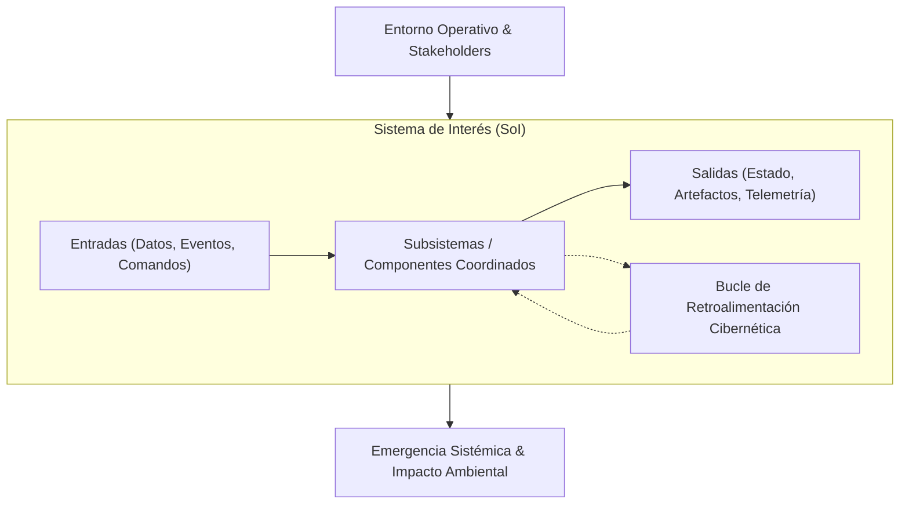
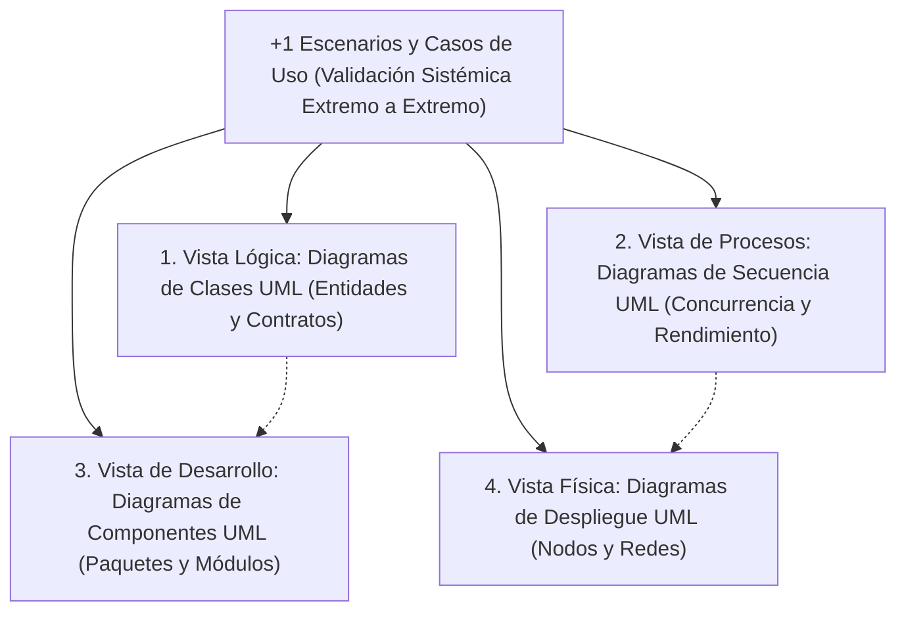

# ⚙️ Ingeniería de Sistemas, Confiabilidad & Ciclos de Vida Sistémicos

Este documento formaliza la metodología de ingeniería de sistemas, la taxonomía de confiabilidad (*dependability*) y los procesos de ciclo de vida que rigen el sistema, basados en el estándar internacional **ISO/IEC/IEEE 15288:2015** y en el **INCOSE Systems Engineering Handbook**.

---

## 1. Fundamentos de la Ingeniería de Sistemas

La ingeniería de sistemas es un enfoque interdisciplinario y un medio para permitir la realización de sistemas sociotécnicos y computacionales exitosos.



### 1.1 Axiomas Centrales de Sistemas
- **Holismo & Emergencia:** El sistema exhibe propiedades, comportamientos y modos de fallo que emergen de la interacción de sus partes y no pueden deducirse de ninguna parte de forma aislada.
- **Especificación Estricta de Límites:** Definición clara de lo que reside dentro del Sistema de Interés (SoI) frente a lo que pertenece al entorno operativo externo. Toda interacción a través del límite debe ocurrir mediante interfaces explícitas y verificadas.
- **Jerarquía & Modularidad:** Los sistemas se particionan en subsistemas cohesivos y débilmente acoplados. El acoplamiento a través de los límites de los subsistemas debe minimizarse estrictamente.

---

## 2. Procesos Técnicos de Ciclo de Vida ISO/IEC/IEEE 15288

El ciclo de desarrollo sigue los procesos técnicos iterativos y recursivos definidos por ISO/IEC/IEEE 15288:

```
Definición de Necesidades de los Stakeholders
         │
         ▼
Definición de Requisitos del Sistema (ISO 29148)
         │
         ▼
Definición de la Arquitectura del Sistema
         │
         ▼
Definición del Diseño
         │
         ▼
Implementación (Cero Comentarios, Clean Code, TDD)
         │
         ▼
Integración (Integración Continua & Validación de Límites)
         │
         ▼
Verificación ("¿Estamos construyendo el producto técnicamente correcto?")
         │
         ▼
Validación ("¿Estamos construyendo el producto correcto para el usuario?")
         │
         ▼
Transición, Operación & Evolución Continua
```

### 2.1 Verificación vs. Validación (V&V)
Según la formulación de Barry Boehm (1981):
- **Verificación:** *"¿Estamos construyendo el producto de la manera correcta?"*  
  Evalúa si el artefacto satisface las restricciones técnicas especificadas, firmas de tipo, aserciones unitarias, techos de rendimiento y trinquetes de calidad.
- **Validación:** *"¿Estamos construyendo el producto correcto?"*  
  Evalúa si el sistema implementado cumple con su propósito previsto, satisface las necesidades reales de las partes interesadas y resuelve el problema del mundo real en su contexto operativo.

### 2.2 Model-Based Systems Engineering (MBSE) & OMG UML 2.5.1
La Ingeniería de Sistemas Basada en Modelos (MBSE), estandarizada por el **INCOSE Systems Engineering Handbook** y la norma **ISO/IEC/IEEE 15288:2023**, reemplaza especificaciones textuales ambiguas por modelos diagramáticos formales y semánticamente integrados. La planificación basada en diagramas opera como el instrumento primario para los procesos de *System Architecture Definition* y *Design Definition* antes de la implementación.

Bajo la norma **OMG UML 2.5.1 (ISO/IEC 19505:2012)**, el modelado se divide en formalismos complementarios estructurales y de comportamiento:
- **Blueprints Estructurales:** Diagramas de Clases, Paquetes, Componentes y Despliegue (Deployment). Anclados en el principio de **Information Hiding de David Parnas (1972)**, el modelado estructural divide los sistemas en módulos cohesivos donde los secretos de implementación se ocultan tras fronteras de interfaz estrictas.
- **Dinámica de Comportamiento & Contratos Formales:** Diagramas de Secuencia, Máquina de Estados y Actividades. Los invariantes, transiciones de estado y flujos de mensajes están regidos por **Design by Contract (Bertrand Meyer, 1988)** y la **Object Constraint Language (OMG OCL / ISO/IEC 19507)**, especificando precondiciones ($pre$), poscondiciones ($post$) e invariantes de estado matemáticos entre operaciones.

#### Modelo de Vistas Arquitectónicas "4+1" de Kruchten
Philippe Kruchten (1995, *IEEE Software*) estableció el estándar canónico para la organización de modelos arquitectónicos, abordando las preocupaciones de diferentes partes interesadas mediante cinco vistas interconectadas:



1. **Vista Lógica (Modelo de Objetos de Diseño):** Captura requisitos funcionales, fronteras de dominio y servicios conceptuales. Representada por Diagramas de Clases y Objetos UML.
2. **Vista de Procesos (Concurrencia & Sincronización):** Aborda requisitos no funcionales como concurrencia, hilos de ejecución, mecanismos de comunicación y presupuestos de latencia. Representada por Diagramas de Secuencia, Actividades y Máquina de Estados UML.
3. **Vista de Desarrollo (Organización Modular del Software):** Define la estructura de código, jerarquías de paquetes, capas internas y dependencias de compilación. Representada por Diagramas de Paquetes y Componentes UML.
4. **Vista Física (Despliegue & Topología):** Detalla el mapeo de componentes de software a nodos de cómputo, clústeres de servidores, enlaces de red y entornos en la nube. Representada por Diagramas de Despliegue (Deployment) UML.
5. **+1 Escenarios (Casos de Uso Operativos):** Recorridos operativos reales que validan e integran las otras cuatro vistas, garantizando que la arquitectura holística satisfaga las misiones del negocio. Representada por Diagramas de Casos de Uso UML.

---

## 3. Taxonomía de Confiabilidad & Tolerancia a Fallos

Los sistemas de software operan en entornos hostiles y falibles. La teoría de la confiabilidad (*dependability*), formalizada por Avizienis, Laprie, Randell y Landwehr (2004), proporciona la taxonomía fundamental para la resiliencia de sistemas.

### 3.1 La Cadena Fundamental de Amenazas
Un fallo en un sistema no es un evento espontáneo; es la culminación de una cadena causal:

$$\text{Fallo / Defecto (Fault)} \xrightarrow{\text{activación}} \text{Error (Error)} \xrightarrow{\text{propagación}} \text{Avería / Falla (Failure)}$$

```
+---------------------------------------------------------------------------------+
| DEFECTO / FAULT (Defecto / Bug / Glitch de Hardware)                             |
| Una anomalía interna o condición externa que puede conducir a un error.          |
| Ejemplos: Error off-by-one, tiempo de espera no manejado, corrupción de memoria. |
+---------------------------------------------------------------------------------+
                                      │ (Activación durante la ejecución)
                                      ▼
+---------------------------------------------------------------------------------+
| ERROR / ERROR (Estado Interno Inválido)                                         |
| Anomalía de estado interno que difiere del estado operativo esperado.           |
| Ejemplos: Puntero nulo en memoria, entrada corrupta en caché, lock desfasado.    |
+---------------------------------------------------------------------------------+
                                      │ (Propagación hacia el límite del sistema)
                                      ▼
+---------------------------------------------------------------------------------+
| FALLA / FAILURE (Desviación del Servicio / Interrupción)                        |
| El servicio prestado por el sistema difiere de su contrato externo especificado. |
| Ejemplos: Error HTTP 500 devuelto al cliente, pérdida de transacción, datos corruptos.|
+---------------------------------------------------------------------------------+
```

### 3.2 Los Cuatro Medios de Confiabilidad
1. **Prevención de Defectos (Fault Prevention):** Prácticas rigurosas de ingeniería de software (TDD, tipado estático estricto, funciones puras) para evitar la introducción de defectos.
2. **Eliminación de Defectos (Fault Removal):** Quality gates, pruebas automatizadas, análisis estático e inspección formal durante el desarrollo para detectar y eliminar defectos existentes.
3. **Pronóstico de Defectos (Fault Forecasting):** Estimación probabilística de tasas de fallo, cálculos de MTBF y monitoreo de tendencias de telemetría.
4. **Tolerancia a Fallos (Fault Tolerance):** Diseñar el sistema para mantener la prestación del servicio o degradarse gradualmente a pesar de la presencia y activación de defectos:
   - *Detección de Errores:* Identificar errores internos antes de que se propaguen al límite (aserciones de esquema, sumas de verificación).
   - *Recuperación de Erros:* Restaurar un estado válido mediante recuperación hacia atrás (reversiones, instantáneas Memento, compensación de Saga) o recuperación hacia adelante (reintentos con idempotencia, circuit breakers, estados seguros de fallback).

---

## 4. Matemáticas Cuantitativas de Confiabilidad

Los atributos de confiabilidad deben cuantificarse utilizando métricas matemáticas rigurosas:

### 4.1 Métricas Centrales de Confiabilidad
- **Tiempo Medio de Detección (MTTD):** Duración media transcurrida entre la ocurrencia de una falla y su detección automatizada por los sistemas de monitoreo/telemetría.
- **Tiempo Medio de Resolución (MTTR):** Duración media requerida para diagnosticar, parchear y restaurar el sistema al estado operativo completo tras una avería detectada.
- **Tiempo Medio Entre Fallos (MTBF):** Duración media de tiempo operativo continuo entre dos fallos consecutivos del sistema.

### 4.2 Ecuación de Disponibilidad del Sistema
La disponibilidad operativa ($A$) se expresa matemáticamente como la proporción entre el tiempo de actividad (*uptime*) y el tiempo total:

$$A = \frac{\text{MTBF}}{\text{MTBF} + \text{MTTR}}$$

### 4.3 Alta Disponibilidad ("Los Nueves")

| Nivel de Disponibilidad | Inactividad por Año | Inactividad por Mes | Implicaciones Arquitectónicas |
| :--- | :--- | :--- | :--- |
| **$99.0\%$ (Dos Nueves)** | $3.65\text{ días}$ | $7.3\text{ horas}$ | Servidor de instancia única con recuperación manual. |
| **$99.9\%$ (Tres Nueves)** | $8.76\text{ horas}$ | $43.8\text{ minutos}$ | Comprobaciones automáticas de estado, conmutación por error multi-instancia. |
| **$99.99\%$ (Cuatro Nueves)** | $52.6\text{ minutos}$ | $4.38\text{ minutos}$ | Despliegues continuos sin interrupciones, redundancia multi-AZ. |
| **$99.999\%$ (Cinco Nueves)** | $5.26\text{ minutos}$ | $26.3\text{ segundos}$ | Activo-activo multirregión, conmutación por consenso en sub-segundos. |

---

## 5. Análisis de Decisión en Sistemas: Trade-Offs & Selección Multicriterio

Las decisiones de ingeniería jamás deben basarse en dogmatismo o preferencias estéticas. Cada decisión estructural importante requiere un análisis formal multicriterio de compromisos (*trade-offs*).

### 5.1 La Frontera de Eficiencia de Pareto
Una opción de diseño es **Pareto-óptima** si ningún atributo individual (ej.: latencia, costo, consistencia, rendimiento) puede mejorarse sin degradar al menos otro atributo.

```
Costo / Complejidad
    ^
    |          Soluciones Subóptimas (Dominadas)
    |              x         x
    |                  x
    |        (Curva de Frontera de Pareto)
    |       *----------------*-------------* Trade-Offs Óptimos
    |      /
    +----------------------------------------> Rendimiento / Confiabilidad
```

### 5.2 Matriz de Decisión de Pugh (Convergencia Controlada)
Al evaluar alternativas arquitectónicas competitivas, asigne pesos normalizados $w_i \in (0, 1)$ con $\sum w_i = 1$ en criterios estandarizados:

$$\text{Score}(A) = \sum_{i=1}^{k} w_i \cdot s_i(A)$$

| Criterio de Evaluación | Peso ($w_i$) | Línea Base (0) | Alternativa A | Alternativa B |
| :--- | :--- | :--- | :--- | :--- |
| **Aislamiento de Fallos** | $0.25$ | $0$ | $+1$ | $+2$ |
| **Sobrecarga de Latencia** | $0.25$ | $0$ | $-1$ | $+1$ |
| **Simplicidad Operativa** | $0.20$ | $0$ | $+1$ | $-2$ |
| **Consistencia de Datos** | $0.30$ | $0$ | $+2$ | $+1$ |
| **Total Ponderado** | **$1.00$** | **$0.00$** | **$+0.80$** | **$+0.45$** |

La Alternativa A proporciona el balance matemático superior de compromisos y se convierte en la arquitectura seleccionada.
