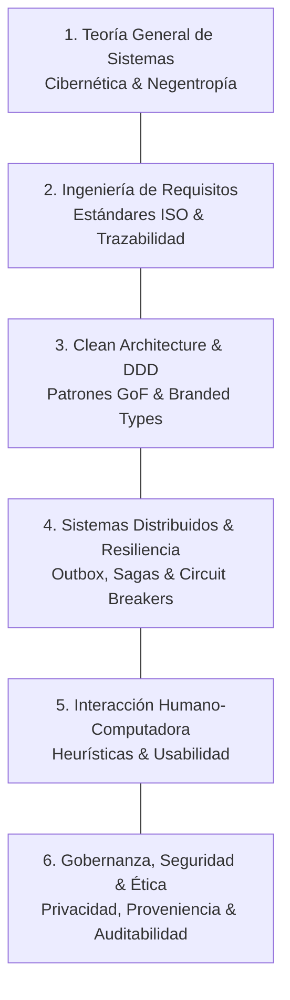

# 🏛️ Teoría General de Sistemas & Pilares de Ingeniería de Software

Este documento formaliza las bases sistémicas y los pilares centrales de ingeniería que fundamentan el diseño del software.

---

## 1. Teoría General de Sistemas (TGS) & Cibernética

- **Fundamentación Teórica:** Ludwig von Bertalanffy (1968) *General System Theory*; Norbert Wiener (1948) *Cybernetics*; Peter Checkland (1981) *Soft Systems Methodology (SSM)*.
- **Formulación Socio-Técnica:** El software se modela como un **sistema socio-técnico abierto**. Operadores humanos desempeñan roles estratégicos, evaluativos y de toma de decisiones, mientras que subsistemas computacionales deterministas y autónomos ejecutan tareas operativas, analíticas y de transformación.
- **Entropía & Negentropía (Entropía Negativa):** Procesos estocásticos, generativos o distribuidos introducen inherentemente entropía sistémica (deriva contextual, desincronización de estado, cargas útiles malformadas). El sistema computacional inyecta **negentropía** mediante:
  1. Contratos estrictos de validación de límites (esquemas inmutables en todos los perímetros).
  2. Registros de auditoría criptográficos para garantizar trazabilidad de estado.
  3. Quality gates automatizados que impiden el avance de artefactos corruptos o no conformes.
- **Bucles de Retroalimentación Cibernética:** Procesos deliberativos e iterativos de decisión deben incorporar señales medibles de retroalimentación que guíen bucles regulatorios autocorrectivos antes de la confirmación definitiva de estado.

---

## 2. Los Seis Pilares de Sistemas e Ingeniería de Software

1. **Teoría General de Sistemas (TGS):** Modelado holístico de los límites del sistema, entradas, salidas, subcomponentes y retroalimentación cibernética.
2. **Ingeniería de Requisitos (ISO/IEC/IEEE 29148:2018):**
   - Delimitación rigurosa entre el **Núcleo Indivisible** y extensiones modulares opcionales.
   - Requisitos atómicos y verificables formulados en términos conductuales testeables (`CUANDO... ENTONCES... Y`).
   - Atributos de calidad no funcional basados en el Modelo de Calidad de Software **ISO/IEC 25010:2023** (Confiabilidad, Eficiencia de Rendimiento, Mantenibilidad, Seguridad).
3. **Clean Architecture & Domain-Driven Design (DDD):**
   - Núcleo de dominio puro aislado de frameworks externos, bases de datos o mecanismos de entrega.
   - Eliminación de la obsesión por primitivos mediante *Branded Types* nominales.
4. **Sistemas Distribuidos & Resiliencia:**
   - Orquestación asíncrona de flujos de trabajo mediante Sagas distribuidas con garantía de compensación ante fallos.
   - Eliminación de anomalías de doble escritura (*dual-write*) mediante el patrón *Transactional Outbox*.
5. **Interacción Humano-Computadora (HCI):**
   - Heurísticas de usabilidad de Nielsen, visibilidad clara de estado del sistema, prevención de errores y ergonomía cognitiva alineada al modelo mental del operador.
6. **Gobernanza, Seguridad & Ética:**
   - Principio de mínimo privilegio, higienización automatizada de datos personales (PII) y credenciales en logs/telemetría, auditabilidad criptográfica inmutable y protección contra mutaciones de estado no autorizadas.
