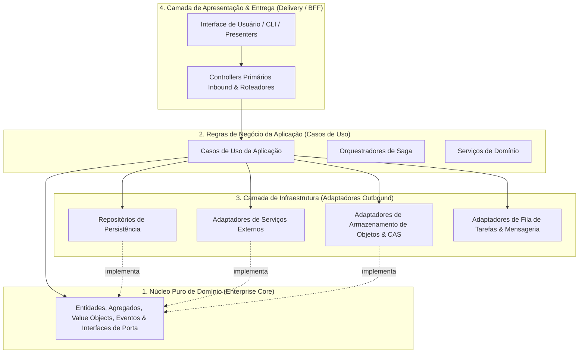

# 🏛️ Clean Architecture & Domain-Driven Design (DDD)

Este documento estabelece as regras canônicas para separação de responsabilidades, estratificação em camadas e isolamento do domínio de negócios.

---

## 1. A Regra de Dependência Unidirecional

O fluxo de dependência é estritamente unidirecional para dentro, em direção ao núcleo do domínio. Camadas externas de entrega (APIs, bancos de dados, interfaces de usuário, bibliotecas de terceiros) são detalhes de infraestrutura e entrega; o núcleo do domínio possui **zero** conhecimento sobre elas.



---

## 2. Estratificação em Camadas

### 2.1 Núcleo Puro de Domínio
- **Conteúdo:** Entidades de Domínio, Raízes de Agregação, Value Objects, Eventos de Domínio, Exceções de Domínio e Interfaces de Porta.
- **Invariante Constitucional:** O domínio é escrito em construções puras da linguagem (TypeScript padrão / primitivos nativos), com **zero** dependências de frameworks web, ORMs, drivers de banco de dados, componentes de interface ou utilitários de rede.

### 2.2 Regras de Negócio da Aplicação (Casos de Uso)
- **Conteúdo:** Casos de uso da aplicação, coordenadores de fluxo de trabalho, políticas de orquestração e contratos de entrada/saída.
- **Responsabilidade:** Orquestra operações de negócio expressas no modelo de domínio, coordenando persistência, transações e comunicação externa exclusivamente via Inversão de Dependência sobre interfaces de Porta declaradas.

### 2.3 Camada de Infraestrutura (Adaptadores Outbound)
- **Conteúdo:** Implementações concretas de repositórios, clientes de banco de dados, conectores de rede, drivers de sistema de arquivos e brokers de mensageria.
- **Responsabilidade:** Traduz interfaces de porta do domínio em invocações técnicas concretas exigidas pelos bancos de dados subjacentes, motores de armazenamento ou APIs de terceiros.

### 2.4 Camada de Apresentação & Entrega (Adaptadores Inbound)
- **Conteúdo:** Controllers HTTP, roteadores de API, comandos CLI ou apresentadores frontend.
- **Responsabilidade:** Atua estritamente como um *Adaptador Primário Inbound*: analisa requisições externas, valida esquemas de dados de entrada na fronteira, extrai o contexto de autenticação e delega a execução diretamente ao Caso de Uso da Aplicação designado.

---

## 3. Eliminando Obsessão por Primitivos (Branded Types)

Na modelagem de domínio, tipos primitivos puros (`string`, `number`) obscurecem o significado semântico e permitem erros sutis de invocação (ex.: fornecer um `UserId` onde um `AccountId` era esperado).

- **Regra de Tipos com Marcação (Branded Types):** Identificadores únicos, valores monetários, intervalos de execução e métricas críticas de domínio devem ser modelados como tipos nominais (*Branded Types*):

```typescript
export type Brand<T, B extends string> = T & { readonly __brand: B };

export type ProjectId = Brand<string, "ProjectId">;
export type EntityId = Brand<string, "EntityId">;
export type Microseconds = Brand<number, "Microseconds">;
export type ExecutionBudget = Brand<number, "ExecutionBudget">;
```

- **Benefício Arquitetural:** O compilador previne estaticamente confusões de tipos semânticos e argumentos invertidos entre assinaturas de funções, preservando a integridade do modelo em toda a aplicação.
