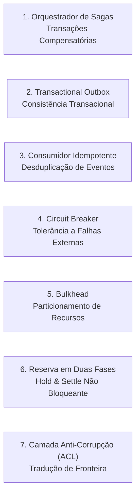

# 🛡️ Sistemas Distribuídos & Padrões de Resiliência

Este documento especifica os padrões de engenharia de software para garantir consistência eventual, isolamento de falhas e proteção de recursos em arquiteturas assíncronas e distribuídas.

---

## 1. Catálogo de Padrões de Resiliência

---

### 1.1 Orquestrador de Sagas (Garcia-Molina & Salem; Richardson)
- **Problema:** Transações distribuídas tradicionais baseadas em Two-Phase Commit (2PC) bloqueiam recursos de banco de dados por longos períodos e sofrem com latência proibitiva em fluxos assíncronos de longa duração.
- **Solução:** O fluxo de trabalho é decomposto em uma série ordenada de transações locais coordenadas por uma Máquina de Estados Finitos (FSM) explícita. Para cada transação direta concluída com sucesso $T_i$, uma ação compensatória correspondente $C_i$ é registrada.
- **Garantia:** Se ocorrer uma falha irrecuperável na etapa $k$, o orquestrador dispara ações compensatórias em ordem reversa ($C_{k-1}, C_{k-2}, \dots, C_1$), desfazendo com segurança mutações parciais, estornando cotas reservadas e expurgando recursos temporários órfãos.

---

### 1.2 Transactional Outbox (Richardson)
- **Problema:** O risco de escrita dupla (*dual-write hazard*) ocorre quando um sistema tenta alterar o estado do banco de dados e publicar um evento em um broker de mensageria em operações separadas. Se o broker estiver inacessível após o commit no banco, o evento é perdido permanentemente; se o evento for publicado antes do commit, uma falha subsequente no banco emite um evento fantasma.
- **Solução:** O evento de domínio a ser despachado é gravado em uma tabela dedicada de `outbox` **dentro da exata mesma transação ACID** que a mutação da entidade de negócio. Um daemon relé assíncrono varre continuamente a tabela de outbox e despacha os eventos para o broker com garantia de *entrega ao menos uma vez (at-least-once delivery)*.

---

### 1.3 Consumidor Idempotente (Hohpe & Woolf)
- **Problema:** Em redes distribuídas com semântica de mensageria *at-least-once*, timeouts de rede ou tentativas de reconexão podem entregar exatamente o mesmo comando ou evento múltiplas vezes.
- **Solução:** Todo comando ou evento de entrada deve conter uma `idempotencyKey` determinística.
- **Protocolo:** Antes de executar qualquer operação com efeitos colaterais, o consumidor inspeciona seu registro de chaves processadas:
  - Se a chave já estiver marcada como concluída: retorna a resposta em cache imediatamente sem reexecutar a lógica de negócio.
  - Se a chave estiver em processamento concorrente: rejeita a reentrância ou inicia uma espera ordenada.
  - Se a chave for inédita: executa a operação e confirma a conclusão de forma atômica com a mutação de estado.

---

### 1.4 Circuit Breaker (Nygard)
- **Problema:** Degradação intermitente ou interrupções graves em APIs externas e dependências de terceiros podem esgotar pools de conexões e threads locais, resultando em colapso em cascata em todo o sistema.
- **Solução:** Invocações de rede externa são encapsuladas em um Circuit Breaker de 3 estados:
  - **Closed (Fechado):** Operação normal. As requisições passam livremente enquanto os erros são monitorados em uma janela deslizante de execução.
  - **Open (Aberto):** A taxa de erro ultrapassa o limiar de tolerância configurado. Todas as requisições subsequentes falham imediatamente (*fast-fail*) sem tocar a rede remota, permitindo que a dependência externa se recupere.
  - **Half-Open (Meio-Aberto):** Após um intervalo de arrefecimento (*cool-down*), um lote experimental de requisições é liberado. Se obtiver sucesso, o circuito retorna a *Closed*; caso as falhas persistam, retorna imediatamente a *Open*.

---

### 1.5 Bulkhead (Nygard)
- **Problema:** Um pico repentino em tarefas lentas ou computacionalmente pesadas consome 100% de CPU, memória ou threads de trabalho, provocando inanição (*starvation*) e indisponibilidade total para requisições interativas e leves dos usuários.
- **Solução:** Particionamento físico de pools de concorrência e recursos:
  - Daemons dedicados e limites estritos de concorrência para processamento de background de alto custo.
  - Pools de threads e conexões de banco de dados isolados, alocados especificamente para a API interativa dos usuários.

---

### 1.6 Reserva de Recursos em Duas Fases (Padrão Hold & Settle)
- **Problema:** Durante tarefas assíncronas de longa duração (ex.: de 2 a 10 minutos), manter uma transação de banco de dados aberta enquanto se aguarda a execução esgota o pool de conexões em poucos segundos.
- **Solução:** Um protocolo não bloqueante de reserva em duas fases:
  1. **Fase 1 (Hold, transação ACID rápida ~5ms):** Valida saldo ou capacidade disponível e confirma um registro de reserva com status `HELD`. A transação fecha imediatamente.
  2. **Execução Assíncrona:** Workers em background realizam o processamento totalmente fora de qualquer transação aberta no banco de dados.
  3. **Fase 2a (Settle, transação ACID rápida ~5ms):** Após conclusão bem-sucedida, uma transação atômica transiciona o status para `SETTLED` e deduz definitivamente a cota consumida.
  4. **Fase 2b (Liberação Compensatória):** Em caso de falha ou timeout da tarefa, o status muda para `RELEASED`, desbloqueando a capacidade reservada sem penalidades.

---

### 1.7 Camada Anti-Corrupção - ACL (Evans)
- **Problema:** Permitir que esquemas de fornecedores externos, formatos de dados de terceiros ou estruturas de SDKs remotos se infiltrem nos serviços centrais corrompe a linguagem ubíqua e acopla a arquitetura a implementações proprietárias.
- **Solução:** Uma fronteira de tradução perimétrica que intercepta estruturas externas e as mapeia bidirecionalmente em entidades internas de domínio fortemente tipadas. Se provedores externos ou protocolos mudarem, apenas o adaptador ACL na borda é atualizado; o núcleo do domínio permanece 100% inalterado.
