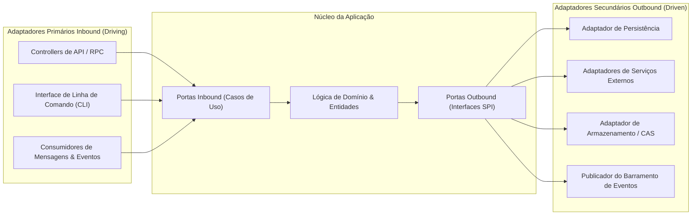

# 🔌 Arquitetura Hexagonal: Portas, Adaptadores & Contratos

Este documento define os princípios centrais da **Arquitetura Hexagonal (Ports & Adapters)** e os limites padronizados de contratos.

---

## 1. Conceito Arquitetural Central (Cockburn)

A lógica de negócio da aplicação reside no centro do hexágono, isolada de preocupações de infraestrutura. O ambiente externo interage com o núcleo exclusivamente através de **Portas** (interfaces abstratas) implementadas por **Adaptadores** técnicos concretos:

---

## 2. Adaptadores Primários (Inbound / Driving)

Adaptadores primários iniciam a comunicação com a aplicação traduzindo requisições externas em comandos de casos de uso internos.

### 2.1 O Padrão Thin Controller (Controladores Finos)
- **Teto de Tamanho:** Nenhum controller, handler de rota ou arquivo de comando individual pode exceder 300 linhas de código ($\le 300\text{ LOC}$).
- **Responsabilidades Estritas:**
  1. Validar a estrutura da requisição e tipagem de payload contra esquemas imutáveis (Zod / JSON Schema).
  2. Extrair identidade da sessão, contexto de tenant e verificar permissões de segurança.
  3. Delegar a execução diretamente ao Caso de Uso da Aplicação designado.
  4. Mapear exceções internas do domínio em códigos de status de protocolo padronizados.
- **Proibição Estrita:** É estritamente proibido incluir lógica de negócio, mutações diretas em banco de dados ou loops de processamento complexos dentro de controllers.

### 2.2 Estratégia Contract-First & Entrega Multi-Protocolo
- As operações são definidas a partir de contratos tipados e imutáveis (entrada, saída, metadados).
- Uma definição unificada de contrato pode atender a protocolos duplos de entrega:
  - **Protocolo RPC Type-Safe:** Otimizado para alto rendimento e segurança de tipo de ponta a ponta em tempo de compilação entre clientes internos e servidores.
  - **Protocolo REST / OpenAPI:** Endpoints padronizados com geração automática de OpenAPI 3.1 para consumidores externos e ferramentas automatizadas.

---

## 3. Adaptadores Secundários (Outbound / Driven)

Adaptadores secundários são invocados pela aplicação para comunicação com infraestrutura externa (bancos de dados, sistemas de arquivos, serviços de rede de terceiros).

### 3.1 O Princípio da Inversão de Dependência (DIP)
- A aplicação define a interface necessária para cumprir seus objetivos (`IRepository`, `IStorageService`, `INotificationGateway`).
- O módulo de infraestrutura implementa essa interface. O núcleo de domínio possui zero conhecimento sobre drivers específicos, dialetos de banco de dados ou protocolos de rede.
- A substituição de um componente de infraestrutura (ex.: troca de motores de banco de dados ou provedores de armazenamento em nuvem) ocorre sem modificar uma única linha de código do domínio ou da aplicação.
