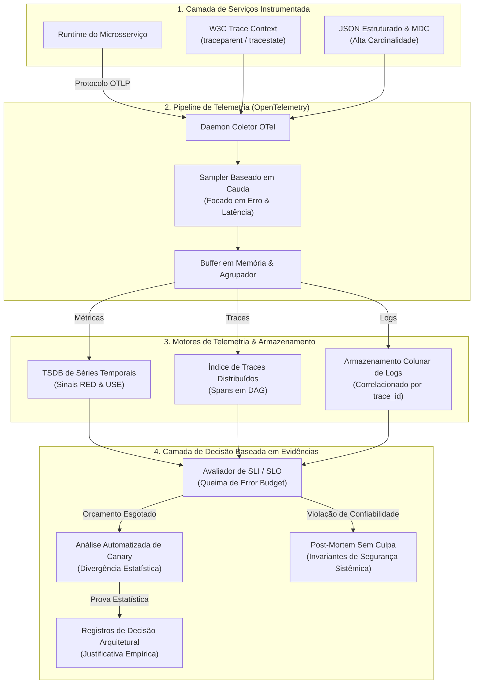

# 📡 Observabilidade, Telemetria Distribuída & Tomada de Decisão Baseada em Evidência

Este documento formaliza os padrões arquiteturais, pipelines de telemetria e frameworks empíricos de decisão utilizados para garantir confiabilidade de software, transparência operacional e resiliência contínua em sistemas distribuídos de missão crítica.

---

## 1. Arquitetura Unificada de Telemetria & Pipeline de Evidências



---

## 2. Catálogo de Padrões Centrais de Observabilidade

### 2.1 Rastreamento Distribuído & Propagação de Contexto W3C (Sigelman et al., 2010; W3C)
- **Problema:** Em malhas de microsserviços e barramentos de mensageria assíncronos, uma única transação de entrada ramifica-se em dezenas de saltos de rede. Logs tradicionais não conseguem correlacionar falhas em múltiplas camadas nem identificar gargalos de latência através das fronteiras de processos.
- **Solução:** Toda transação de entrada recebe um contexto único global W3C Trace Context:
  $$\text{traceparent} = \text{version}-\text{trace\_id}-\text{parent\_id}-\text{trace\_flags}$$
- **Protocolo:**
  1. O gateway de borda cria um `trace_id` imutável de 16 bytes e o `span_id` inicial.
  2. Adaptadores de entrada e saída HTTP/gRPC/Mensageria extraem e injetam automaticamente os cabeçalhos `traceparent` e `tracestate` através das fronteiras de rede sem poluir as entidades de domínio.
  3. Cada span de execução registra timestamps monotônicos de início e término, referência ao span pai, código de status e atributos estruturados, formando um Grafo Acíclico Dirigido (DAG) de toda a árvore de execução da requisição.

---

### 2.2 Os 4 Sinais Dourados & O Método RED (Beyer et al., 2016; Wilkie, 2017)
- **Problema:** Monitorar milhares de contadores brutos de CPU e memória gera fadiga de alertas enquanto mascara a degradação real percebida pelo cliente.
- **Solução:** Para todos os serviços voltados ao usuário e APIs orientadas a requisições, o monitoramento de engenharia é estritamente estruturado em torno do paradigma **RED** e dos **Quatro Sinais Dourados** do Google:

| Sinal / Métrica | Definição Matemática Formal | Significado Operacional |
| :--- | :--- | :--- |
| **Taxa (Rate / R) / Tráfego** | $\lambda = \frac{\Delta N_{\text{requests}}}{\Delta t}$ | Taxa de chegada de requisições por segundo através das fronteiras de serviço. |
| **Erros (Errors / E)** | $E_{\text{rate}} = \frac{\Delta N_{\text{failed}}}{\Delta N_{\text{total}}} \times 100\%$ | Proporção de requisições com falha ($5\text{xx}$ HTTP, exceções não tratadas) sobre o total de requisições. |
| **Duração (Duration / D) / Latência** | $\mathcal{P}_{50}, \mathcal{P}_{95}, \mathcal{P}_{99} \text{ de } T_{\text{elapsed}}$ | Percentis de latência em janelas temporais; médias são estritamente proibidas devido à distorção de cauda longa. |
| **Saturação (Saturation)** | $\text{Sat} = \frac{\text{Tamanho da Fila}}{\text{Capacidade Máxima}} \text{ ou } \frac{\text{Workers Ativos}}{\text{Tamanho do Pool}}$ | Fração consumida da capacidade do recurso; alerta sobre degradação iminente antes do colapso de vazão. |

---

### 2.3 O Método USE para Recursos de Sistema (Gregg, 2012)
- **Problema:** Gargalos de infraestrutura (latência de agendamento de CPU, esgotamento de sockets, fragmentação de memória) degradam serviços silenciosamente antes que erros explícitos apareçam.
- **Solução:** Para cada recurso físico ou de nível de kernel (CPUs, memória, discos, interfaces de rede, pools de conexões), coletores amostram continuamente:
  1. **Utilização (Utilization):** Porcentagem de tempo em que o recurso esteve ativamente atendendo trabalho (ex.: taxa de ocupação dos núcleos de CPU).
  2. **Saturação (Saturation):** Volume de trabalho enfileirado que não pode ser processado imediatamente (ex.: tamanho da run-queue no Linux, profundidade da fila de threads).
  3. **Erros (Errors):** Eventos de erro de hardware ou driver (ex.: pacotes de rede descartados, retransmissões TCP, retentativas de leitura em disco).

---

### 2.4 Logs Estruturados de Alta Cardinalidade & Mapped Diagnostic Context (MDC)
- **Problema:** Logs em texto desestruturado (`console.log("Processando pedido " + id)`) impedem indexação, inflam o volume e não podem ser filtrados programaticamente durante incidentes críticos de produção.
- **Solução:** Toda emissão de log é estritamente estruturada em JSON aderindo às Convenções Semânticas do OpenTelemetry. Cada registro de log transporta tags contextuais injetadas automaticamente através de Mapped Diagnostic Context (MDC):
  ```json
  {
    "timestamp": "2026-09-22T18:40:00.123Z",
    "level": "ERROR",
    "message": "Payment gateway connection timeout",
    "service.name": "billing-service",
    "trace_id": "4bf92f3577b34da6a3ce929d0e0e4736",
    "span_id": "00f067aa0ba902b7",
    "account.id": "acc-9841",
    "circuit_breaker.state": "HALF_OPEN",
    "duration_ms": 2503.4
  }
  ```
- **Regra:** Concatenação manual de strings em logs de produção constitui violação automatizada de qualidade.

---

### 2.5 Amostragem Dinâmica de Telemetria (Head vs. Tail-Based)
- **Problema:** Amostragem uniforme de 100% dos traces em sistemas de alta vazão consome largura de banda astronômica e petabytes de armazenamento desnecessário para requisições saudáveis $200\text{ OK}$.
- **Solução:** Coletores de telemetria empregam **Amostragem Baseada em Cauda (Tail-Based Sampling)**:
  - Coletores de ingestão mantêm DAGs de spans em buffer na memória local até a conclusão da requisição.
  - Traces contendo erros não tratados ($5\text{xx}$), disparos de circuit breaker ou latências que excedam o percentil $\mathcal{P}_{95}$ são retidos com **100% de taxa de amostragem**.
  - Traces nominais bem-sucedidos sub-milissegundo são amostrados a **1% a 5%** para representação estatística de linha de base.

---

## 3. Padrões de Engenharia de Decisão Baseada em Evidência

### 3.1 Contratos Quantitativos de Confiabilidade: SLI, SLO & Error Budgets (Google SRE)
Confiabilidade não é um estado binário; é uma distribuição empírica de probabilidade delimitada por limiares quantitativos:

1. **Indicador de Nível de Serviço (SLI):** Razão formal calculada que define o comportamento aceitável do serviço:
   $$\text{SLI} = \frac{\sum \text{Eventos com Sucesso}}{\sum \text{Eventos Válidos}} \times 100\%$$
   *Exemplo:* $\frac{\text{Contagem de chamadas HTTP com status } < 500 \text{ e duração } \le 200\text{ms}}{\text{Contagem total de chamadas HTTP}}$

2. **Objetivo de Nível de Serviço (SLO):** Percentual alvo de confiabilidade acordado para uma janela de conformidade (tipicamente 30 dias móveis):
   $$\text{SLO} \ge 99.9\% \quad (\text{Três Noves})$$

3. **Orçamento de Erro (Error Budget - $EB$):** Margem permitida para não confiabilidade:
   $$EB = 1.0 - \text{SLO} = 1.0 - 0.999 = 0.001 \quad (0.1\% \text{ do tráfego total})$$

4. **Política de Esgotamento do Error Budget:**
   - **$EB > 20\%$ Disponível:** Desenvolvimento normal de novas funcionalidades e deploys prosseguem.
   - **$EB \le 0\%$ (Esgotado):** Congelamento automatizado de deploys. Toda a capacidade de engenharia interrompe lançamentos e se concentra 100% em melhorias de resiliência, robustez arquitetural e correção de bugs até a recuperação do orçamento de erro.

---

### 3.2 Análise Automatizada de Canary & Divergência Estatística de Métricas (Humble & Farley, 2010)
- **Problema:** Fazer deploy de código novo diretamente para 100% do tráfego de produção arrisca interrupções sistêmicas devido a casos de borda não detectados ou vazamentos de memória.
- **Solução:** Verificação automatizada de liberação canary:
  1. Uma pequena fatia canary (ex.: $5\%$ do tráfego) é implantada com a versão candidata lado a lado com a frota baseline idêntica.
  2. O pipeline de telemetria calcula continuamente testes Mann-Whitney $U$ ou Kolmogorov-Smirnov comparando taxas de erro e distribuições de latência $\mathcal{P}_{99}$ entre instâncias canary e baseline.
  3. Se a divergência estatística ultrapassar o limiar crítico alfa ($\alpha = 0.01$), o deploy do canary é automaticamente abortado e revertido em milissegundos sem necessidade de intervenção humana.

---

### 3.3 Registros de Decisão Arquitetural (ADRs) como Provas Empíricas (Nygard, 2011)
Mudanças arquiteturais jamais devem ocorrer por intuição. Toda evolução estrutural, adoção de framework ou refatoração de fronteira exige um ADR versionado contendo:
1. **Status:** Proposto, Aceito, Rejeitado, Depreciado, Substituído.
2. **Contexto:** O problema técnico e as medições empíricas (flame graphs de profiler, métricas de fila da Lei de Little, gargalos de rede) que tornam a mudança necessária.
3. **Decisão & Invariantes:** O padrão arquitetural exato, fronteiras de módulos e interfaces selecionadas.
4. **Consequências & Trade-offs:** Garantias positivas, sobrecarga operacional reconhecida e caminhos de reversão/migração.

---

### 3.4 Post-Mortems Sem Culpa & Engenharia de Resiliência (Allspaw, 2012)
- **Princípio Central:** Erro humano nunca é a causa raiz de um incidente; o erro humano é o *sintoma* de uma vulnerabilidade sistêmica no sistema sócio-técnico.
- **Protocolo:** Após qualquer anomalia de produção $P_0$ ou $P_1$:
  1. Construir uma linha do tempo cronológica com métricas empíricas de telemetria (Sinais Dourados, mudanças de estado, logs).
  2. Identificar condições latentes: ausência de circuit breakers, filas não bufferizadas, proteções de fallback inadequadas ou timeouts conflitantes.
  3. Produzir remediações acionáveis de engenharia: testes automatizados de regressão, catracas de qualidade arquitetural e circuit breakers estruturais. Atribuição de culpa pessoal é explicitamente proibida.

---

## 4. Invariantes Arquiteturais & Anti-Patterns

### ✅ Invariantes de Engenharia Mandatórios
1. **Zero Fronteiras Inbound Sem Instrumentação:** Todo ponto de entrada externo (HTTP, gRPC, WebSocket, consumidor de fila) deve inicializar automaticamente um span de trace W3C.
2. **Zero Logs em Texto Desestruturado:** Logs devem ser emitidos estritamente como JSON estruturado com campos obrigatórios `trace_id`, `service.name` e nível de severidade.
3. **Verificação de SLA Orientada a Percentis:** Relatórios de performance devem citar exclusivamente $\mathcal{P}_{50}$, $\mathcal{P}_{95}$, $\mathcal{P}_{99}$ e $\mathcal{P}_{99.9}$. Médias aritméticas são proibidas.
4. **Contrato de Alertas Acionáveis:** Um alerta jamais deve disparar a menos que represente uma ameaça imediata ao SLO e contenha um runbook operacional verificado para remediação.

### 🚫 Anti-Patterns Proibidos
- **O Cemitério de Métricas:** Emitir centenas de gauges e contadores ad-hoc que nenhum painel visualiza e nenhum alerta verifica.
- **Supressão Cega de Telemetria com Try-Catch:** Capturar exceções para retornar um objeto nulo padrão sem incrementar contadores de erro ou registrar o contexto do trace.
- **Falácia das Médias Estáticas:** Afirmar que "o tempo médio de resposta da API é 80ms" enquanto o percentil 99 sofre com timeouts de 4 segundos causados por pausas de garbage collection.
- **Cultura de Atribuição de Culpa:** Concluir uma investigação de incidente com "desenvolvedor enviou configuração errada" em vez de implementar barreiras automatizadas de validação de esquema.

---

## 5. Referências Acadêmicas & Seminais

- **Allspaw, J. (2012).** *Blameless Post-Mortems and a Just Culture*. Etsy Code as Craft.
- **Beyer, B., Jones, C., Petoff, J., & Murphy, N. R. (2016).** *Site Reliability Engineering: How Google Runs Production Systems*. O'Reilly Media. ISBN: 978-1491929124.
- **Gregg, B. (2012).** *The USE Method: A Methodology for Analyzing Performance*. Brendan Gregg's Technical Papers.
- **Humble, J., & Farley, D. (2010).** *Continuous Delivery: Reliable Software Releases through Build, Test, and Deployment Automation*. Addison-Wesley. ISBN: 978-0321601919.
- **Majors, C., Fong-Jones, L., & Miranda, G. (2022).** *Observability Engineering: Achieving Production Excellence*. O'Reilly Media. ISBN: 978-1492029014.
- **Nygard, M. (2011).** *Documenting Architecture Decisions*. Cognitect Technical Artifacts.
- **Sigelman, B. H., et al. (2010).** *Dapper, a Large-Scale Distributed Systems Tracing Infrastructure*. Google Technical Report.
- **W3C Recommendation (2021).** *Trace Context: W3C Recommendation 23 November 2021*. World Wide Web Consortium.
- **Wilkie, T. (2017).** *The RED Method: How to Instrument Your Services*. Microservices Practitioner Summit.
