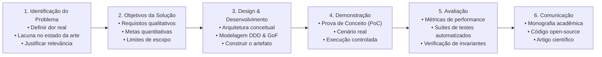

# 🎓 Metodologia Científica: Design Science Research (DSR)

Este documento estabelece o arcabouço epistemológico e metodológico para o projeto, implementação e avaliação de artefatos computacionais rigorosos na pesquisa em engenharia de software.

---

## 1. O Paradigma de Design Science Research (DSR)

Na pesquisa em Sistemas de Informação (SI) e Engenharia de Software, o paradigma comportamental busca explicar ou prever fenômenos humanos e organizacionais, enquanto o paradigma de **Design Science Research (DSR)** busca expandir as fronteiras das capacidades humanas e organizacionais através da criação e avaliação de **artefatos computacionais inovadores** (Hevner, March, Park, & Ram, 2004).

Este projeto está estruturado sobre o modelo de processo de seis estágios formalizado por Peffers, Tuunanen, Rothenberger e Chatterjee (2007):

---

## 2. As Sete Diretrizes de Hevner et al. (2004)

A condução desta pesquisa adere rigorosamente às sete diretrizes fundamentais da ciência do design:

1. **Design como um Artefato:**  
   A pesquisa deve produzir um artefato computacional viável — formalizado como construtos (linguagem ubíqua, tipos nominais), modelos (diagramas arquiteturais, modelos de domínio), métodos (algoritmos, invariantes) ou instanciações (código executável de PoC).

2. **Relevância do Problema:**  
   O artefato deve abordar um problema de negócio ou técnico importante e relevante que não seja satisfatoriamente solucionado por ferramentas ou abordagens existentes.

3. **Avaliação do Design:**  
   A utilidade, qualidade e eficácia do artefato devem ser demonstradas rigorosamente por métodos de avaliação empírica (suítes de testes automatizados, catracas de complexidade estática, verificação formal de invariantes).

4. **Contribuições da Pesquisa:**  
   A pesquisa deve fornecer contribuições claras e verificáveis na área do artefato projetado, nos fundamentos da engenharia de software ou nas metodologias aplicadas de design.

5. **Rigor na Pesquisa:**  
   A construção e avaliação do artefato apoiam-se na aplicação rigorosa de formalismos matemáticos, padrões consolidados de engenharia de software (Clean Architecture, DDD, GoF) e teorias de sistemas.

6. **Design como Processo de Busca:**  
   A descoberta de um design eficaz é um processo heurístico iterativo de exploração de alternativas, navegação por trade-offs e convergência progressiva para soluções ótimas.

7. **Comunicação da Pesquisa:**  
   Os resultados devem ser comunicados de forma eficaz tanto a audiências acadêmicas (rigor epistemológico, embasamento teórico) quanto a audiências técnicas e profissionais da indústria (implementação prática, viabilidade arquitetural).
