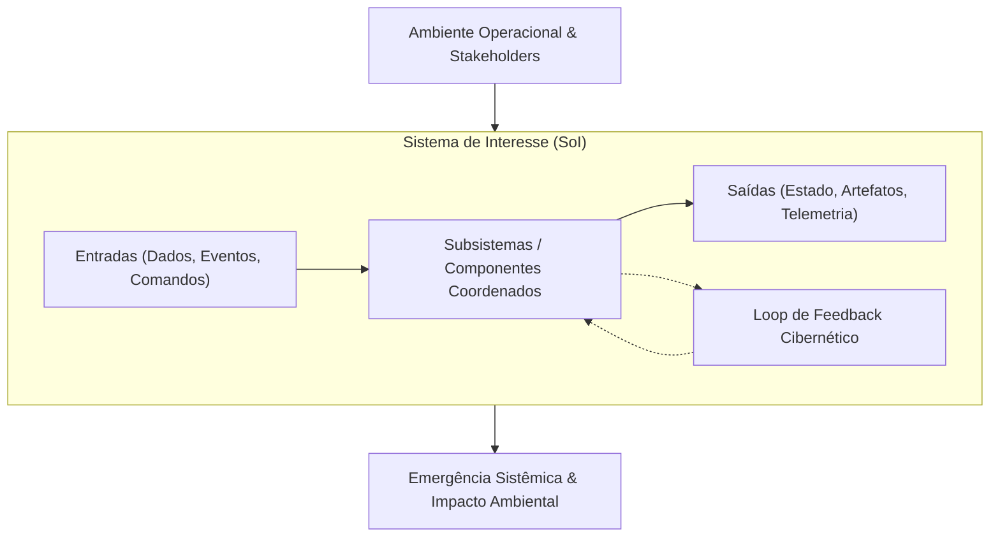

# ⚙️ Engenharia de Sistemas, Confiabilidade & Ciclos de Vida Sistêmicos

Este documento formaliza a metodologia de engenharia de sistemas, a taxonomia de confiabilidade (dependability) e os processos de ciclo de vida que regem o sistema, embasados no padrão internacional **ISO/IEC/IEEE 15288:2015** e no **INCOSE Systems Engineering Handbook**.

---

## 1. Fundamentos da Engenharia de Sistemas

A engenharia de sistemas é uma abordagem interdisciplinar e um meio para viabilizar a realização de sistemas sócio-técnicos e computacionais bem-sucedidos.



### 1.1 Axiomas Centrais de Sistemas
- **Holismo & Emergência:** O sistema exibe propriedades, comportamentos e modos de falha que emergem da interação de suas partes e não podem ser deduzidos de qualquer parte isoladamente.
- **Especificação Estrita de Fronteira:** Definição clara do que reside dentro do Sistema de Interesse (SoI) versus o que pertence ao ambiente operacional externo. Toda interação através da fronteira deve ocorrer por interfaces explícitas e verificadas.
- **Hierarquia & Modularidade:** Sistemas são particionados em subsistemas coesos e fracamente acoplados. O acoplamento através das fronteiras dos subsistemas deve ser estritamente minimizado.

---

## 2. Processos Técnicos de Ciclo de Vida ISO/IEC/IEEE 15288

O ciclo de desenvolvimento segue os processos técnicos iterativos e recursivos definidos pela ISO/IEC/IEEE 15288:

```
Definição de Necessidades dos Stakeholders
         │
         ▼
Definição de Requisitos do Sistema (ISO 29148)
         │
         ▼
Definição da Arquitetura do Sistema
         │
         ▼
Definição de Design
         │
         ▼
Implementação (Zero Comentários, Clean Code, TDD)
         │
         ▼
Integração (Integração Contínua & Validação de Fronteiras)
         │
         ▼
Verificação ("Estamos construindo o produto certo tecnicamente?")
         │
         ▼
Validação ("Estamos construindo o produto correto para o usuário?")
         │
         ▼
Transição, Operação & Evolução Contínua
```

### 2.1 Verificação vs. Validação (V&V)
Conforme formulado por Barry Boehm (1981):
- **Verificação:** *"Estamos construindo o produto do modo certo?"*  
  Avalia se o artefato satisfaz as restrições técnicas especificadas, assinaturas de tipo, asserções unitárias, tetos de performance e catracas de qualidade.
- **Validação:** *"Estamos construindo o produto certo?"*  
  Avalia se o sistema realizado atinge seu propósito pretendido, satisfaz as necessidades reais dos stakeholders e resolve o problema do mundo real em seu contexto operacional.

---

## 3. Taxonomia de Confiabilidade & Tolerância a Falhas

Sistemas de software operam em ambientes hostis e falíveis. A teoria da confiabilidade (*dependability*), formalizada por Avizienis, Laprie, Randell e Landwehr (2004), fornece a taxonomia fundamental para a resiliência de sistemas.

### 3.1 A Cadeia Fundamental de Ameaças
Uma falha em um sistema não é um evento espontâneo; é o ápice de uma cadeia causal:

$$\text{Defeito (Fault)} \xrightarrow{\text{ativação}} \text{Erro (Error)} \xrightarrow{\text{propagação}} \text{Falha (Failure)}$$

```
+---------------------------------------------------------------------------------+
| DEFEITO / FAULT (Defeito / Bug / Glitch de Hardware)                             |
| Uma anomalia interna ou condição externa que pode levar a um erro.              |
| Exemplos: Erro off-by-one, timeout de rede não tratado, corrupção de memória.   |
+---------------------------------------------------------------------------------+
                                      │ (Ativação durante a execução)
                                      ▼
+---------------------------------------------------------------------------------+
| ERRO / ERROR (Estado Interno Inválido)                                          |
| Anomalia de estado interno que diverge do estado operacional esperado.         |
| Exemplos: Ponteiro nulo na memória, cache corrompido, lock dessincronizado.     |
+---------------------------------------------------------------------------------+
                                      │ (Propagação para a fronteira do sistema)
                                      ▼
+---------------------------------------------------------------------------------+
| FALHA / FAILURE (Desvio de Serviço / Interrupção)                               |
| O serviço entregue pelo sistema diverge de seu contrato externo especificado.   |
| Exemplos: Erro HTTP 500 retornado ao cliente, perda transacional, dados corrompidos.|
+---------------------------------------------------------------------------------+
```

### 3.2 Os Quatro Meios de Confiabilidade
1. **Prevenção de Defeitos (Fault Prevention):** Práticas rigorosas de engenharia de software (TDD, tipagem estática forte, funções puras) para prevenir a introdução de defeitos.
2. **Remoção de Defeitos (Fault Removal):** Quality gates, testes automatizados, análise estática e inspeção formal durante o desenvolvimento para detectar e eliminar defeitos existentes.
3. **Previsão de Defeitos (Fault Forecasting):** Estimativa probabilística de taxas de falha, cálculos de MTBF e monitoramento de tendências de telemetria.
4. **Tolerância a Falhas (Fault Tolerance):** Projetar o sistema para manter a entrega de serviço ou degradar graciosamente apesar da presença e ativação de defeitos ativos:
   - *Detecção de Erros:* Identificar erros internos antes que se propaguem para a fronteira (asserções de esquema, checksums).
   - *Recuperação de Erros:* Restaurar um estado válido via recuperação para trás (rollbacks, snapshots de Memento, compensações de Saga) ou recuperação para frente (retentativa com idempotência, circuit breakers, estados seguros de fallback).

---

## 4. Matemática Quantitativa de Confiabilidade

Atributos de confiabilidade devem ser quantificados usando métricas matemáticas rigorosas:

### 4.1 Métricas Centrais de Confiabilidade
- **Tempo Médio para Detecção (MTTD):** Duração média decorrida entre a ocorrência de uma falha e sua detecção automatizada pelos sistemas de monitoramento/telemetria.
- **Tempo Médio para Resolução (MTTR):** Duração média necessária para diagnosticar, corrigir e restaurar o sistema ao estado operacional completo após uma falha detectada.
- **Tempo Médio Entre Falhas (MTBF):** Duração média de operação contínua sem falhas entre dois incidentes consecutivos.

### 4.2 Equação de Disponibilidade do Sistema
A disponibilidade operacional ($A$) é expressa matematicamente como a razão entre tempo de atividade (*uptime*) e tempo total:

$$A = \frac{\text{MTBF}}{\text{MTBF} + \text{MTTR}}$$

### 4.3 Alta Disponibilidade ("Os Noves")

| Nível de Disponibilidade | Indisponibilidade por Ano | Indisponibilidade por Mês | Implicações Arquiteturais |
| :--- | :--- | :--- | :--- |
| **$99.0\%$ (Dois Noves)** | $3.65\text{ dias}$ | $7.3\text{ horas}$ | Servidor de instância única com recuperação manual. |
| **$99.9\%$ (Três Noves)** | $8.76\text{ horas}$ | $43.8\text{ minutos}$ | Health checks automatizados, failover multi-instância. |
| **$99.99\%$ (Quatro Noves)** | $52.6\text{ minutos}$ | $4.38\text{ minutos}$ | Deploys contínuos sem downtime, redundância multi-AZ. |
| **$99.999\%$ (Cinco Noves)** | $5.26\text{ minutos}$ | $26.3\text{ segundos}$ | Multi-região ativo-ativo, failover de consenso sub-segundo. |

---

## 5. Análise de Decisão em Sistemas: Trade-Offs & Seleção Multi-Critério

Decisões de engenharia jamais devem ser guiadas por dogmatismo ou preferências estéticas. Toda decisão estrutural importante exige análise formal multi-critério de trade-offs.

### 5.1 A Fronteira de Eficiência de Pareto
Uma opção de design é **Pareto-ótima** se nenhum atributo individual (ex.: latência, custo, consistência, vazão) puder ser melhorado sem degradar ao menos um outro atributo.

```
Custo / Complexidade
    ^
    |          Soluções Sub-ótimas (Dominadas)
    |              x         x
    |                  x
    |        (Curva da Fronteira de Pareto)
    |       *----------------*-------------* Trade-Offs Ótimos
    |      /
    +----------------------------------------> Performance / Confiabilidade
```

### 5.2 Matriz de Decisão de Pugh (Convergência Controlada)
Ao avaliar alternativas arquiteturais concorrentes, atribua pesos normalizados $w_i \in (0, 1)$ com $\sum w_i = 1$ através de critérios padronizados:

$$\text{Score}(A) = \sum_{i=1}^{k} w_i \cdot s_i(A)$$

| Critério de Avaliação | Peso ($w_i$) | Baseline (0) | Alternativa A | Alternativa B |
| :--- | :--- | :--- | :--- | :--- |
| **Isolamento de Falhas** | $0.25$ | $0$ | $+1$ | $+2$ |
| **Sobrecarga de Latência** | $0.25$ | $0$ | $-1$ | $+1$ |
| **Simplicidade Operacional** | $0.20$ | $0$ | $+1$ | $-2$ |
| **Consistência de Dados** | $0.30$ | $0$ | $+2$ | $+1$ |
| **Total Ponderado** | **$1.00$** | **$0.00$** | **$+0.80$** | **$+0.45$** |

A Alternativa A fornece o equilíbrio de trade-off matematicamente superior e torna-se a arquitetura selecionada.
