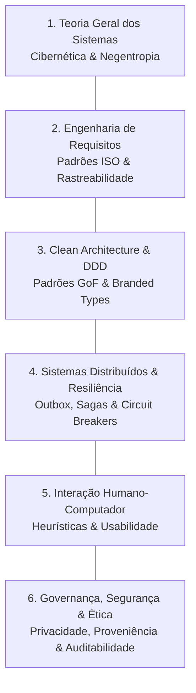

# 🏛️ Teoria Geral dos Sistemas & Pilares de Engenharia de Software

Este documento formaliza as bases sistêmicas e os pilares centrais de engenharia que fundamentam o design do software.

---

## 1. Teoria Geral dos Sistemas (TGS) & Cibernética

- **Embasamento Teórico:** Ludwig von Bertalanffy (1968) *General System Theory*; Norbert Wiener (1948) *Cybernetics*; Peter Checkland (1981) *Soft Systems Methodology (SSM)*.
- **Formulação Sócio-Técnica:** O software é modelado como um **sistema sócio-técnico aberto**. Operadores humanos desempenham papéis estratégicos, avaliativos e de tomada de decisão, enquanto subsistemas computacionais determinísticos e autônomos executam tarefas operacionais, analíticas e de transformação.
- **Entropia & Negentropia (Entropia Negativa):** Processos estocásticos, generativos ou distribuídos introduzem inerentemente entropia sistêmica (deriva contextual, dessincronização de estado, payloads malformados). O sistema computacional injeta **negentropia** através de:
  1. Contratos estritos de validação de borda (esquemas imutáveis em todos os perímetros).
  2. Registros de auditoria criptográficos para garantir rastreabilidade de estado.
  3. Quality gates automatizados que impedem o avanço de artefatos corrompidos ou não conformes.
- **Ciclos de Feedback Cibernético:** Processos deliberativos e iterativos de decisão devem incorporar sinais de feedback mensuráveis que guiem loops regulatórios autocorretivos antes do commit definitivo de estado.

---

## 2. Os Seis Pilares de Sistemas e Engenharia de Software

1. **Teoria Geral dos Sistemas (TGS):** Modelagem holística das fronteiras do sistema, entradas, saídas, subcomponentes e feedback cibernético.
2. **Engenharia de Requisitos (ISO/IEC/IEEE 29148:2018):**
   - Delineamento rigoroso entre o **Núcleo Indivisível** e extensões modulares opcionais.
   - Requisitos atômicos e verificáveis formulados em termos comportamentais testáveis (`QUANDO... ENTÃO... E`).
   - Atributos de qualidade não funcional embasados no Modelo de Qualidade de Software **ISO/IEC 25010:2023** (Confiabilidade, Eficiência de Desempenho, Manutenibilidade, Segurança).
3. **Clean Architecture & Domain-Driven Design (DDD):**
   - Núcleo de domínio puro isolado de frameworks externos, bancos de dados ou mecanismos de entrega.
   - Eliminação da obsessão por primitivos através de *Branded Types* nominais.
4. **Sistemas Distribuídos & Resiliência:**
   - Orquestração assíncrona de workflows via Sagas distribuídas com garantia de rollbacks compensatórios.
   - Eliminação de anomalias de escrita dupla (*dual-write*) através do padrão *Transactional Outbox*.
5. **Interação Humano-Computador (IHC):**
   - Heurísticas de usabilidade de Nielsen, visibilidade clara de status do sistema, prevenção de erros e ergonomia cognitiva alinhada ao modelo mental do operador.
6. **Governança, Segurança & Ética:**
   - Princípio do menor privilégio, higienização automatizada de PII e credenciais em logs/telemetria, auditabilidade criptográfica imutável e proteção contra mutações de estado não autorizadas.
